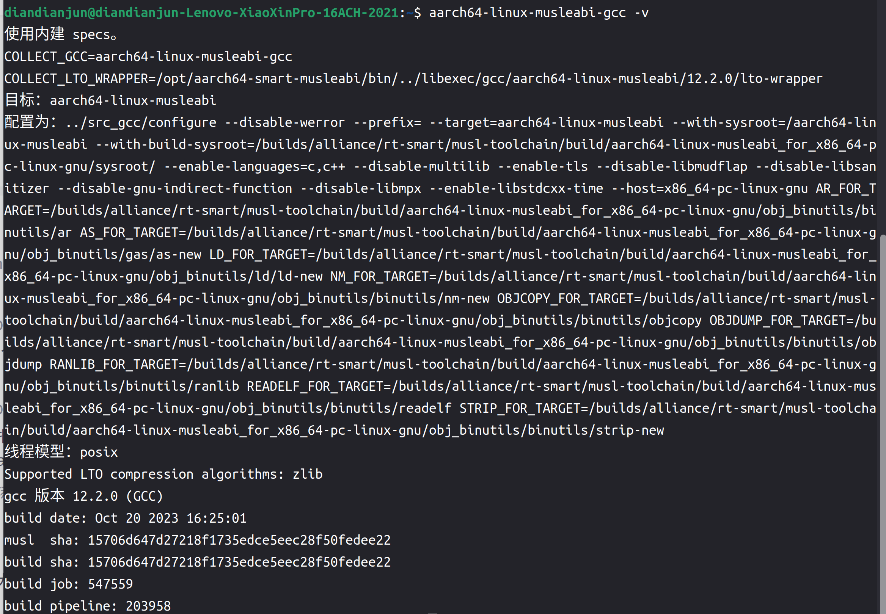
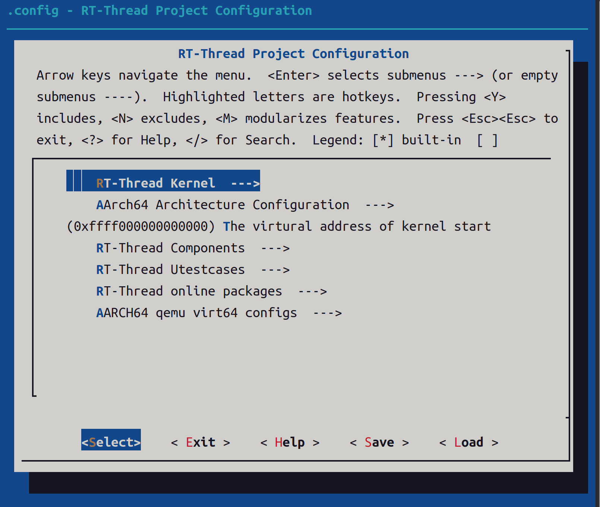
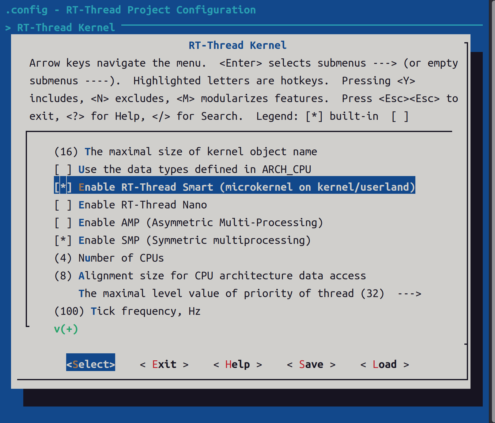
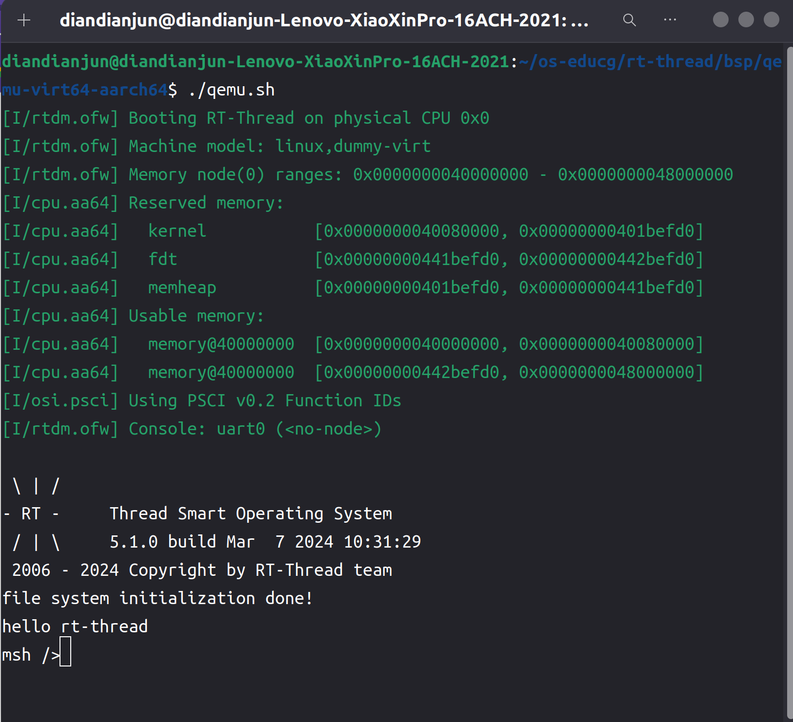
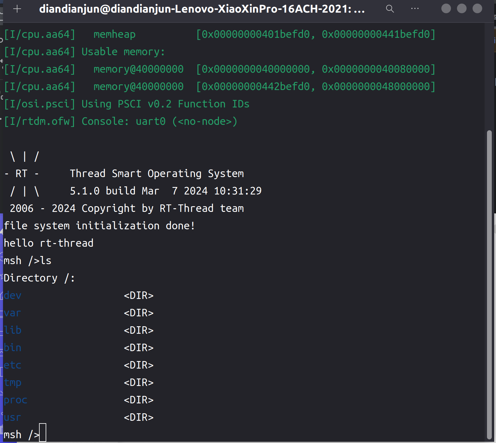
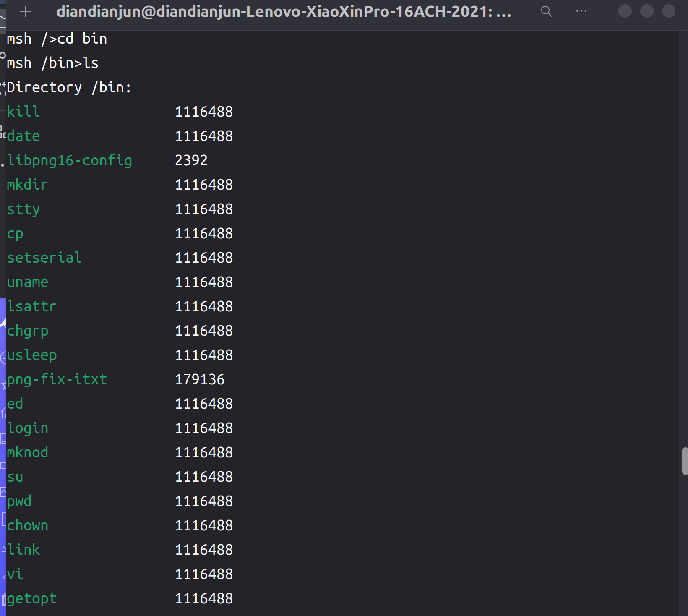
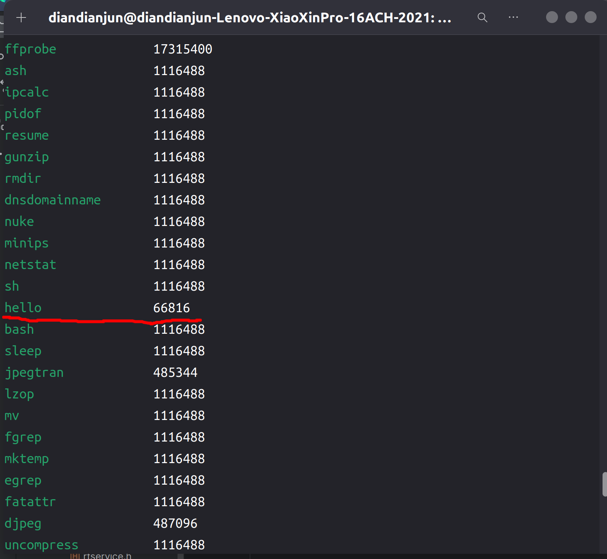
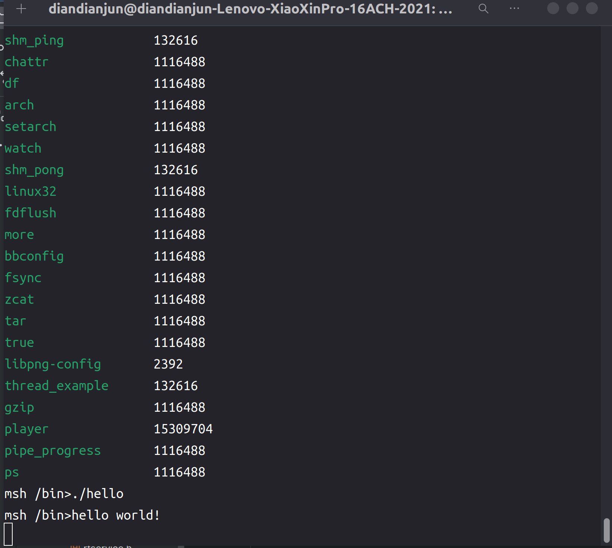

## 2024.03.10-2024.03.16-work-log

## 工作进展

本阶段主要完成的任务有：选定题目、报名、与项目导师沟通、收集查阅题目的相关资料、搭建项目的开发环境、编译并运行了C语言编写的用户态`userapps`

经过与项目导师的沟通，我们制定了这样的技术路线来达成题目的目标：

首先，将`musl libc`和rt-thread中所需的C库变量和函数封装到`libc`中供用Rust编写的应用程序调用。

其次，制作一个到`aarch64-unknown-rtsmart`的Rust语言的编译目标，使得Rust编译器可以将程序编译成能够在`aarch64`平台上的rt-smart操作系统上运行的指令序列。

最后，我们将选择Rust生态中一些实现与平台有关，需要特定操作系统功能支持的库，为其添加目标为rt-smart操作系统时的实现代码。

## 资料收集

rt-thread系统`API`：https://www.rt-thread.org/document/api/index.html，该`API`为rt-smart的用户态应用程序可以调用的`API`，可以借此实现各种系统功能

`Rust FFI`编程: https://cloud.tencent.com/developer/article/1620862，通过封装`libc`的方式让Rust语言编写的程序能够调用C语言库函数

查看了Rust编译器的源码和其文档，了解了Rust编译器支持的目标平台及其实现：https://doc.rust-lang.org/nightly/rustc/platform-support.html

## 搭建开发环境

### 安装qemu-system-aarch64

我们选择的目标平台为`aarch64`，因此我们首先需要安装`qemu-system-aarch64`，用于支持rt-smart内核

```shell
sudo apt install qemu-system-aarch64
```

### 安装musl gcc工具链

然后需要安装`musl gcc`工具链，下载地址为：https://download.rt-thread.org/download/rt-smart/toolchains/aarch64-linux-musleabi_for_x86_64-pc-linux-gnu_latest.tar.bz2

然后配置环境变量：

```bash
# aarch64 musl gcc
export RTT_CC=gcc
export RTT_EXEC_PATH=/yourpath/aarch64-linux-musleabi_for_x86_64-pc-linux-gnu/bin
export RTT_CC_PREFIX=aarch64-linux-musleabi-
export PATH=$PATH:$RTT_EXEC_PATH
```

使用命令`source ~/.bashrc`刷新环境变量配置文件

之后可使用命令`aarch64-linux-musleabi-gcc -v`检查`musl gcc`工具环境变量是否正确设置



### 安装xmake和scons工具

```shell
sudo add-apt-repository ppa:xmake-io/xmake
sudo apt update
sudo apt install xmake
sudo apt-get install scons
```

### 构建内核镜像

首先将rt-smart的源码下载到本地：https://github.com/RT-Thread/rt-thread.git

进入到`qemu-virt64-aarch64`目录下

```shell
cd ./rt-thread/bsp/qemu-virt64-aarch64/  #打开 rt-thread 项目目录中的 bsp/qemu-virt64-aarch64 目录
scons --menuconfig
```

1. 选择RT-Thread Kernel选项

   

2. 使用Smart内核

   

然后在该目录下执行`scons`命令开始编译内核

然后执行当前目录下的`qemu.sh`脚本即可运行rt-smart内核



## 编译并运行用户态userapps

### 克隆仓库

将Smart的userapps仓库克隆下来：

```shell
git clone https://github.com/RT-Thread/userapps.git
```

### 编译

首先运行env.sh 添加一下环境变量

```shell
source env.sh
```

进入 apps 目录进行编译

```shell
cd apps
xmake f -a aarch64 # 配置为 aarch64平台
xmake -j8
```

### 镜像制作

运行 xmake smart-rootfs 制作 rootfs ，运行 xmake smart-image 制作镜像

```shell
xmake smart-rootfs
xmake smart-image -f fat -o ../prebuilt/qemu-virt64-aarch64-fat/fat.img #制作 fat 镜像
```

之后将`fat.img`，`rtthread.bin`，`qemu.sh`放在一个目录下，将`qemu.sh`中的`file=sd.bin`修改为`file=fat.img`，然后运行`qemu.sh`

使用命令

```shell
ls
```

可以看到文件系统内的一些文件



运行命令：

```shell
cd bin
ls
```

可以看到用户态编写的应用程序和系统里的一些命令程序混在一起



可以找到之前apps里的hello应用程序在其中



运行命令：

```shell
./hello
```

可以观察到输出hello world

