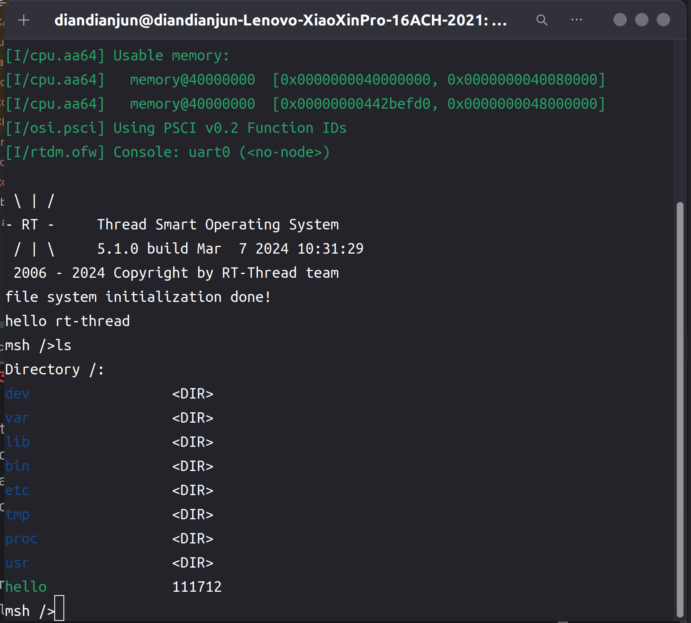
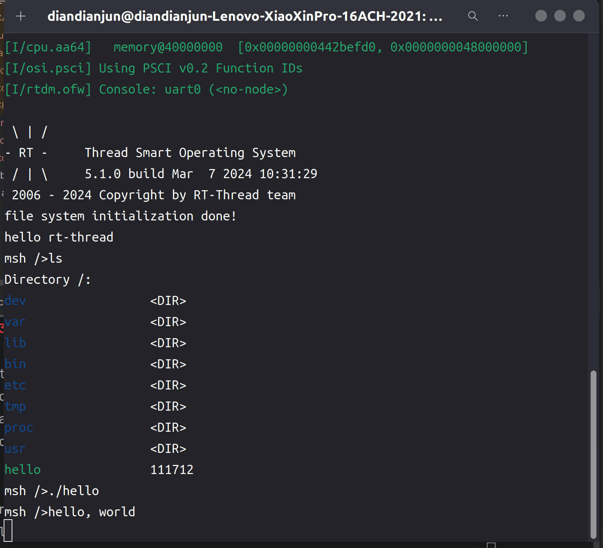

# 2024.03.17-2024.03.23-work-log

## 工作进展

本阶段主要完成的任务有：继续收集相关资料，如Rust编译器的编译目标，Rust程序链接C库函数等资料。阅读往年队伍的项目代码，搭建代码框架，修改旧代码中过时的部分，复现项目效果。

项目中使用的`libc`和`rust`编译器代码已放在仓库中

其中rust编译器源码由于过于庞大，因此只上传了修改过内容的文件以及新增文件

## 资料收集

为Rust编译器添加一个编译目标：https://rustc-dev-guide.rust-lang.org/building/new-target.html#specifying-a-new-llvm

在#![no_std]环境下调用`libc`编写Rust程序：https://users.rust-lang.org/t/solved-hello-world-no-std-build-problem/23122/2

Rust链接c语言静态库：https://doc.rust-lang.org/cargo/reference/build-scripts.html#rustc-link-lib

从源码编译Rust编译器：https://www.jianshu.com/p/63ce92182dbf

## 为Rust编译器添加一个aarch64-unknown-rtsmart的编译目标

### 从源码编译rust编译器

下载rust源代码

```shell
git clone https://github.com/rust-lang/rust.git
cd rust
```

借用官方提供的`config.toml`：

```shell
cp config.toml.example config.toml
```

修改`config.toml`中的安装目录

```toml
[install]

# Where to install the generated toolchain. Must be an absolute path.
prefix = "rust编译器的安装路径"

# Where to install system configuration files.
# If this is a relative path, it will get installed in `prefix` above
sysconfdir = "etc"

# Where to install documentation in `prefix` above
docdir = "share/doc/rust"

# Where to install binaries in `prefix` above
bindir = "bin"

# Where to install libraries in `prefix` above
libdir = "lib"

# Where to install man pages in `prefix` above
mandir = "share/man"

# Where to install data in `prefix` above
datadir = "share"
```

修改`config.toml`配置，构建及安装包括cargo在内的所有工具：

```toml
# Enable a build of the extended Rust tool set which is not only the compiler
# but also tools such as Cargo. This will also produce "combined installers"
# which are used to install Rust and Cargo together.
# The `tools` (check `config.example.toml` to see its default value) option specifies
# which tools should be built if `extended = true`.
#
# This is disabled by default.
extended = true
```

构建并安装：

```shell
./x.py build && ./x.py install
```

然后等待编译器编译完，即可在配置的目录中看到编译好的rust toolchains

### 添加编译目标

找到`rust/compiler/rustc_target/src/spec`

在targets文件夹中添加文件`aarch64_unknown_rtsmart.rs`

在base文件夹中添加`rtsmart_base.rs`文件

由于rust编译器源码的结构和内容发生了一些变化，因此两个文件中的内容与旧代码中有一些区别

之后在`base/mod.rs`中的第38行增加模块定义：

```rust
pub(crate) mod rtsmart_base;
```

在`spec/mod.rs`中的第1705行增加模块定义

```rust
("aarch64-unknown-rtsmart", aarch64_unknown_rtsmart)
```

这样就创建了一个新的编译目标。

为了让给这个new target添加core、std之类的库，还需要做如下操作：

在`rust/src/bootstrap/src/lib.rs`中的第95行添加一个target specification:

```rust
(Some(Mode::Std), "target_os", Some(&["rtsmart"])),
```

在`rust/library/std/os`中添加`rtsmart`文件夹，这里面的内容基本不需要更改，和旧代码中相同

然后在同目录下的`mod.rs`中的第160行添加模块定义：

```rust
#[cfg(target_os = "rtsmart")]
pub mod rtsmart;
```

在`rust/library/std/sys/pal`中添加`rtsmart`文件夹

这里面的`mod.rs`中许多模块的路径发生了变化，需要修改

之后在同目录下的`unix`下的`os.rs`的第51行添加一个`target_os = rtsmart`:

```rust
#[cfg(not(any(target_os = "dragonfly", target_os = "vxworks")))]
    #[cfg_attr(
        any(
            target_os = "linux",
            target_os = "emscripten",
            target_os = "fuchsia",
            target_os = "l4re",
            target_os = "hurd",
            target_os = "rtsmart"
        ),
        link_name = "__errno_location"
    )]
```

之后在`sys/pal`下的`mod.rs` 的第40行添加一个条件分支：

```rust
 else if #[cfg(target_os = "rtsmart")] {
    mod rtsmart;
    pub use self::rtsmart::*;
}
```

最后在`std`目录下的`build.rs`的第46行添加一个`target_os == rtsmart`的分支：

```rust
|| target_os == "uefi"
|| target_os == "teeos"
|| target_os == "zkvm"
|| target_os == "rtsmart"
```

之后再重新编译构建安装rust的编译器

在安装目录下的bin目录输入如下命令：

```shell
./rustc --print target-list
```

可以在输出中找到`aarch64-unknown-rtsmart`这个编译目标：


## 修改libc

下载`libc`的源代码

```shell
git clone https://github.com/rust-lang/libc.git
```

在`src`目录下添加`rtsmart`目录

将目录下的`mod.rs`最后第2250到第2267行的link中的`kind = “static-nobundle”`修改为`kind = “static”`

在`src/lib.rs`的第25行添加，以允许使用`cfg(target_feature = "crt-static")`：

```rust
#![feature(link_cfg)]
```

在`Cargo.toml`中的第34行的targets中添加`aarch64-unknown-rtsmart`目标：

```toml
targets = [
    "aarch64-apple-darwin",
    "aarch64-apple-ios",
    "aarch64-linux-android",
    "aarch64-pc-windows-msvc",
    "aarch64-unknown-freebsd",
    "aarch64-unknown-fuchsia",
    "aarch64-unknown-hermit",
    "aarch64-unknown-linux-gnu",
    "aarch64-unknown-linux-musl",
    "aarch64-unknown-netbsd",
    "aarch64-unknown-openbsd",
    "aarch64-unknown-rtsmart",
    ...
]
```

最后，需要在`build.rs`中的第33行添加一行代码：

```rust
println!("cargo:rustc-link-search=/path/to/lib");
```

这段代码的作用是让项目在编译的时候找到链接的C库并打包进程序中

在指定的目录下需要有`src/rtsmart/mod.rs`最后第2250到第2267行链接的静态库，分别有：

```rust
libutil.a
librt.a
libpthread.a
libm.a
libdl.a
libc.a
librtthread.a
libgcc_eh.a
libgcc.a
```

其中`libgcc.a`和`libgcc_eh.a`在`/opt/aarch64-smart-musleabi/lib/gcc/aarch64-linux-musleabi`下，`librtthread.a`在`userapps/sdk/rt-thread/lib/aarch64/cortex-a`下，剩下的应该都在`/opt/aarch64-smart-musleabi/aarch64-linux-musleabi/lib`下

## 编写示例程序进行测试

创建项目hello

在`cargo.toml`中添加依赖：

```toml
[dependencies]
libc = { path = "/path/to/libc" }
```

`main.rs`内容如下：

```rust
#![no_std]
#![no_main]
extern crate libc;

#[no_mangle]
pub extern "C" fn main(_argc: isize, _argv: *const *const u8) -> usize {
    const HELLO: &'static str = "hello, world\n\0";
    unsafe { 
        libc::printf(HELLO.as_ptr() as *const _);
    }
    0
}

#[panic_handler]
fn my_panic(_info: &core::panic::PanicInfo) -> ! {
    loop {}
}
```

由于我们尚未为`aarch64-unknown-rtsmart`编写std库，因此只能在`#![no_std]`下编写程序，避免项目链接标准库

还需要安装xbuild，否则会报错找不到core库：

```shell
cargo install cargo-xbuild
```

之后用如下命令编译项目：

```shell
/path/to/cargo xbuild --target=aarch64-unknown-rtsmart --release
```

这个cargo是源码编译Rust编译器时设置的安装目录下的bin目录内的命令

之后就可以在`target/aarch64-unknown/rtsmart/release`中找到编译好的hello应用程序

将该应用程序放入`fat.img`文件系统中，具体操作如下：

首先创建一个fat文件夹用于挂载该文件系统

```shell
mkdir fat
sudo mount fat.img fat/
```

然后将hello放进去

```shell
sudo cp -fv ./hello ./fat/hello
```

然后取消挂载

```shell
sudo umount fat/
```

之后再用`./qemu.sh`命令运行虚拟机

用`ls`命令可以看到目录下有一个hello应用程序



使用`./hello`运行该程序

