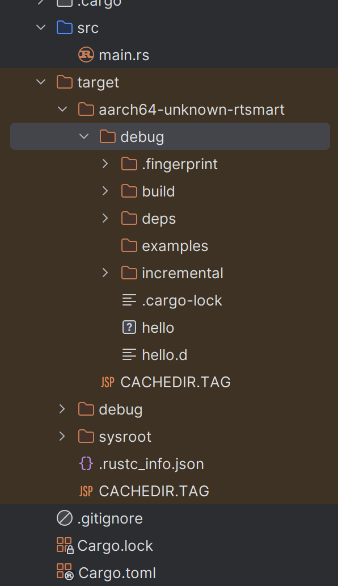
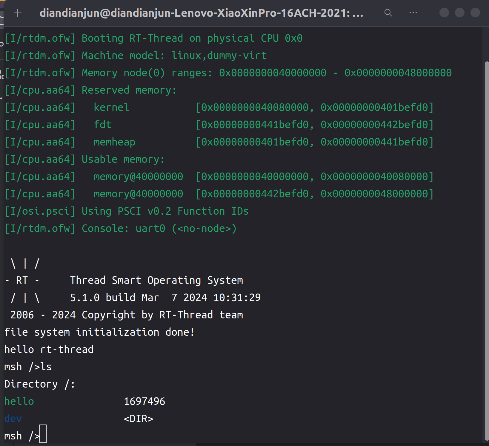
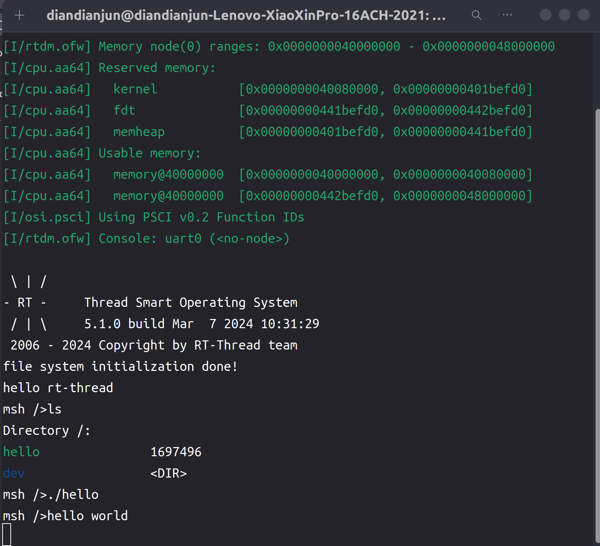

# 2024.04.15-2024.04.21-work-log

## 工作进展

本阶段完成的任务有：将前三周编写的rtsmart-std、marco_main等库进行测试。编译了一个简单的rust程序，观察代码能否成功编译。并在qemu上测试一下，观察能否正常运行。

## 测试项目代码

### Cargo.toml

```toml
[package]
name = "hello"
version = "0.1.0"
edition = "2021"

# See more keys and their definitions at https://doc.rust-lang.org/cargo/reference/manifest.html
[dependencies]
marco_main = {path = "../marco_main"}
rtsmart-std = { path = "../rtsmart-std" }
```

需要引用原先编写的rtsmart-std和marco_main库作为依赖。

同时在.cargo文件夹中添加一个config.toml文件，在里面添加如下内容：

```toml
[build]
target = "aarch64-unknown-rtsmart"

[target.aarch64-unknown-rtsmart]
linker = "aarch64-linux-musleabi-gcc"
```

指定编译目标和链接器，这样就不需要在编译的时候指定--target=aarch64-unknown-rtsmart参数，直接cargo xbuild即可

### main.rs

```rust
#![no_std]
#![no_main]

use marco_main::marco_main_use;
use rtsmart_std::println;

#[marco_main_use(appname = "rust_hello", desc = "Rust example2 app.")]
fn main(_param: Param) {
    println!("hello world");
}
```

仍需加上#![no_std]和#![no_main]标注，否则编译器会自动去寻找标准库，而我们并未对Rust编译器内的标准库添加`aarch64-unknown-rtsmart`平台的支持，因此必然会报错。

然后需要使用marco_main_use这一过程宏。除此之外，与正常使用Rust标准刊库类似，调用println!()宏对内容进行输出

## 编译过程

### 宏展开

首先我们可以观察一下宏展开后的代码是什么情况，因此我们下载cargo-expand工具

```shell
cargo install cargo-expand
```

然后通过如下命令观察宏展开后的Rust代码

```shell
cargo expand -Zbuild-std=core,alloc
```

运行后命令行窗口输出如下内容：

```rust
#![feature(prelude_import)]
#![no_std]
#![no_main]
#[prelude_import]
use core::prelude::rust_2021::*;
#[macro_use]
extern crate core;
extern crate compiler_builtins as _;
use marco_main::marco_main_use;
use rtsmart_std::println;
#[no_mangle]
pub extern "C" fn main(_argc: isize, _argv: *const *const u8) -> usize {
    {
        {
            ::rtsmart_std::out::_print(format_args!("hello world\n"));
        };
    }
    0
}
```

这是声明宏和过程宏同时展开后的结果，与我们之前编写的测试libc的应用程序代码相似，都是通过将用户编写的main函数转换为以 C ABI 调用约定为基础的 `main` 函数，作为程序的入口点，来进行编译运行的。

### 编译

使用如下命令编译应用程序

```shell
cargo xbuild -Zbuild-std=core,alloc
```

由于有了config.toml文件中的配置，因此不需要在命令中指定target

编译成功后在target/aarch64-unknown-rtsmart/debug里能找到编译好的应用程序hello



之后通过2024.03.17-2024.03.23-work-log中描述的方法，将应用程序通过文件系统转移到qemu虚拟机中。

### 运行

```shell
./qemu.sh
```

运行虚拟机，使用命令

```shell
ls
```

可以观察到新放入的应用程序hello



由于本次编译将rtsmart-std和marco_main等新编写的库都通过静态链接的方式编译到应用程序中了，因此本次的应用程序大小为1.7MB，比上次测试libc的hello应用程序的170KB大了不少

运行应用程序

```shell
./hello
```



观察到，能够正常输出hello world

## 总结

本周的工作进展主要是把前三周写的东西进行测试，验证了我们这种，新编写的仿制标准库+属性宏改写main函数的方式是可行的，能够正常调用libc，编译运行在`aarch64-unknown-rtsmart`平台上。

成功验证了我们的思路的正确性后，未来我们将继续完善当前标准库，提供更多的标准库函数给用户使用。