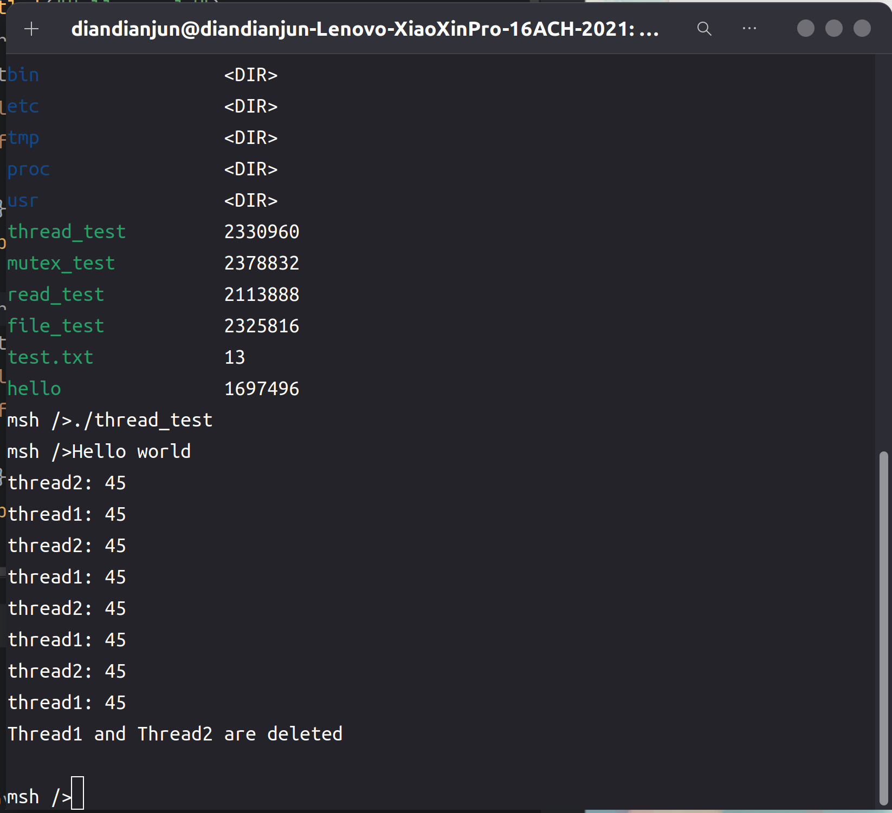

# 2024.04.22-2024.04.29-work-log

## 工作进展

本阶段完成的任务有：查看rt-thread中关于线程使用的接口函数，将其加入到libc中，基于这些函数，编写Rust中的thread库。编写的thread库与正常的Rust标准库中的thread的使用方法可能有一些差异，具体使用方法可以查看example3的thread_test这一测试程序。

编写完成thread库后，我们对其进行了测试。测试过程中发现了许多写的有问题的地方，进行了修改，最终得到了一个能够正常运行多个线程的标准库版本。

`thread`库提供了创建和管理线程的功能，它允许你在你的程序中并发执行多个任务。线程是执行流的基本单元，它允许程序在不同的上下文中并发执行代码，从而实现并行性。使得Rust程序能够更加高效地利用计算资源，从而提高程序的性能和响应能力。

## 资料收集

RT-Thread编程手册：https://gitee.com/rtthread/rtthread-manual-doc

RT-Thread API参考手册：https://www.rt-thread.org/document/api/

Rust标准库：https://rustwiki.org/zh-CN/std/thread/index.html

## rt-thread中线程相关的api

查看rt-thread的头文件`rtthread.h`可以查到rt-thread的如下线程相关的api：

```c
/*
 * thread interface
 */
rt_err_t rt_thread_init(struct rt_thread *thread,
                        const char       *name,
                        void (*entry)(void *parameter),
                        void             *parameter,
                        void             *stack_start,
                        rt_uint32_t       stack_size,
                        rt_uint8_t        priority,
                        rt_uint32_t       tick);
rt_err_t rt_thread_detach(rt_thread_t thread);
rt_thread_t rt_thread_create(const char *name,
                             void (*entry)(void *parameter),
                             void       *parameter,
                             rt_uint32_t stack_size,
                             rt_uint8_t  priority,
                             rt_uint32_t tick);
rt_thread_t rt_thread_self(void);
rt_thread_t rt_thread_find(char *name);
rt_err_t rt_thread_startup(rt_thread_t thread);
rt_err_t rt_thread_delete(rt_thread_t thread);

rt_err_t rt_thread_yield(void);
rt_err_t rt_thread_delay(rt_tick_t tick);
rt_err_t rt_thread_delay_until(rt_tick_t *tick, rt_tick_t inc_tick);
rt_err_t rt_thread_mdelay(rt_int32_t ms);
rt_err_t rt_thread_control(rt_thread_t thread, int cmd, void *arg);
rt_err_t rt_thread_suspend(rt_thread_t thread);
rt_err_t rt_thread_suspend_with_flag(rt_thread_t thread, int suspend_flag);
rt_err_t rt_thread_resume(rt_thread_t thread);
```

将其加入到libc中，转换为Rust风格的调用接口：

```rust
// rtthread sdk
pub type rt_base_t   = c_long;
pub type rt_err_t    = rt_base_t;

pub type rt_uint32_t = ::c_uint;
pub type rt_int32_t = ::c_int;
pub type rt_uint8_t  = ::c_uchar;

pub type rt_thread_t = *mut c_void;
pub type rt_tick_t = rt_uint32_t;
pub type rt_ubase_t = c_ulong;
pub type rt_size_t = rt_ubase_t;
```

```rust
pub fn rt_thread_create(
    name: *const ::c_char,
    entry: extern "C" fn(*mut ::c_void),
    paramter: *mut ::c_void,
    stack_size: rt_uint32_t,
    priority: rt_uint8_t,
    tick: rt_uint32_t
) -> rt_thread_t;

pub fn rt_thread_self() -> rt_thread_t;

pub fn rt_thread_startup(thread: rt_thread_t) -> rt_err_t;

pub fn rt_thread_delete(thread: rt_thread_t) -> rt_err_t;

pub fn rt_thread_yield() -> rt_err_t;

pub fn rt_thread_delay(tick: rt_tick_t) -> rt_err_t;

pub fn rt_thread_mdelay(ms :rt_uint32_t) -> rt_err_t;
```

## thread库

### ThreadBuilder

在使用`thread::Thread::new()`的时候，返回一个`ThreadBuilder`，让编程者设置一些thread的参数，效果如下所示：

```rust
let run = || loop {
        time::sleep(Duration::new(1, 0));
        let mut sum = 0;
        for i in 0..10 {
            sum += i;
        }
        println!("sum: {}", sum);
    };

let t = Thread::new()
        .name("thread 1")
        .stack_size(4096)
		.priority(0)
        .start(run.clone())
		.unwrap();
```

为此，定义如下ThreadBuilder：

```rust
pub struct ThreadBuilder {
    th_name: String,
    th_stack_size: u32,
    th_priority: u8,
    th_ticks: u32,
}

impl ThreadBuilder {
    pub fn name(&mut self, name: &str) -> &mut Self {
        self.th_name = name.into();
        self
    }

    pub fn stack_size(&mut self, stack_size: u32) -> &mut Self {
        self.th_stack_size = stack_size;
        self
    }

    pub fn priority(&mut self, priority: u8) -> &mut Self {
        self.th_priority = priority;
        self
    }

    pub fn ticks(&mut self, ticks: u32) -> &mut Self {
        self.th_ticks = ticks;
        self
    }

    pub fn start<F>(&self, func: F) -> RTResult<Thread>
        where
            F: FnOnce() -> (),
            F: Send + 'static,
    {
        Thread::spawn(
            self.th_name.clone(),
            self.th_stack_size,
            self.th_priority,
            self.th_ticks,
            func,
        )
    }
}
```

### Thread

一个Thread对象对应一个`rt_thread_t`，即一个线程控制块TCB，用于管理和标识一个线程。由于时间问题，`rt_thread_t`内部过于复杂，我们暂时没有将它完整定义到rust的libc中，只是用`*mut c_void`代替

Thread最重要的创建功能如下：

```rust
unsafe fn spawn_inner(
    name: String,
    stack_size: u32,
    priority: u8,
    ticks: u32,
    func: Box<dyn FnOnce() -> () + Send + 'static>,
) -> RTResult<Thread> {
    let func = Box::new(func);
    let param = &*func as *const _ as *mut _;

    extern "C" fn thread_func(param: *mut c_void) {
        unsafe {
            let run = Box::from_raw(param as *mut Box<dyn FnOnce()>);
            run();
        }
    }

    let th_handle = thread_create(
        name.as_ref(),
        thread_func,
        param,
        stack_size,
        priority,
        ticks,
    )
        .ok_or(RTTError::OutOfMemory)?;

    let ret = match Self::_startup(th_handle) {
        Ok(_) => {
            mem::forget(func);
            Ok(Thread(th_handle))
        }
        Err(e) => Err(e),
    };

    return ret;
}
```

较为关键的一步是将闭包转变为函数，使得参数类型能够成功对应，`rt_thread_create`接受的参数类型是

```rust
extern "C" fn(parameter: *mut c_void);
```

为此我们定义了一个这样的函数，并将闭包以参数的方式通过指针传入，并在内部运行，完成相关的逻辑。

创建完成后需要启动，也就是startup方法

这与Unix环境下的线程使用有一定的差别，即Unix接口下的线程创建后可直接运行，而rt-thread的接口中需要调用`rt_thread_startup`使得线程运行

除此之外，还提供如下方法：

```rust
pub fn delete(&self) -> RTResult<()> {
    let ret = thread_delete(self.0);
    if ret == 0 {
        Ok(())
    } else {
        Err(ThreadStartupErr)
    }
}

pub fn delay(ms: i32) -> RTResult<()> {
    let ret = thread_m_delay(ms);
    if ret == 0 {
        Ok(())
    } else {
        Err(ThreadStartupErr)
    }
}
```

用于暂停和删除线程

## thread库测试

### 编写测试代码

测试代码选择使用两个线程，每隔特定的时间输出一些信息，用于标识它们正在运行

在线程运行完成后输出一句调试，用于表示线程正常结束

```rust
#![no_std]
#![no_main]

extern crate alloc;

use alloc::boxed::Box;
use core::time::Duration;
use marco_main::marco_main_use;
use rtsmart_std::{println, time};
use rtsmart_std::thread::Thread;

#[marco_main_use(appname = "rust_thread_test", desc = "Rust example3 app.")]
fn main() {
    println!("Hello world");
    let run1 = || loop {
        time::sleep(Duration::new(1, 0));
        let mut sum = 0;
        for i in 0..10 {
            sum += i;
        }
        println!("thread1: {}", sum);
    };
    let run2 = || loop {
        time::sleep(Duration::new(1, 0));
        let mut sum = 0;
        for i in 0..10 {
            sum += i;
        }
        println!("thread2: {}", sum);
    };

    let t1 = Thread::new()
        .name("thread 1")
        .stack_size(4096)
        .start(run1.clone());
    let t2 = Thread::new()
        .name("thread 2")
        .stack_size(4096)
        .start(run2.clone());
    let thread1 = t1.unwrap();
    let thread2 = t2.unwrap();
    time::sleep(Duration::new(5, 0));
    thread1.delete().unwrap();
    thread2.delete().unwrap();
    println!("Thread1 and Thread2 are deleted");
}
```

编译运行，和前面的程序一样，命令如下：

```shell
cargo xbuild -Zbuild-std=core,alloc
```

在target/aarch64-unknown-rtsmart/debug里能找到编译好的应用程序thread_test

将其通过挂载文件系统放入qemu虚拟机磁盘后运行

运行结果如下图所示：



观察到两个线程交替输出，最后正常结束

## 总结

本周的工作主要是编写了thread库并测试。`thread`库在开发过程中是很重要的库，并且是经常使用的库，能够高效的利用计算资源，因此我们在编写完标准输出库后就开始编写thread库

下周我们应该会继续围绕线程的相关功能，编写mutex库，保证线程运行时的线程安全问题。