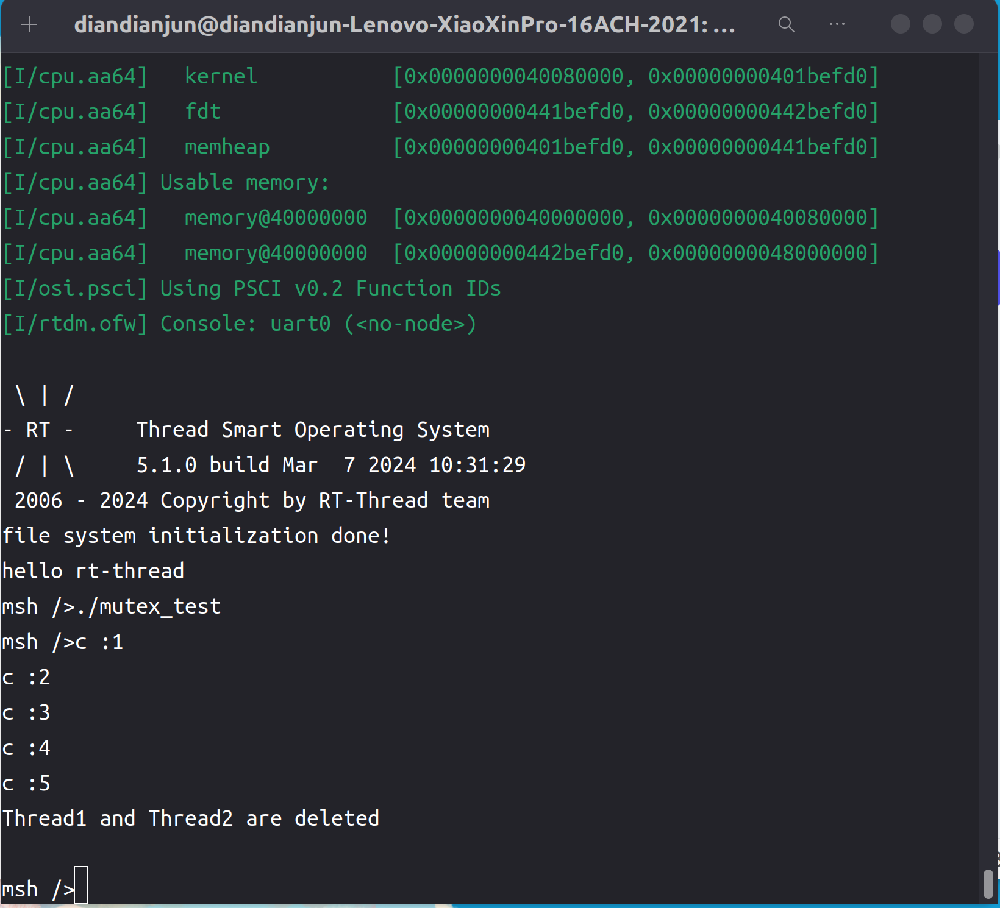

# 2024.04.30-2024.05.06-work-log

## 工作进展

本阶段完成的任务有：查看rt-thread中mutex相关的接口函数，将其加入到libc中，基于这些函数，编写Rust中的mutex库。

编写完mutex库后，对其进行测试，解决了一些异常问题，得到了一个能够正常运行的mutex库

Mutex（互斥锁）是一种并发编程中常用的同步原语，用于保护共享资源，防止多个线程同时访问和修改。在多线程环境下，通过获取互斥锁，线程可以安全地访问共享资源，从而避免竞态条件和数据不一致。是并发编程中的重要工具，使得多线程程序可以安全地访问和修改共享资源，从而实现并发执行和协作。

## 资料收集

RT-Thread编程手册：https://gitee.com/rtthread/rtthread-manual-doc

RT-Thread API参考手册：https://www.rt-thread.org/document/api/

Rust标准库：https://rustwiki.org/zh-CN/std/thread/index.html

## rt-thread中mutex相关的api

```c
/*
 * mutex interface
 */
rt_err_t rt_mutex_init(rt_mutex_t mutex, const char *name, rt_uint8_t flag);
rt_err_t rt_mutex_detach(rt_mutex_t mutex);
rt_mutex_t rt_mutex_create(const char *name, rt_uint8_t flag);
rt_err_t rt_mutex_delete(rt_mutex_t mutex);

void rt_mutex_drop_thread(rt_mutex_t mutex, rt_thread_t thread);
rt_uint8_t rt_mutex_setprioceiling(rt_mutex_t mutex, rt_uint8_t priority);
rt_uint8_t rt_mutex_getprioceiling(rt_mutex_t mutex);

rt_err_t rt_mutex_take(rt_mutex_t mutex, rt_int32_t time);
rt_err_t rt_mutex_take_interruptible(rt_mutex_t mutex, rt_int32_t time);
rt_err_t rt_mutex_take_killable(rt_mutex_t mutex, rt_int32_t time);
rt_err_t rt_mutex_release(rt_mutex_t mutex);
rt_err_t rt_mutex_control(rt_mutex_t mutex, int cmd, void *arg);
```

将其加入到libc中，转换为Rust风格的调用接口：

```rust
s!{
    pub struct rt_mutex {
        pub mtype: c_int,
        pub data: *mut c_void,
    }
}
pub type rt_mutex_t  = *mut rt_mutex;
```

```rust
pub fn rt_mutex_create(
    name: *const ::c_char,
    flag: ::rt_uint8_t
) -> ::rt_mutex_t;

pub fn rt_mutex_init(
    mutex: *mut rt_mutex,
    name: *mut ::c_char,
    flag: ::rt_uint8_t,
) -> rt_err_t;
pub fn rt_mutex_delete(mutex: ::rt_mutex_t) -> rt_err_t;
pub fn rt_mutex_take(mutex: ::rt_mutex_t, time: ::rt_int32_t) -> rt_err_t;
pub fn rt_mutex_release(mutex: ::rt_mutex_t) -> rt_err_t;
```

## mutex库

### Mutex

Mutex对象持有一个`rt_mutex_t`作为互斥量，同时还保存该互斥量所保存的共享资源data

```rust
pub struct Mutex<T: Sized> {
    mutex: rt_mutex_t,
    data: UnsafeCell<T>,
}
```

```rust
impl<T> Mutex<T> {
    pub fn new(t: T) -> Result<Self, RTTError> {
        Ok(Mutex {
            mutex: mutex_create("Unnamed").unwrap(),
            data: UnsafeCell::new(t),
        })
    }
    
    pub fn new_with_name(t: T, name: &str) -> Result<Self, RTTError> {
        Ok(Mutex {
            mutex: mutex_create(name).unwrap(),
            data: UnsafeCell::new(t),
        })
    }

    pub fn try_lock(&self) -> Result<MutexGuard<T>, RTTError> {
        let ret = unsafe { mutex_take(self.mutex, 0) };
        if ret != 0 {
            return Err(RTTError::MutexTakeTimeout);
        }
        Ok(MutexGuard {
            mutex: &self.mutex,
            data: &self.data,
        })
    }
    
    pub fn lock(&self) -> Result<MutexGuard<T>, RTTError> {
        let ret = unsafe { mutex_take(self.mutex, -1) };
        if ret != 0 {
            return Err(RTTError::MutexTakeTimeout);
        }
        Ok(MutexGuard {
            mutex: &self.mutex,
            data: &self.data,
        })
    }
}
```

比较关键的是Mutex必须实现`Send`和`Sync`这两个trait，才能保证数据在多线程间访问是2不出错：

```rust
unsafe impl<T: Send> Send for Mutex<T> {}
unsafe impl<T: Send> Sync for Mutex<T> {}
```

### MutexGuard

这是一个控制互斥量的智能指针，在Mutex对象上锁之后，返回一个MutexGuard智能指针，用于访问数据和管理锁的释放

```rust
pub struct MutexGuard<'a, T: Sized> {
    mutex: &'a rt_mutex_t,
    data: &'a UnsafeCell<T>,
}
```

由于所有权机制的限制，只能将引用传给MutexGuard，因此需要加上生命周期。

需要实现`Deref`和`DerefMut`这两个trait让指针能够通过解引用的方式访问和改变数据，同时需要实现`Drop`这一trait自动释放互斥量。如果忘记这个的话极易造成死锁。

```rust
impl <'a, T> Deref for MutexGuard<'a, T> {
    type Target = T;

    fn deref(&self) -> &Self::Target {
        unsafe { &*self.data.get() }
    }
}

impl <'a, T> Drop for MutexGuard<'a, T> {
    fn drop(&mut self) {
        let mutex = self.mutex as *const _ as *mut _;
        mutex_release(mutex);
    }
}

impl <'a, T> DerefMut for MutexGuard<'a, T> {
    fn deref_mut(&mut self) -> &mut Self::Target {
        unsafe { &mut *self.data.get() }
    }
}
```

## mutex库测试

### 编写测试代码

测试代码选择创建两个线程，一个共享资源，两个线程每隔一段时间对其进行修改，并输出修改的值

```rust
#![no_std]
#![no_main]

extern crate alloc;

use alloc::sync::Arc;
use core::time::Duration;

use marco_main::marco_main_use;
use rtsmart_std::{println, thread, time};
use rtsmart_std::mutex::Mutex;

#[marco_main_use(appname = "rust_mutex_test", desc = "Rust example4 app.")]
fn main() {
    let counter = Arc::new(Mutex::new(0).unwrap());
    let run = move || loop {
        time::sleep(Duration::new(1, 0));
        let mut c = counter.lock().unwrap();
        *c += 1;
        println!("c :{}", *c);
    };

    let t1 = thread::Thread::new()
        .name("thread 1")
        .stack_size(4096)
        .start(run.clone()).unwrap();
    let t2 = thread::Thread::new()
        .name("thread 2")
        .stack_size(4096)
        .start(run.clone()).unwrap();
    time::sleep(Duration::new(5, 0));
    t1.delete().unwrap();
    t2.delete().unwrap();
    println!("Thread1 and Thread2 are deleted");
}
```

编译运行，和前面的程序一样，命令如下：

```shell
cargo xbuild -Zbuild-std=core,alloc
```

在target/aarch64-unknown-rtsmart/debug里能找到编译好的应用程序mutex_test

将其通过挂载文件系统放入qemu虚拟机磁盘后运行

运行结果如下图所示：



观察到c的值正常被并发修改，没有出现并发错误

## 总结

本周的工作主要是编写了mutex库并测试。`mutex`库在开发过程中是与`thread`库搭配使用的，用于确保在任意时刻只有一个线程能够访问资源。这样可以避免多个线程同时修改共享状态导致的数据竞争和不确定行为。因此在多线程编程中的地位不亚于`thread`库

下周我们应该会编写并测试标准输入库的代码，也会考虑加入文件功能。