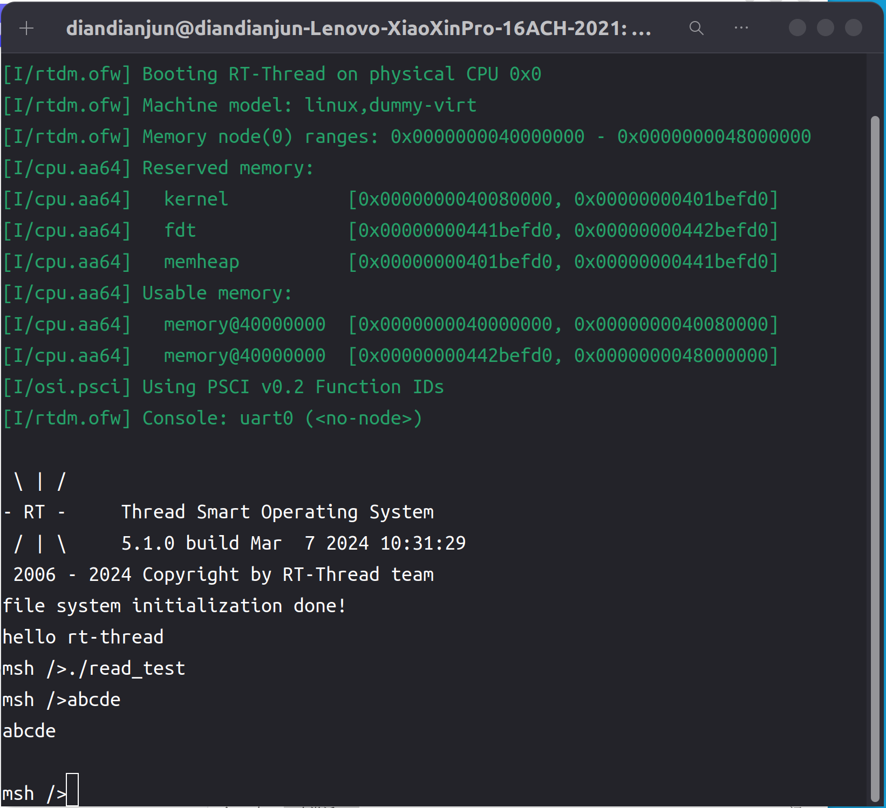

# 2024.05.07-2024.05.14-work-log

## 工作进展

本阶段完成的任务有：继续研究阅读Rust编译器的标准库的实现，为rtsmart-std项目编写标准输入库stdin，可以等待读取用户的输入字符串，用于进行其他的操作。

本阶段为新建的标准库项目编写了标准输入库。代码思路有借鉴Rust标准库的源代码，做了较多的简化，核心最终落在调用libc中的输出函数getchar()。

## 资料收集

Rust标准库源代码：https://github.com/rust-lang/rust/tree/master/library/std

Rust标准库源代码解析：https://github.com/Warrenren/inside-rust-std-library、https://rustwiki.org/zh-CN/std/

UNIX环境高级编程 作者: [W.Richard Stevens](https://book.douban.com/author/368367) / [Stephen A.Rago](https://book.douban.com/search/Stephen A.Rago)
出版社: [人民邮电出版社](https://book.douban.com/press/2609) ISBN: 9787115147318

## Stdin模块

### Stdout

首先创建一个Read Trait，表示具有读取功能的特性

```rust
pub trait Read {
    fn read(&mut self, buf: &mut [u8]) -> Result<usize, RTTError>;
}
```

然后创建一个结构体Stdin，用于表示标准输入

并为其实现Read Trait

```rust
struct Stdin;

impl Read for Stdin {
    fn read(&mut self, buf: &mut [u8]) -> Result<usize, RTTError> {
        let mut i = 0;
        unsafe {
            while i < buf.len() {
                let c = libc::getchar();
                if c == 0 || c == '\n' as i32 {
                    break;
                }
                buf[i] = c as u8;
                i += 1;
            }
        }
        Ok(i)
    }
}
```

使用一个缓冲池buf，不断将读取到的字节放入其中，直到读完或到达上限。遇到EOF或换行时即停止

### InputStream

Stdin只能用固定长度的buf去读取字符，而我们希望直接能读取一整行字符串并返回String，因此又创建了一个InputStream

```rust
pub struct InputStream {
    stdin: Stdin
}
```

InputStream内部有一个Stdin，然后为它实现read_line()方法

```rust
impl InputStream {
    pub fn new() -> InputStream {
        InputStream {
            stdin: Stdin
        }
    }
    
    pub fn read_line(&mut self) -> Result<String, RTTError> {
        let mut buf = [0u8; 1024];
        let mut s = String::new();
        loop {
            let n = self.stdin.read(&mut buf)?;
            if n == 0 {
                break;
            }
            s.push_str(&String::from_utf8_lossy(&buf[..n]));
            if n < buf.len() {
                break;
            } else {
                buf = [0u8; 1024];
            }
        }
        Ok(s)
    }
}
```

每次用一个长度为1024的数组作为缓冲区去读取输入的字符。如果读取的字符少于1024，则说明遇到了换行符，则本次读取直接结束。否则就继续清空buf，再去读取，将新读取的输入拼接在原先的结果后面。然后返回结果。

## Stdin库测试

这个测试程序比较简单，就是创建一个InputStream，然后读取一行字符串，再将其输出即可

```rust
#![no_std]
#![no_main]

extern crate alloc;

use marco_main::marco_main_use;
use rtsmart_std::println;
use rtsmart_std::stdin::InputStream;

#[marco_main_use(appname = "rust_read_test", desc = "Rust example5 app.")]
fn main() {
    let mut input = InputStream::new();
    let line = input.read_line().unwrap();
    println!("{}", line);
}
```

编译运行，和前面的程序一样，命令如下：

```shell
cargo xbuild -Zbuild-std=core,alloc
```

在target/aarch64-unknown-rtsmart/debug里能找到编译好的应用程序read_test

将其通过挂载文件系统放入qemu虚拟机磁盘后运行

运行结果如下图所示：



可以观察到输入了abcde，然后立马就输出了abcde

说明功能是正常的

## 总结

本周的工作主要是编写了stdin库并测试。`stdin`库在开发过程中常与`stdout`库搭配使用，达到与用户进行交互的目的，能够从用户端得到输入，也使得应用程序更为灵活。

下周我们计划编写文件操作相关的标准库，如文件创建，写入，读取等，并进行测试。