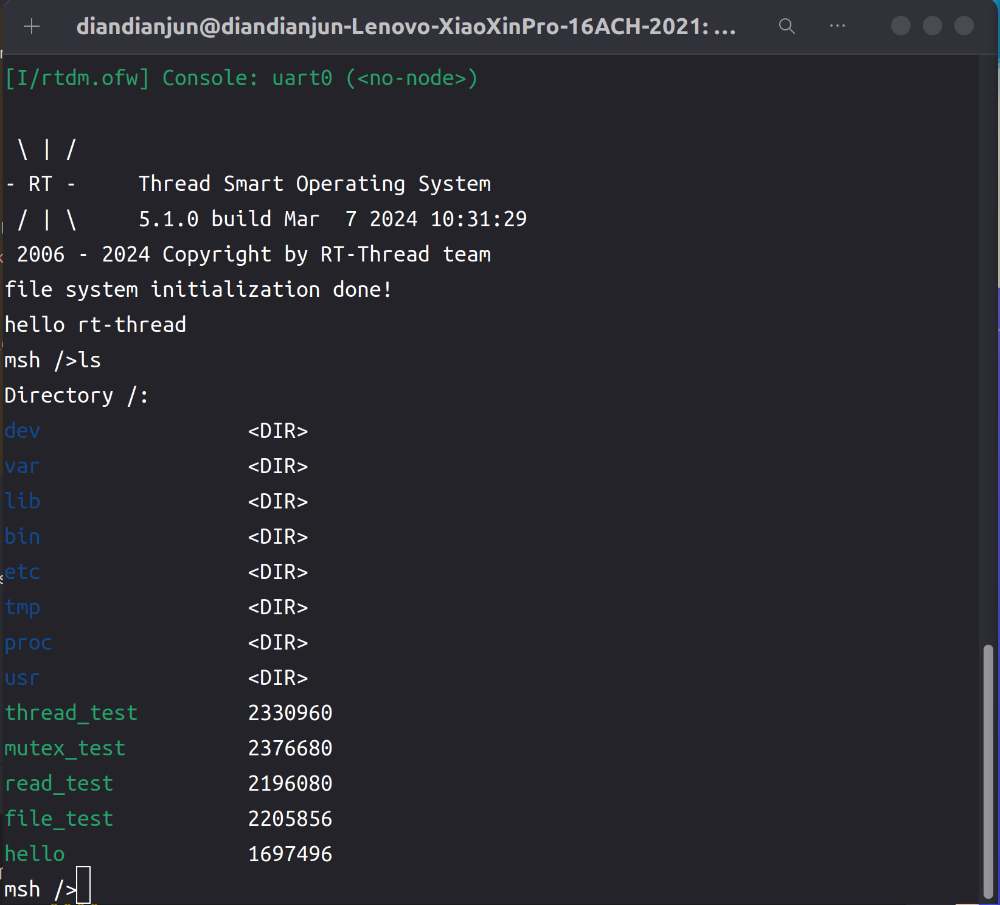
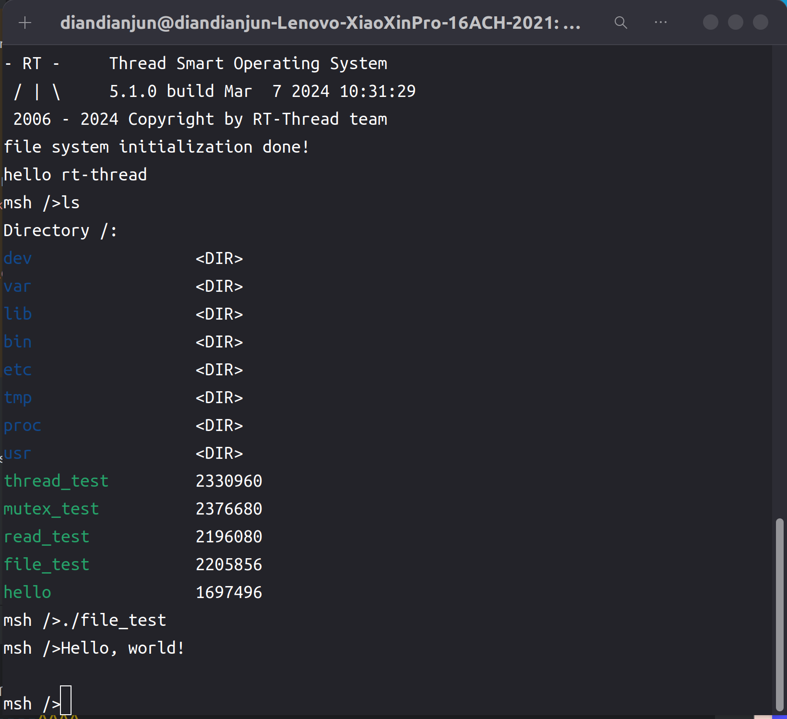
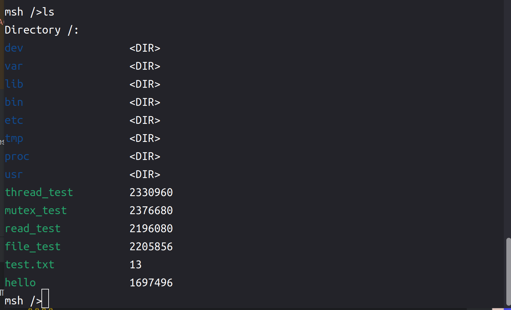
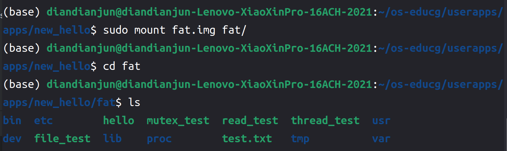
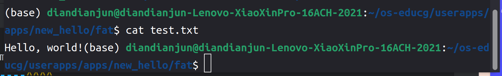

# 2024.05.15-2024.05.22-work-log

## 工作进展

本阶段完成的任务有：阅读Rust编译器中`fs`库的实现，以及C库函数中文件的相关操作接口的使用，编写了rt-smart平台上的`fs`库的部分实现，可以创建文件、写入文件、从文件中读取内容、将读取指针移动到特定位置再开始读取等等

同时还编写了对应的测试应用程序对`fs`库进行测试，保证其功能能够正常完成。

`std::fs` 库提供了与文件系统交互的一系列功能，使得开发者可以在 Rust 程序中方便地进行文件操作。开发者能够方便、可靠地进行文件系统交互。

## 资料收集

Rust标准库源代码：https://github.com/rust-lang/rust/tree/master/library/std

Rust标准库源代码解析：https://github.com/Warrenren/inside-rust-std-library、https://rustwiki.org/zh-CN/std/

UNIX环境高级编程 作者: [W.Richard Stevens](https://book.douban.com/author/368367) / [Stephen A.Rago](https://book.douban.com/search/Stephen A.Rago) 出版社: [人民邮电出版社](https://book.douban.com/press/2609) ISBN: 9787115147318

## fs标准库

首先我们计划提供与`ThreadBuilder`类似的函数式调用配置方法来创建或打开文件，示例如下所示

```rust
let mut res_file = fs::OpenOptions::new()
    .read(true)
    .write(true)
    .create(true)
    .append(false)
    .open("test.txt");
```

可用来配置文件的读写、创建与否、是否追加等属性，通过这种方式提供接口，使得接口的使用变得更加简单。

因此，我们会先创建一个`OpenOptions`来打开文件

### OpenOptions

```rust
pub struct OpenOptions {
    pub path: String,
    pub read: bool,
    pub write: bool,
    pub create: bool,
    pub append: bool,
}
```

```rust
impl OpenOptions {
    pub fn new() -> OpenOptions {
        OpenOptions {
            path: String::new(),
            read: false,
            write: false,
            create: false,
            append: false,
        }
    }

    pub fn read(&mut self, read: bool) -> &mut Self {
        self.read = read;
        self
    }

    pub fn write(&mut self, write: bool) -> &mut Self {
        self.write = write;
        self
    }

    pub fn create(&mut self, create: bool) -> &mut Self {
        self.create = create;
        self
    }

    pub fn append(&mut self, append: bool) -> &mut Self {
        self.append = append;
        self
    }

    pub fn open(&mut self, path: &str) -> RTResult<File> {
        self.path = path.to_string();
        let fd = unsafe {
            crate::fs::open(
                self.path.as_ptr(),
                self.read,
                self.write,
                self.create,
                self.append,
            )
        };
        if fd < 0 {
            Err(FileOpenErr)
        } else {
            Ok(File { fd })
        }
    }
}
```

在最终open的时候再将配置信息一并传入用于打开文件

```rust
pub fn open(path: *const u8, read: bool, write: bool, create: bool, append: bool) -> i32 {
    let flags = if read && write {
        libc::O_RDWR
    } else if write {
        libc::O_WRONLY
    } else {
        libc::O_RDONLY
    };

    let flags = if create {
        flags | libc::O_CREAT
    } else {
        flags
    };

    let flags = if append {
        flags | libc::O_APPEND
    } else {
        flags
    };
    unsafe { libc::open(path as *const c_char, flags) }
}
```

### fs库使用到的libc中的一些C库接口函数

```c
int open(const char *, int, ...);
int close(int);
ssize_t read(int, void *, size_t);
ssize_t write(int, const void *, size_t);
off_t lseek(int, off_t, int);
int fsync(int);
int ftruncate(int, off_t);
```

这些是rt-smart上支持的一些C语言库函数，可用于文件操作，将其转换为Rust风格的函数接口如下：

```rust
pub fn open(path: *const c_char, oflag: ::c_int, ...) -> ::c_int;
pub fn close(fd: ::c_int) -> ::c_int;
pub fn read(fd: ::c_int, buf: *mut ::c_void, count: ::size_t) -> ::ssize_t;
pub fn write(fd: ::c_int, buf: *const ::c_void, count: ::size_t) -> ::ssize_t;
pub fn lseek(fd: ::c_int, offset: off_t, whence: ::c_int) -> off_t;
pub fn fsync(fd: ::c_int) -> ::c_int;
pub fn ftruncate(fd: ::c_int, length: off_t) -> ::c_int;
```

基于这些库函数编写File模块

### File

与Linux操作系统相同，rt-smart每个打开的文件都由一个文件描述符（file descriptor, FD）来标识。文件描述符是一个非负整数，用于指代一个已经打开的文件或其他类型的 I/O 资源（如管道、网络套接字等）。文件描述符与打开的文件之间的映射由内核管理。

因此，我们对File结构的定义如下：

```rust
pub struct File {
    pub fd: i32,
}
```

需对其实现Drop这一trait，使其在离开作用域后自动释放时，关闭文件

```rust
impl Drop for File {
    fn drop(&mut self) {
        unsafe {
            libc::close(self.fd);
        }
    }
}
```

#### 读写功能

```rust
pub fn read(&self, buf: &mut [u8]) -> RTResult<usize> {
    let n = unsafe { libc::read(self.fd, buf.as_mut_ptr() as *mut c_void, buf.len()) };
    if n < 0 {
        Err(FileReadErr)
    } else {
        Ok(n as usize)
    }
}

pub fn read_to_string(&self) -> RTResult<String> {
        let mut buf = [0; 128];
        let mut string = String::new();
        self.seek(0)?;
        loop {
            let n = self.read(&mut buf)?;
            if n == 0 {
                break;
            }
            let substr = unsafe { String::from_utf8_unchecked(buf.to_vec()) };
            string.push_str(&substr);
        }
        Ok(string)
}
```

```rust
pub fn write(&self, buf: &[u8]) -> RTResult<usize> {
    let n = unsafe { libc::write(self.fd, buf.as_ptr() as *const c_void, buf.len()) };
    if n < 0 {
        Err(FileWriteErr)
    } else {
        Ok(n as usize)
    }
}

pub fn write_all(&self, buf: &str) -> RTResult<()> {
        self.write(buf.as_bytes())?;
        Ok(())
}
```

读取的步骤与stdin的逻辑相似，用一个固定长度的buf进去读取内容，再不断的拼到String后面，最后再将结果String返回

#### 其他功能

```rust
pub fn seek(&self, offset: i64) -> RTResult<i64> {
    let n = unsafe { libc::lseek(self.fd, offset, SEEK_SET) };
    if n < 0 {
        Err(FileSeekErr)
    } else {
        Ok(n)
    }
}

pub fn flush(&self) -> RTResult<()> {
    let n = unsafe { libc::fsync(self.fd) };
    if n < 0 {
        Err(FileFlushErr)
    } else {
        Ok(())
    }
}

pub fn set_len(&self, len: i64) -> RTResult<()> {
    let n = unsafe { libc::ftruncate(self.fd, len) };
    if n < 0 {
        Err(FileSetLengthErr)
    } else {
        Ok(())
    }
}

pub fn close(&self) -> RTResult<()> {
    let n = unsafe { libc::close(self.fd) };
    if n < 0 {
        Err(FileCloseErr)
    } else {
        Ok(())
    }
}
```

- `seek`函数：将文件指针移动到文件中的指定位置。
- `flush`函数：将文件的所有缓冲区数据刷新到磁盘上，确保数据持久化。
- `set_len`函数：调整文件的长度。
- `close`函数：关闭文件描述符，释放相关资源。

这些函数都是通过调用底层的 `libc` 库函数来操作文件描述符，提供了文件指针移动、缓冲区刷新、文件长度设置和文件关闭等基本功能。每个函数都使用 `RTResult` 类型来返回结果，处理可能的错误，并提供适当的错误处理机制。

## fs库测试

### 编写测试代码

测试程序写的相对简单，使用`OpenOptions`打开一个文件，然后向里面写入一段字符串，再将其读出，输出到标准输出上，如果能正常创建文件、写入字符串、读出字符串，则说明fs库的功能正常。

```rust
#![no_std]
#![no_main]

extern crate alloc;

use alloc::string::String;
use marco_main::marco_main_use;
use rtsmart_std::{fs, println};

#[marco_main_use(appname = "rust_file_test", desc = "Rust example6 app.")]
fn main() {
    let mut res_file = fs::OpenOptions::new()
        .read(true)
        .write(true)
        .create(true)
        .append(false)
        .open("test.txt");
    if res_file.is_err() {
        println!("{:?}", res_file.err().unwrap());
    } else {
        let mut file = res_file.unwrap();
        let buf = "Hello, world!".as_bytes();
        file.write(buf).expect("write error");
        let string = file.read_to_string().unwrap();
        println!("{}", string);
        file.close().expect("close error");
    }
}
```

编译运行，和前面的程序一样，命令如下：

```shell
cargo xbuild -Zbuild-std=core,alloc
```

在target/aarch64-unknown-rtsmart/debug里能找到编译好的应用程序file_test

将其通过挂载文件系统放入qemu虚拟机磁盘后运行

### 测试过程

首先观看文件目录内的文件，不存在test.txt文件



运行file_test程序，发现如下输出：



成功将写入的Hello,world!读取出来

再使用ls命令查看文件目录下的文件



会发现多出了一个test.txt文件，是我们新创建的。

回到linux环境下的文件系统，查看文件目录，发现存在test.txt文件



用cat命令查看其中的内容，发现与我们写入的内容是一致的



至此，文件系统的测试结束，功能正常。

## 总结与展望

本周的工作主要是编写了`fs`库并测试。`fs`库在开发过程中是经常需要使用的库，它为文件和目录操作提供了基础设施，使得开发者能够方便、可靠地进行文件系统交互。

但是我们编写的功能还太少，今后我们将继续完善库的内容，提供更多的功能，如可创建目录等等。