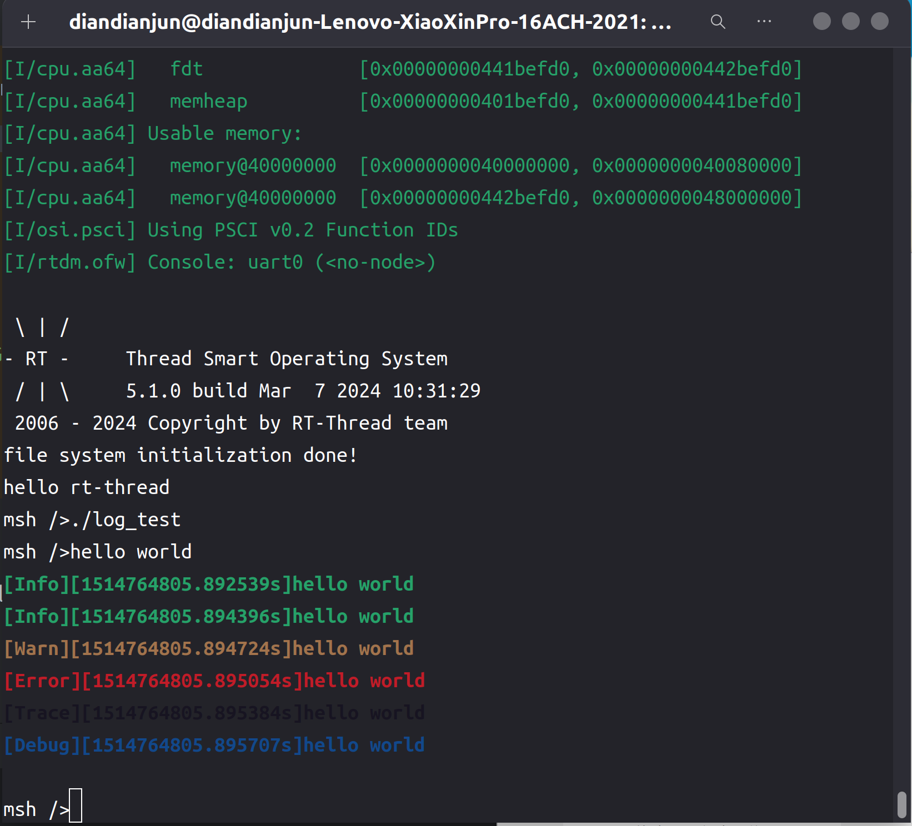

# 2024.06.16-2024.06.22-work-log

## 工作进展

本阶段完成的任务有：回顾初赛阶段我们的项目情况，制定后续的开发计划，如修改之前编写的标准库，编写新的标准库，将我们的项目部署到真机上进行测试等等。

同时，我们对标准库中的log功能进行了修改，分为五个日志等级，并能够以不同的颜色显示，使其更加直观，也符合当前的日志标准

## 资料收集

Rust log库相关资料：https://course.rs/logs/log.html、https://crates.io/crates/log

## 初赛回顾

回顾初赛阶段我们开发的项目，标准库方面尚有缺失，且原有的标准库开发显得有些粗糙，因此在之后的开发中，我们将进一步优化原有的标准库，并增加新的Rust库，使得用户能够使用Rust和rtthread的更多相关功能。

除此之外，我们计划将编写的项目部署到真机上进行测试，并与C语言编写的应用程序进行性能对比，以验证我们的项目在实际生产中的运行正确性情况和性能。

## log库的编写

在软件开发和系统监控中，日志记录是一个至关重要的工具。不同的日志级别用于表示消息的重要性和详细程度。日志共分为如下5个等级，且分别以不同的颜色呈现：

```Rust
#[repr(usize)]
#[derive(Debug, Copy, Clone, PartialEq, Eq)]
pub enum Level {
    Error = 1,
    Warn = 2,
    Info = 3,
    Debug = 4,
    Trace = 5,
}
```

- Error表示系统中的严重问题，可能导致程序无法继续运行。记录会导致系统崩溃或重大故障的事件。这些日志通常需要立即关注和处理。用红色字体表示。
- Warn表示潜在问题或非正常操作，但不会立即导致系统失败。记录可能会导致问题但当前不影响系统运行的事件。这些日志提示需要注意的问题，可能需要将来进行检查或修复。用黄色字体表示。
- Info表示常规操作或重要事件的日志。记录系统运行中的常规信息，用于跟踪程序流程和状态。这些日志有助于了解系统的正常运行情况。用绿色字体表示。
- Debug表示开发和调试过程中使用的详细信息。记录详细的调试信息，以帮助开发人员查找和解决问题。这些日志通常包括变量值、函数调用等细节信息。用蓝色字体表示。
- Trace表示最详细的日志级别，用于记录系统的每一步操作。记录极其详细的跟踪信息，通常用于诊断复杂问题或分析系统性能。这些日志可以提供完整的执行路径和状态。用灰色字体表示。

首先定义一个基本日志函数，用于根据日志等级输出对应的信息

```Rust
pub fn _log(level: Level, args: core::fmt::Arguments) {
    use core::fmt::Write;
    use crate::stdout;
    use crate::time;
    let mut s = String::new();
    write!(&mut s, "[{:?}][{:?}]", level, time::get_time()).unwrap();
    write!(&mut s, "{}", args).unwrap();
    match level {
        Level::Error => {
            println!("\x1b[1;31m{}\x1b[0m", s);
        }
        Level::Warn => {
            println!("\x1b[1;33m{}\x1b[0m", s);
        }
        Level::Info => {
            println!("\x1b[1;32m{}\x1b[0m", s);
        }
        Level::Debug => {
            println!("\x1b[1;34m{}\x1b[0m", s);
        }
        Level::Trace => {
            println!("\x1b[1;30m{}\x1b[0m", s);
        }
    }
}
```

这段代码用于根据日志级别记录日志信息。该函数会根据传入的日志级别（`level`）和格式化的日志内容（`args`），生成带有时间戳和日志级别标识的日志消息，并以不同的颜色输出到控制台。

在定义了这个函数后，可基于该函数定义对应的不同的日志宏，其内容如下：

```rust
#[macro_export]
macro_rules! log {
    ($level:expr, $($arg:tt)*) => ({
        $crate::logging::_log($level, format_args!($($arg)*));
    });
}

#[macro_export]
macro_rules! error {
    ($($arg:tt)*) => ({
        $crate::logging::_log($crate::logging::Level::Error, format_args!($($arg)*));
    });
}

#[macro_export]
macro_rules! warn {
    ($($arg:tt)*) => ({
        $crate::logging::_log($crate::logging::Level::Warn, format_args!($($arg)*));
    });
}

#[macro_export]
macro_rules! info {
    ($($arg:tt)*) => ({
        $crate::logging::_log($crate::logging::Level::Info, format_args!($($arg)*));
    });
}

#[macro_export]
macro_rules! debug {
    ($($arg:tt)*) => ({
        $crate::logging::_log($crate::logging::Level::Debug, format_args!($($arg)*));
    });
}

#[macro_export]
macro_rules! trace {
    ($($arg:tt)*) => ({
        $crate::logging::_log($crate::logging::Level::Trace, format_args!($($arg)*));
    });
}
```

这段代码定义了一组用于日志记录的宏，这些宏封装了对 `_log` 函数的调用，以便于使用不同的日志级别记录消息。每个宏使用 `macro_rules!` 进行定义，并通过 `#[macro_export]` 导出，以便在其他模块或包中使用。

## 测试

编写如下测试程序：

```Rust
#![no_std]
#![no_main]

extern crate alloc;

use marco_main::marco_main_use;
use rtsmart_std::{debug, error, info, log, println, trace, warn};
use rtsmart_std::logging::Level;
use rtsmart_std::param::Param;

#[marco_main_use(appname = "rust_log", desc = "Rust example7 app.")]
fn rust_main(_param: Param) {
    println!("hello world");
    log!(Level::Info, "hello world");
    info!("hello world");
    warn!("hello world");
    error!("hello world");
    trace!("hello world");
    debug!("hello world");
}
```

首先基于println!宏输出一条正常的信息

然后通过log!宏+日志等级的方法调用log库进行输出

最后直接通过info!、warn!、error!、trace!、debug!等已封装的日志宏进行对应日志的输出。

编译运行，和前面的程序一样，命令如下：

```shell
cargo xbuild -Zbuild-std=core,alloc --release
```

在target/aarch64-unknown-rtsmart/debug里能找到编译好的应用程序log_test

将其通过挂载文件系统放入qemu虚拟机磁盘后运行

运行结果如下图所示：



观察到不同级别的日志以不同颜色输出，并且带有时间戳

## 总结

本周的主要工作是回顾我们初赛阶段的项目开发情况，并制定了未来的开发计划，以便之后更加规范有效率地进行开发。除此之外，我们还修改完善了log库，提供种不同级别的日志宏，以不同的颜色输出，用于表示消息的重要性和详细程度。

下周我们计划会修改marco_main宏，使程序在运行时能够接受命令行输入的参数。