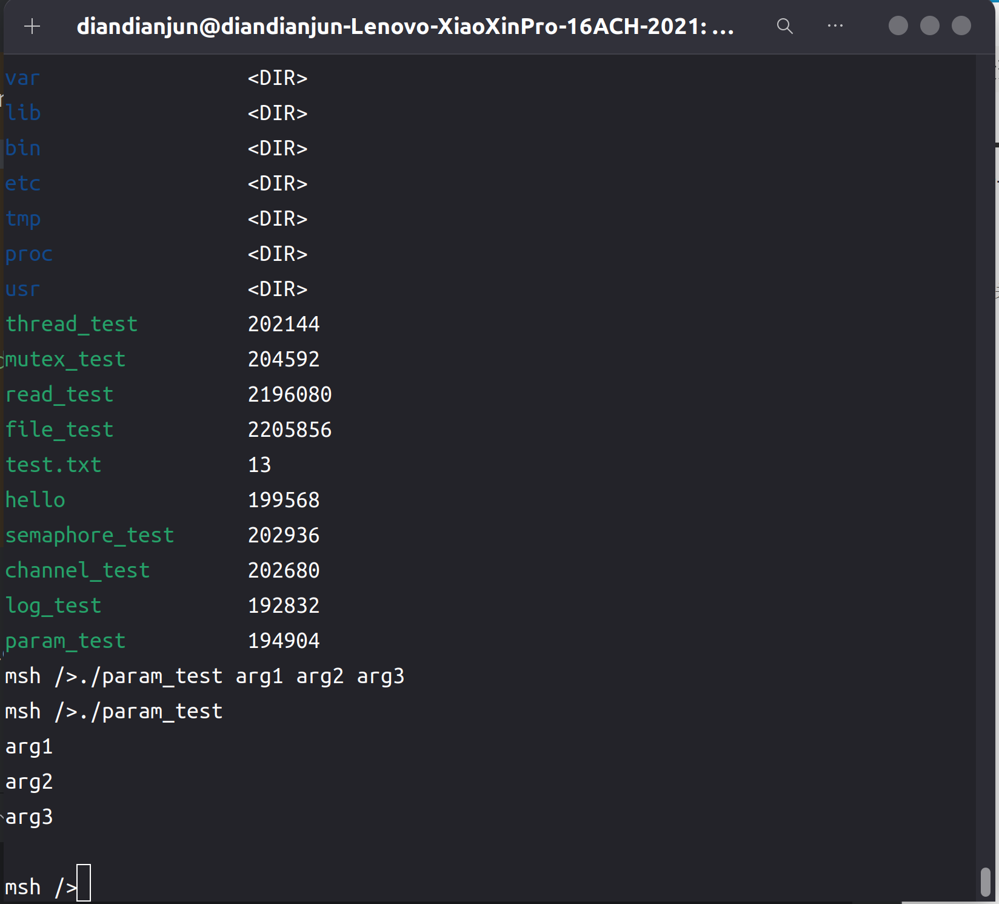

# 2024.06.23-2024.06.29-work-log

## 工作进展

本阶段完成的任务有：修改marco_main过程宏，使其支持从命令行读入用户输入的参数，便于用户与应用程序进行交互

## 资料收集

Rust参考手册：https://rustwiki.org/zh-CN/reference/procedural-macros.html

Rust宏小册：https://zjp-cn.github.io/tlborm/

学习编写过程宏的相关细节

## marco_main相关修改

首先需要main函数接受参数，先定义一个Param类作为接受的对象

```rust
use alloc::vec::Vec;
use core::iter::IntoIterator;
use core::ops::Deref;
use core::fmt::{self, Display};

#[derive(Debug)]
pub struct ParamItem(&'static [u8]);

impl Deref for ParamItem {
    type Target = [u8];
    fn deref(&self) -> &Self::Target {
        return self.0;
    }
}

impl Display for ParamItem {
    fn fmt(&self, f: &mut fmt::Formatter) -> fmt::Result {
        write!(f, "{}", core::str::from_utf8(self.0).unwrap())
    }
}

impl ParamItem {
    pub fn new(raw: &'static [u8]) -> Self {
        ParamItem(raw)
    }
}

pub type Param = <Vec<ParamItem> as IntoIterator>::IntoIter;
```

每个参数ParamItem是一个u8类型的数组切片，Param类是多个ParamItem构成的动态数组。这样参数即可以字符串形式输入，以u8数组切片的形式传递，用户可自行将其转换回字符串。

除此之外，需要让main函数接受一个输入参数

```Rust
// check the function signature
let valid_signature = f.sig.constness.is_none()
    && f.sig.unsafety.is_none()
    && f.sig.asyncness.is_none()
    && f.vis == Visibility::Inherited
    && f.sig.abi.is_none()
    && f.sig.inputs.len() == 1
    && f.sig.generics.params.is_empty()
    && f.sig.generics.where_clause.is_none()
    && f.sig.variadic.is_none()
    && match f.sig.output {
    ReturnType::Default => true,
    _ => false,
};
```

然后在外围包裹一个函数用于处理C语言中接受的参数，将其转换封装成Param对象，传入到main函数中

```rust
let core = quote!(
    #[no_mangle]
    pub unsafe extern "C" fn #main_func_name(argc: u32, argv: *const *const u8) {
        use core::iter::Iterator;
        use rtsmart_std::param::ParamItem;
        let vec = {
            (0..argc as isize)
                .map(|i| {
                    let mut len = 0usize;
                    loop {
                        if *(*argv.offset(i)).offset(len as isize) != b'\0' {
                            len += 1;
                        } else {
                            break
                        }
                    }
                    ParamItem::new(core::slice::from_raw_parts::<'static, _>(*argv.offset(i), len))
                })
                .collect::<Vec<_>>()
        };
        #call_func_name (vec.into_iter())
    }
);
```

自此之后，由于外围这个函数充当C语言中的main函数，因此我们定义的函数不能再叫main函数，必须改叫其他函数，我们约定叫做rust_main

## 测试

编写如下测试程序

```Rust
#![no_std]
#![no_main]

extern crate alloc;

use marco_main::marco_main_use;
use rtsmart_std::param::Param;
use rtsmart_std::println;

#[marco_main_use(appname = "rust_param", desc = "Rust example8 app.")]
fn rust_main(_param: Param) {
    for p in _param {
        println!("{}", p);
    }
}
```

该程序十分简单，把从命令行中读取的参数全部输出即可

编译运行，和前面的程序一样，命令如下：

```shell
cargo xbuild -Zbuild-std=core,alloc --release
```

在target/aarch64-unknown-rtsmart/debug里能找到编译好的应用程序param_test

将其通过挂载文件系统放入qemu虚拟机磁盘后运行

运行结果如下图所示：



可以观察到它依次输出了每个传入的命令行参数，包括运行该程序的命令，说明读取命令行参数的功能实现成功。

## 总结

本周的主要工作是为我们的项目添加了接受用户输入的命令行参数的功能，因为在开发者编写应用程序时，往往需要基于用户输入的参数进行特定的功能调整，因此在我们看来，main函数接受命令行参数是十分重要的功能。

下周我们计划添加新的与进程通讯相关的标准库。