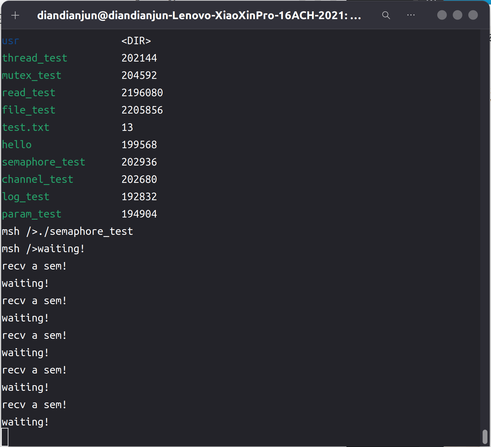

# 2024.06.30-2024.07.06-work-log

## 工作进展

本阶段完成的任务有：查看rt-thread中**semaphore**相关的接口函数，将其添加到libc中，并基于这些函数，编写Rust中的semaphore库

`semaphore` 库是一个 Rust 库，用于实现信号量（Semaphore）机制。信号量是一种常见的同步原语，广泛用于多线程编程中，用于控制对共享资源的访问。信号量可以用于限制资源的并发访问次数，防止资源竞争或数据不一致问题。

## 资料收集

RT-Thread编程手册：https://gitee.com/rtthread/rtthread-manual-doc

RT-Thread API参考手册：https://www.rt-thread.org/document/api/

Rust标准库：https://rustwiki.org/zh-CN/std/thread/index.html

## rt-thread中semaphore相关的api

```c
/*
 * semaphore interface
 */
rt_err_t rt_sem_init(rt_sem_t    sem,
                     const char *name,
                     rt_uint32_t value,
                     rt_uint8_t  flag);
rt_err_t rt_sem_detach(rt_sem_t sem);
rt_sem_t rt_sem_create(const char *name, rt_uint32_t value, rt_uint8_t flag);
rt_err_t rt_sem_delete(rt_sem_t sem);

rt_err_t rt_sem_take(rt_sem_t sem, rt_int32_t time);
rt_err_t rt_sem_take_interruptible(rt_sem_t sem, rt_int32_t time);
rt_err_t rt_sem_take_killable(rt_sem_t sem, rt_int32_t time);
rt_err_t rt_sem_trytake(rt_sem_t sem);
rt_err_t rt_sem_release(rt_sem_t sem);
rt_err_t rt_sem_control(rt_sem_t sem, int cmd, void *arg);
```

```C
/**
 * Semaphore structure
 */
struct rt_semaphore
{
    struct rt_ipc_object parent; /**< inherit from ipc_object */
    rt_uint16_t value; /**< value of semaphore. */
    rt_uint16_t reserved; /**< reserved field */
};
```

将其加入到libc中，转换为Rust风格的调用接口：

```rust
pub type rt_sem_t = *mut c_void;

pub fn rt_sem_create(name: *const ::c_char, value: ::rt_int32_t, flag: ::rt_uint8_t) -> rt_sem_t;
pub fn rt_sem_delete(sem: rt_sem_t) -> rt_err_t;
pub fn rt_sem_take(sem: rt_sem_t, time: ::rt_int32_t) -> rt_err_t;
pub fn rt_sem_release(sem: rt_sem_t) -> rt_err_t;
```

由于我们不需要用到rt_semaphore结构体内部的变量，因此我们只将rt_sem_t定义为void*，不具体实现内部的结构

## semaphore库

### semaphore

Semaphore对象持有对应的信号量变量

```rust
pub struct Semaphore {
    pub sem: rt_sem_t,
}
```

并支持以下接口

```rust
impl Semaphore {
    pub fn new(name: &str) -> Option<Self> {
        sem_create(name)
    }

    pub fn take(&self, tick: isize) -> bool {
        sem_take(&self, tick)
    }

    pub fn take_wait_forever(&self) {
        sem_take_forever(&self)
    }

    pub fn release(&self) {
        sem_release(&self)
    }
    
    pub fn drop(&self) {
        sem_delete(&self)
    }
}
```

这些接口基于libc中对应的库函数实现

```rust
use alloc::ffi::CString;
use libc::{c_char, RT_IPC_FLAG_FIFO};
use crate::semaphore::Semaphore;

pub fn sem_create(name: &str) -> Option<Semaphore> {
    let name = CString::new(name).unwrap();
    let name_c = name.as_ptr() as *const c_char;
    let sem = unsafe { libc::rt_sem_create(name_c, 0, RT_IPC_FLAG_FIFO) };
    if sem.is_null() {
        None
    } else {
        Some(Semaphore { sem })
    }
}

pub fn sem_take(sem: &Semaphore, tick: isize) -> bool {
    let ret = unsafe { libc::rt_sem_take(sem.sem, tick as _) };
    ret == 0
}

pub fn sem_take_forever(sem: &Semaphore) {
    unsafe {
        libc::rt_sem_take(sem.sem, libc::RT_WAITING_FOREVER);
    }
}

pub fn sem_release(sem: &Semaphore) {
    unsafe {
        libc::rt_sem_release(sem.sem);
    }
}

pub fn sem_delete(sem: &Semaphore) {
    unsafe {
        libc::rt_sem_delete(sem.sem);
    }
}
```

由于信号量也属于线程间的共享资源，因此必须实现`Send`和`Sync`这两个trait，才能保证数据在多线程间访问时不报错

```rust
unsafe impl Send for Semaphore {}
unsafe impl Sync for Semaphore {}
```

## semaphore库测试

### 编写测试代码

```rust
#![no_std]
#![no_main]

extern crate alloc;

use alloc::sync::Arc;
use core::time::Duration;
use marco_main::marco_main_use;
use rtsmart_std::param::Param;
use rtsmart_std::semaphore::Semaphore;
use rtsmart_std::{println, thread, time};

#[marco_main_use(appname = "rust_sem_test", desc = "Rust example9 app.")]
fn rust_main(_param: Param) {
    let send = Arc::new(Semaphore::new("Semaphore").unwrap());
    let recv = send.clone();

    let _ = thread::Thread::new()
        .name("thread 1")
        .stack_size(1024)
        .start(move || {
            loop {
                time::sleep(Duration::new(1, 0));
                send.release()
            }
        });
    time::sleep(Duration::new(1, 0));
    let _ = thread::Thread::new()
        .name("thread 2")
        .stack_size(1024)
        .start(move || {
            loop {
                println!("waiting!");
                recv.take_wait_forever();
                println!("recv a sem!")
            }
        });
}
```

测试代码选择创建两个线程，一个信号量，一个线程获取信号量，然后释放，另一个线程等待信号量，如此反复循环执行，用于测试semaphore库的功能的正确性

编译运行，和前面的程序一样，命令如下：

```shell
cargo xbuild -Zbuild-std=core,alloc --release
```

在target/aarch64-unknown-rtsmart/debug里能找到编译好的应用程序semaphore_test

将其通过挂载文件系统放入qemu虚拟机磁盘后运行

运行结果如下图所示：



可以观察到释放信号量的线程释放后，等待信号量的线程可以拿到信号量，因此该库的功能编写是正确的。

## 总结

本周的工作主要是编写了semaphore库并测试，semaphore库在开发过程中与thread搭配使用，广泛用于多线程编程中，用于控制对共享资源的访问。信号量可以用于限制资源的并发访问次数，防止资源竞争或数据不一致问题。基于semaphore库能够编写更多更复杂的多线程应用程序。

下周我们计划开发channel库，即不仅满足于在线程间传递信号量，还能传递任意类型的变量信息，如数字、字符串、甚至是结构体。