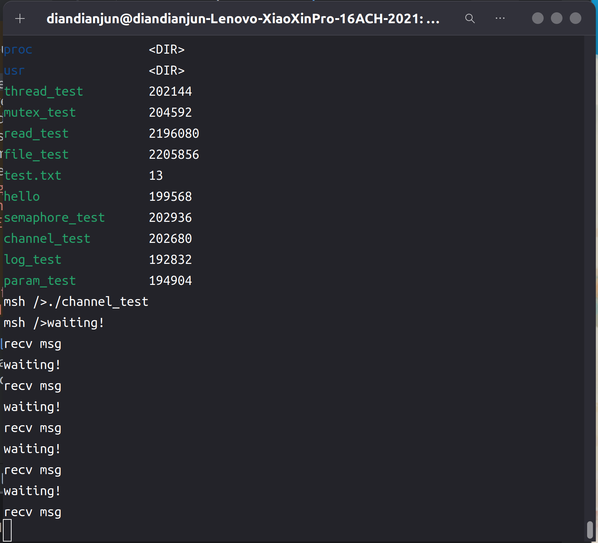

# 2024.07.07-2024.07.13-work-log

## 工作进展

本阶段完成的任务有：查看rt-thread中**rt_messagequeue**相关的接口函数，将其添加到libc中，并基于这些函数，编写Rust中的channel库

`rt_messagequeue` 是 RT-Thread 实时操作系统中的消息队列机制。消息队列用于线程之间的异步通信，允许一个线程向消息队列发送消息，而另一个线程从消息队列接收消息。这种机制可以用于线程之间的数据交换和同步。它是 RT-Thread 中用于实现线程间异步通信的重要机制。通过消息队列，线程可以安全地交换数据，避免了直接共享内存带来的复杂性和潜在风险。消息队列机制在实时操作系统中广泛应用，特别适用于需要高可靠性和实时性的嵌入式系统。

在 Rust 中，`std::sync::mpsc` 模块提供了消息传递通道（channel）机制，用于线程间的通信。`mpsc` 是 "multiple producer, single consumer"（多生产者，单消费者）的缩写。通过 `channel`，一个或多个生产者线程可以向同一个消费者线程发送消息。

基于以上信息我们可知，可以基于RT-Thread的messagequeue机制实现rust中的channel，方便地实现线程间通信。

## 资料收集

RT-Thread编程手册：https://gitee.com/rtthread/rtthread-manual-doc

RT-Thread API参考手册：https://www.rt-thread.org/document/api/

Rust标准库：https://rustwiki.org/zh-CN/std/thread/index.html

## rt-thread中messagequeue相关的api

```c
/*
 * message queue interface
 */
rt_err_t rt_mq_init(rt_mq_t     mq,
                    const char *name,
                    void       *msgpool,
                    rt_size_t   msg_size,
                    rt_size_t   pool_size,
                    rt_uint8_t  flag);
rt_err_t rt_mq_detach(rt_mq_t mq);
rt_mq_t rt_mq_create(const char *name,
                     rt_size_t   msg_size,
                     rt_size_t   max_msgs,
                     rt_uint8_t  flag);
rt_err_t rt_mq_delete(rt_mq_t mq);

rt_err_t rt_mq_send(rt_mq_t mq, const void *buffer, rt_size_t size);
rt_err_t rt_mq_send_interrupt(rt_mq_t mq, const void *buffer, rt_size_t size);
rt_err_t rt_mq_send_killable(rt_mq_t mq, const void *buffer, rt_size_t size);
rt_err_t rt_mq_send_wait(rt_mq_t     mq,
                         const void *buffer,
                         rt_size_t   size,
                         rt_int32_t  timeout);
rt_err_t rt_mq_send_wait_interruptible(rt_mq_t     mq,
                         const void *buffer,
                         rt_size_t   size,
                         rt_int32_t  timeout);
rt_err_t rt_mq_send_wait_killable(rt_mq_t     mq,
                         const void *buffer,
                         rt_size_t   size,
                         rt_int32_t  timeout);
rt_err_t rt_mq_urgent(rt_mq_t mq, const void *buffer, rt_size_t size);
rt_err_t rt_mq_recv(rt_mq_t    mq,
                    void      *buffer,
                    rt_size_t  size,
                    rt_int32_t timeout);
rt_err_t rt_mq_recv_interruptible(rt_mq_t    mq,
                    void      *buffer,
                    rt_size_t  size,
                    rt_int32_t timeout);
rt_err_t rt_mq_recv_killable(rt_mq_t    mq,
                    void      *buffer,
                    rt_size_t  size,
                    rt_int32_t timeout);
rt_err_t rt_mq_control(rt_mq_t mq, int cmd, void *arg);
```

```c
/**
 * message queue structure
 */
struct rt_messagequeue
{
    struct rt_ipc_object parent; /**< inherit from ipc_object */

    void *msg_pool; /**< start address of message queue */

    rt_uint16_t msg_size; /**< message size of each message */
    rt_uint16_t max_msgs; /**< max number of messages */

    rt_uint16_t entry; /**< index of messages in the queue */

    void *msg_queue_head; /**< list head */
    void *msg_queue_tail; /**< list tail */
    void *msg_queue_free; /**< pointer indicated the free node of queue */

    rt_list_t suspend_sender_thread; /**< sender thread suspended on this message queue */
};
typedef struct rt_messagequeue *rt_mq_t;
```

将其加入到libc中，转换为Rust风格的调用接口：

```rust
pub type rt_mq_t = *mut c_void;

pub fn rt_mq_create(name: *const ::c_char, msg_size: rt_size_t, max_msgs: rt_size_t, flag: rt_uint8_t) -> rt_mq_t;
pub fn rt_mq_send(mq: rt_mq_t, buffer: *const ::c_void, size: rt_size_t) -> rt_err_t;
pub fn rt_mq_send_wait(mq: rt_mq_t, buffer: *const ::c_void, size: rt_size_t, timeout: rt_int32_t) -> rt_err_t;
pub fn rt_mq_recv(mq: rt_mq_t, buffer: *mut ::c_void, size: rt_size_t, timeout: rt_int32_t) -> rt_base_t;
pub fn rt_mq_delete(mq: rt_mq_t) -> rt_err_t;
pub fn rt_mq_detach(mq: rt_mq_t) -> rt_err_t;
```

由于我们不需要用到rt_messagequeue结构体内部的变量，因此我们只将rt_mq_t定义为void*，不具体实现内部的结构

## channel库

首先定义通信的节点Node

```rust
#[derive(Clone)]
pub struct Node<T> {
    pub mq: MessageQueue,
    item_type: PhantomData<UnsafeCell<T>>,
}
```

因为支持任意类型的数据传递，所以设定为泛型

其提供如下接口：

```rust
impl <T>Node<T> {
    pub fn new(mq: MessageQueue) -> Option<Self> {
        Some(Node { 
            mq,
            item_type: PhantomData,
        })
    }
    
    pub fn send(&self, item: T) {
        let inner = MaybeUninit::new(item);
        mq_send(self.mq, inner.as_ptr() as *const c_void, size_of::<T>() as _, libc::RT_WAITING_FOREVER)
    }
    
    pub fn send_timeout(&self, item: T, timeout: i32) {
        let inner = MaybeUninit::new(item);
        mq_send(self.mq, inner.as_ptr() as *const c_void, size_of::<T>() as _, timeout)
    }

    pub fn recv(&self) -> Option<T> {
        let mut item = MaybeUninit::<T>::uninit();
        mq_recv(self.mq, item.as_mut_ptr() as *mut c_void, size_of::<T>() as _, libc::RT_WAITING_FOREVER);
        Some(unsafe { item.assume_init() })
    }

    pub fn recv_timeout(&self, timeout: i32) -> Option<T> {
        let mut item = MaybeUninit::<T>::uninit();
        mq_recv(self.mq, item.as_mut_ptr() as *mut c_void, size_of::<T>() as _, timeout);
        Some(unsafe { item.assume_init() })
    }
}
```

其中send和receive主要基于rt_mq_send和rt_mq_recv实现

`MaybeUninit` 是 Rust 标准库中的一个工具类型，用于表示可能未初始化的内存。它可以帮助开发者安全地处理未初始化的变量，避免未定义行为，同时提高性能。

这里用MaybeUninit来封装数据内存是为了提供了对未初始化内存比裸指针更好的的安全控制避免未定义行为并提升性能。

最后，再定义获取通信节点的方法

```rust
pub fn channel<T>(name: &str, num: u32) -> (Arc<Node<T>>, Arc<Node<T>>) {
    let mb = mq_create(name, num, size_of::<T>() as _);
    let node = Arc::new(Node::new(mb).unwrap());
    (node.clone(), node)
}
```

节点均由Arc包裹，可以被复制和移动到线程闭包中使用

## channel库测试

### 编写测试代码

```rust
#![no_std]
#![no_main]

extern crate alloc;

use marco_main::marco_main_use;
use rtsmart_std::{mpsc, println, time};
use rtsmart_std::api::thread::thread_m_delay;
use rtsmart_std::param::Param;
use rtsmart_std::thread::Thread;

#[marco_main_use(appname = "rust_channel_test", desc = "Rust example10 app.")]
fn rust_main(_param: Param) {
    let (tx, rx) = mpsc::channel("rust_channel_test", 2);
    let run1 = move || {
        loop {
            tx.send(String::from("msg"));
            time::sleep(Duration::new(1, 0));
        }
    };
    let run2 = move || {
        loop {
            time::sleep(Duration::new(1, 0));
            println!("waiting!");
            let a = rx.recv().unwrap();
            println!("recv {}", a);
        }
    };
    let t1 = Thread::new()
        .name("thread 1")
        .stack_size(4096)
        .start(run1.clone());
    let t2 = Thread::new()
        .name("thread 2")
        .stack_size(4096)
        .start(run2.clone());
}
```

测试代码创建了两个线程和一个channel，一个线程用于发送数据，另一个线程用于接收并输出数据的值，这里数据以字符串为例。如此反复循环执行，用于测试channel库的功能的正确性

编译运行，和前面的程序一样，命令如下：

```shell
cargo xbuild -Zbuild-std=core,alloc --release
```

在target/aarch64-unknown-rtsmart/debug里能找到编译好的应用程序channel_test

将其通过挂载文件系统放入qemu虚拟机磁盘后运行

运行结果如下图所示：



可以观察到接受数据的线程能够正确输出发送方发送的对应的数据，因此该库的功能编写是正确的。

## 总结

本周的工作主要是编写了channel库并测试，channel库在开发过程中与thread搭配使用，是基于rt-thread中的messagequeue实现的消息传递通道机制，方便地实现线程间通信。通过使用通道，开发者可以避免直接使用共享内存，从而减少并发编程中的复杂性和错误风险。消息传递通道广泛应用于多线程编程场景中，特别适用于需要高并发和实时性的系统。