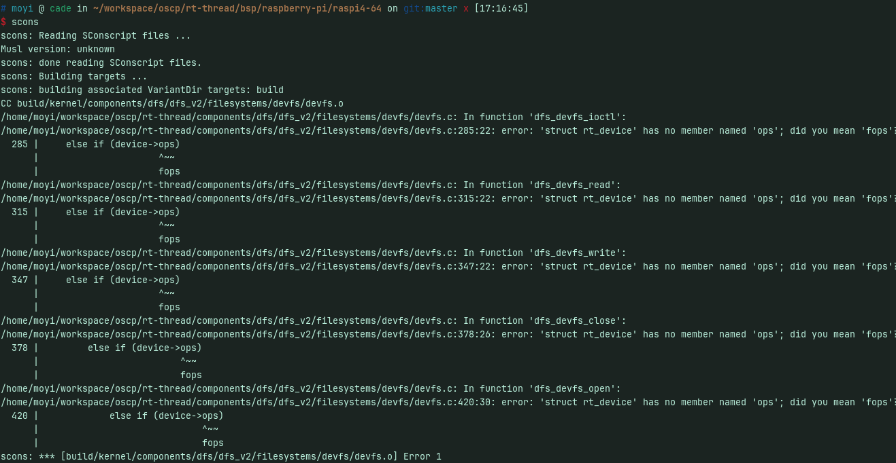
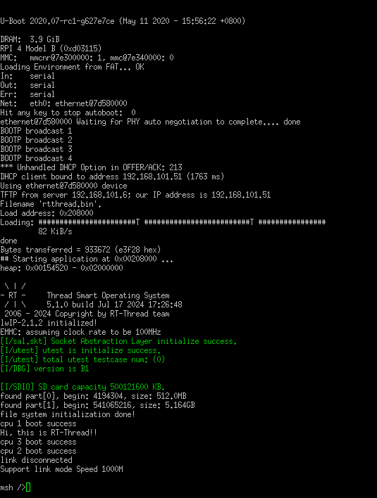
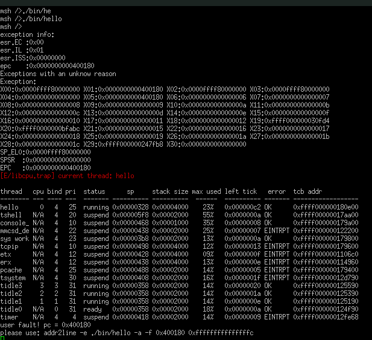

# 2024.07.14-2024.07.20-work-log
## 工作进展

本阶段完成的任务是将RT-Thread的smart内核移植到树莓派4B上，并构建SD卡启动。然后测试当前项目编译出的Rust程序在树莓派上的运行情况。

## 编译固件
环境： linux amd64

下载rt-thread原码

在bsp\raspberry-pi\raspi4-64目录中运行配置
```
scons --menuconfig  
```
启用smart内核


保存设置后，编译固件
```
scons
```
报错

查询资料，根据[issue](https://github.com/RT-Thread/rt-thread/issues/8420)可以对bsp进行修改

修改`rt-thread/components/dfs/dfs_v2/filesystems/devfs/devfs.c`285行，315行，347行，378行，420行的ops为fops后成功编译


## 构建SD卡
使用raspi-imager先刷入raspberry os 。然后，将/bsp/toosl/uboot.bin和config.txt放入sd卡的boot


## 上机
如下所示连接 USB 转 TTL 串口线：

Radxa SBC	连接	串口线
GND (pin 6)	<--->	黑色线
TX (pin 8)	<--->	白色线
RX (pin 10)	<--->	绿色线
使用tty转usb连线


## 问题
发现运行程序出现问题，判断为bsp配置问题，询问社区发现树莓派缺少社区支持


## 总结

本周主要工作是将RT-Thread的smart内核移植到树莓派4B上，并构建SD卡启动。然后测试当前项目编译出的Rust程序在树莓派上的运行情况。在移植过程中遇到了一些问题，通过查阅资料和询问社区解决了一部分问题，但是最终还是没有成功运行。原因是树莓派4B的支持不够完善，后续我们选择更换其他开发板进行测试。
