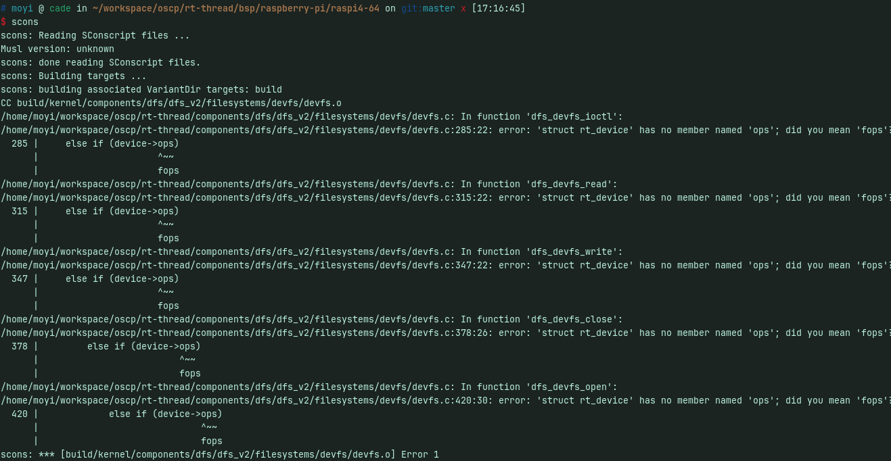
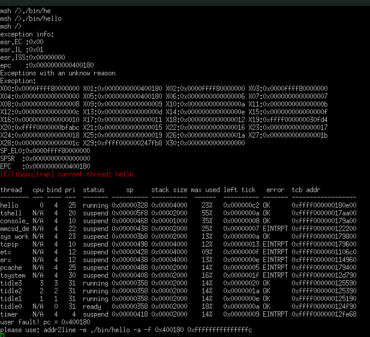

# 2024.07.14-2024.07.28-work-log
## 编译固件
环境： linux amd64

下载rt-thread原码

在bsp\raspberry-pi\raspi4-64目录中运行配置
```
scons --menuconfig  
```
启用smart内核


保存设置后，编译固件
```
scons
```
报错

查询资料，根据[issue](https://github.com/RT-Thread/rt-thread/issues/8420)可以对bsp进行修改

修改`rt-thread/components/dfs/dfs_v2/filesystems/devfs/devfs.c`285行，315行，347行，378行，420行的ops为fops后成功编译


## 构建SD卡
使用raspi-imager先刷入raspberry os 。然后，将/bsp/toosl/uboot.bin和config.txt放入sd卡的boot


## 上机


## 问题
