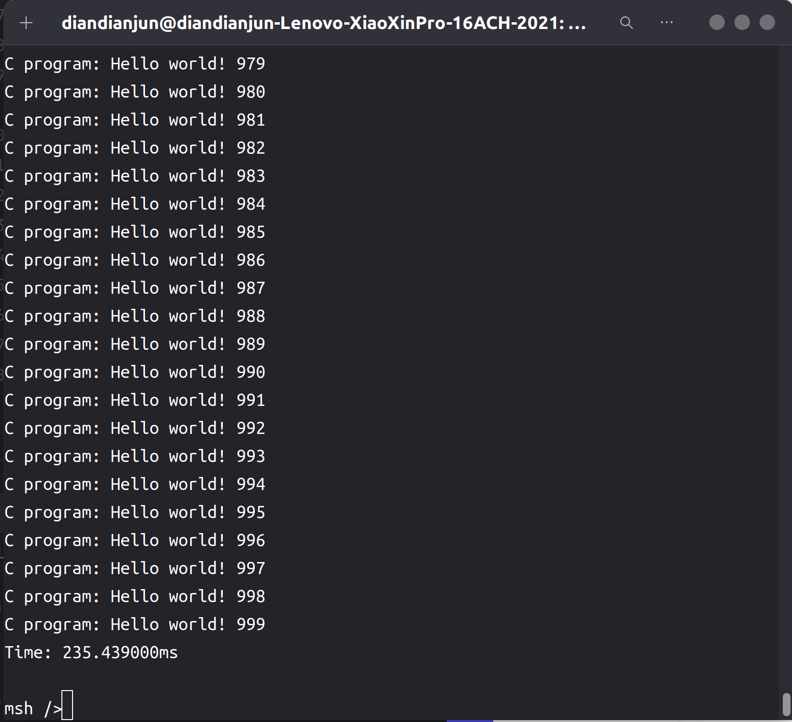
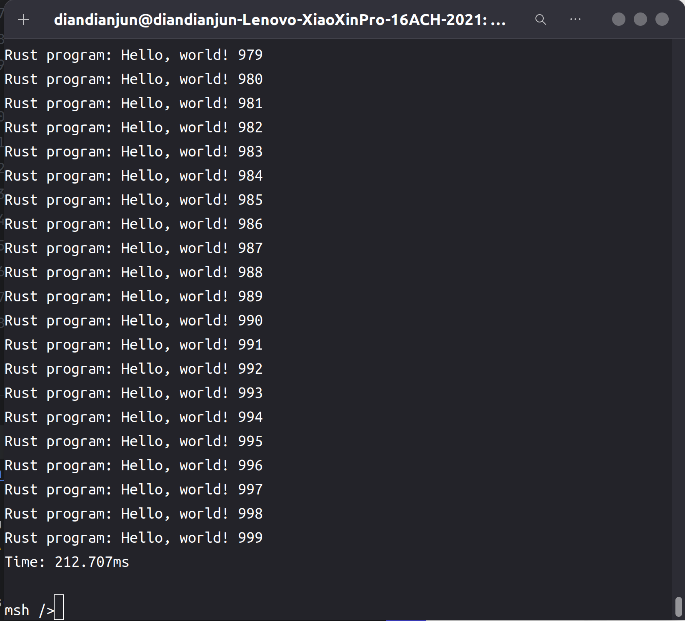
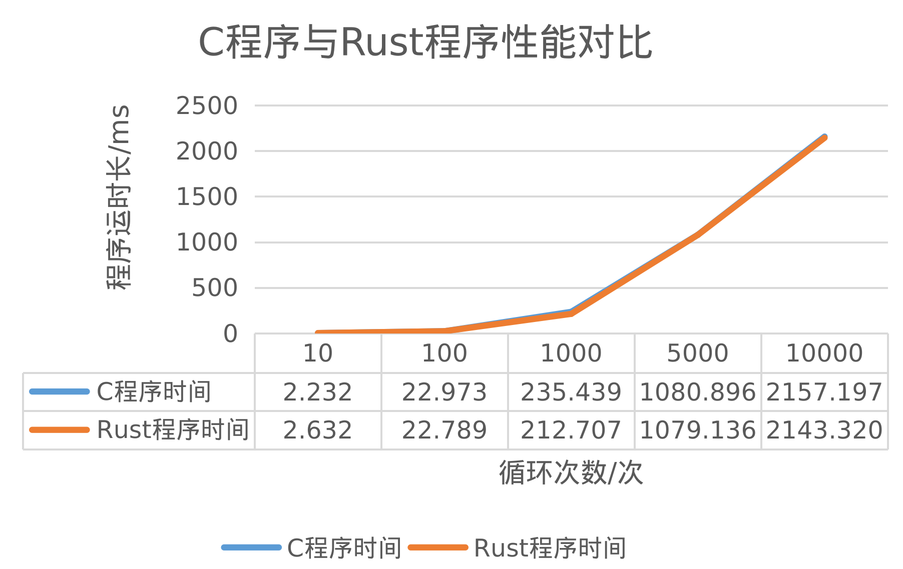

# 2024.07.21-2024.07.27-work-log

## 工作进展

本周完成的主要有：对我们开发的项目进行benchmark，即将基于rust语言编写的应用程序在rt-thread上的运行时间，与基于C语言编写的应用程序在rt-thread上运行的运行时间相比较，比较二者的性能，从而可以得知我们的项目是否有在生产环境上运行的潜力

要达到这个目的需要设计用于benchmark的应用程序，学习使用测量代码运行时间的接口，并将其引入到rust库中。然后编写相同操作的C程序，在rt-thread上运行得到二者的运行时间结果，再进行对比分析

## 资料收集

POISX接口标准库：https://pubs.opengroup.org/onlinepubs/7908799/index.html

RT-Thread API参考手册：https://www.rt-thread.org/document/api/

Rust标准库：https://rustwiki.org/zh-CN/std/thread/index.html

## 代码时间测量

在C语言中可以使用函数gettimeofday()函数来得到精确时间。它的精度可以达到微妙，是C标准库的函数。

```c
#include<sys/time.h>

int gettimeofday(struct  timeval*tv,struct  timezone *tz )
```

gettimeofday()会把目前的时间用tv 结构体返回，当地时区的信息则放到tz所指的结构中

**timeval 结构体定义：**

```c
struct  timeval{
   long  tv_sec;  /*秒*/
   long  tv_usec; /*微妙*/
}；
```

将该接口函数添加到rust的libc中

```rust
pub fn gettimeofday(tp: *mut ::timeval, tz: *mut ::c_void) -> ::c_int;
```

```rust
pub struct timeval {
    pub tv_sec: time_t,
    pub tv_usec: suseconds_t,
}
```

在rust中添加time库，并添加一个用于获取当前时间的函数

```rust
pub fn get_time() -> Duration {
    let mut tv = libc::timeval {
        tv_sec: 0,
        tv_usec: 0,
    };
    unsafe {
        libc::gettimeofday(&mut tv, core::ptr::null_mut());
    }
    Duration::new(tv.tv_sec as u64, tv.tv_usec as u32 * 1000)
}
```

至此，我们为C语言程序和Rust程序的代码时间测量找到了解决方案

## 测试程序代码

C程序代码：

```c
#include <stdio.h>
#include <stdlib.h>
#include <unistd.h>
#include <sys/time.h>

int main(int argc, char **argv) {
    struct timeval tv_begin, tv_end;
    gettimeofday(&tv_begin,NULL);
    for (int i = 0; i < 1000; i++) {
        printf("C program: Hello world! %d\n", i);
    }
    gettimeofday(&tv_end,NULL);
    double milisecs = (tv_end.tv_sec - tv_begin.tv_sec) * 1000.0 + (tv_end.tv_usec - tv_begin.tv_usec) / 1000.0;
    printf("Time: %fms\n", milisecs);
    return 0;
}
```

Rust程序代码：

```rust
#![no_std]
#![no_main]

extern crate alloc;

use marco_main::marco_main_use;
use rtsmart_std::{println, time};
use rtsmart_std::param::Param;

#[marco_main_use(appname = "rust_bench", desc = "Rust bench app.")]
fn rust_main(_param: Param) {
    let start = time::get_time();
    for i in 0..1000 {
        println!("Rust program: Hello, world! {}", i);
    }
    let end = time::get_time();
    println!("Time: {:?}", end   - start);
}
```

循环进行输出，循环次数可调整，代码开始和结束时分别打时间戳进行时间测量，最终将结果输出

c程序编译命令：

```shell
aarch64-linux-musleabi-gcc ./main.c -o c_bench -static
```

Rust程序编译命令：

```shell
cargo xbuild -Zbuild-std=core,alloc --release
```

将二者编译出来的程序通过挂载文件系统放入qemu虚拟机磁盘后运行

C程序运行结果如下：



Rust程序运行结果如下：



可以观察到Rust程序的运行性能更佳

## 多组bench测试

更换循环次数，进行多组测试，画出如下测试结果折线图

| 循环次数 | C程序时间  | Rust程序时间 |
| -------- | ---------- | ------------ |
| 10次     | 2.232ms    | 2.632ms      |
| 100次    | 22.973ms   | 22.789ms     |
| 1000次   | 235.439ms  | 212.707      |
| 5000次   | 1080.896ms | 1079.136ms   |
| 10000次  | 2157.197ms | 2143.320ms   |



## 总结

本周我们对我们的项目，在RT-Thread Smart上支持Rust语言编写的用户态程序进行了性能测试，主要是与C语言编写的用户态程序的运行时间进行对比，发现Rust语言编写的程序与C语言编写的程序的运行性能非常接近，差距很小，因此将该项目使用在生产环境中是具有可行性的。
