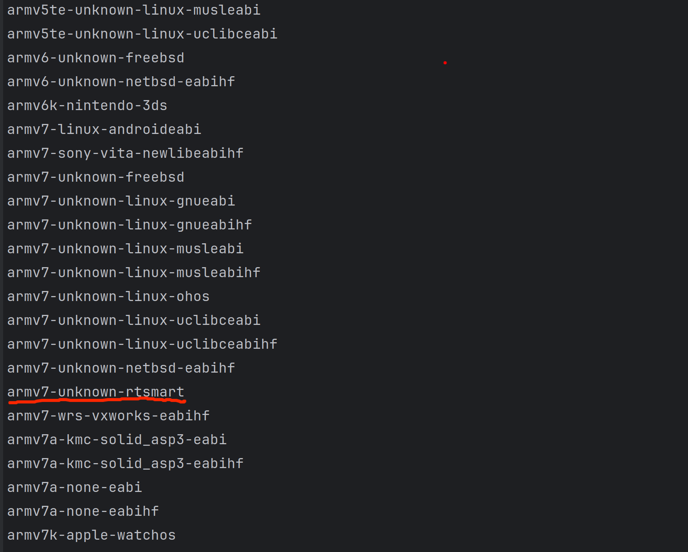
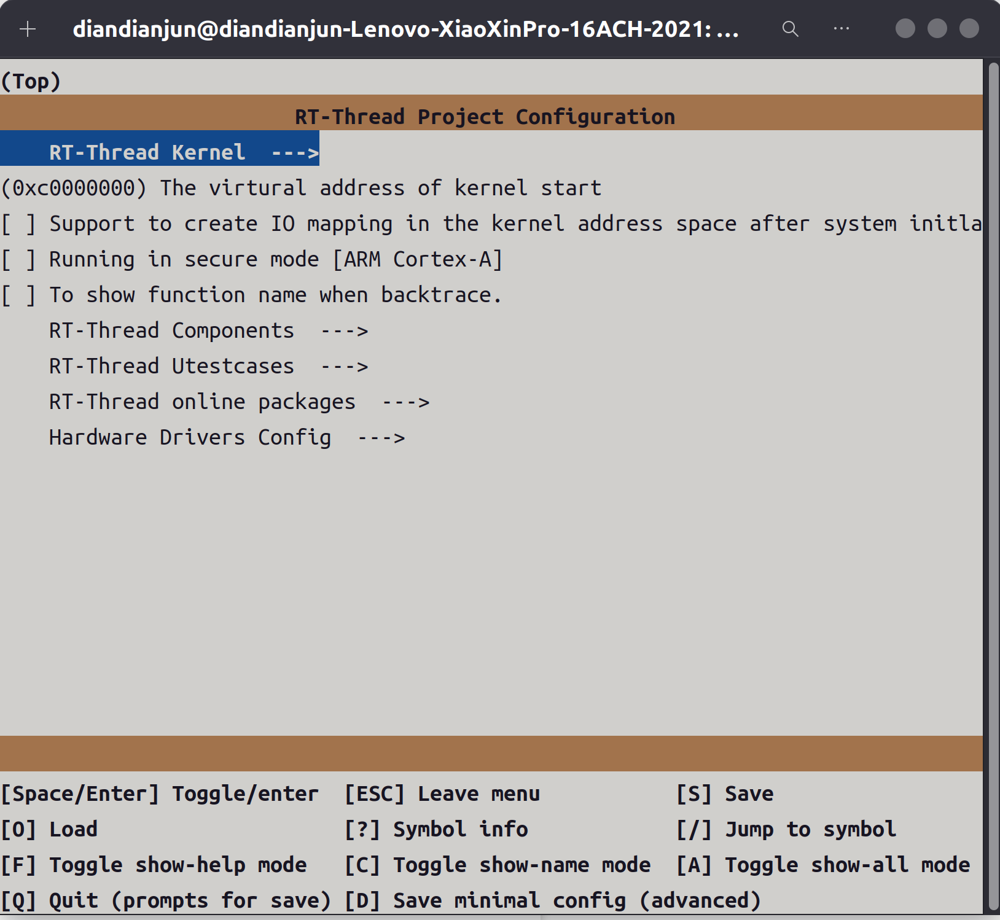
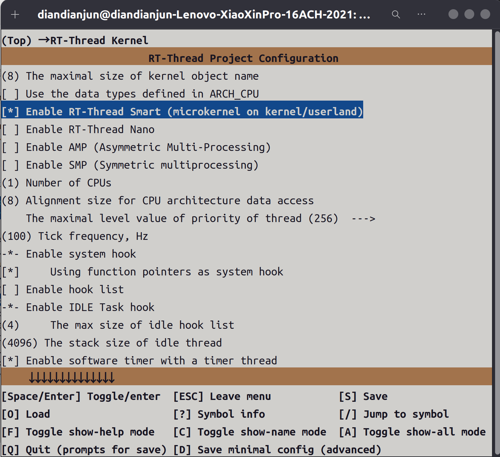
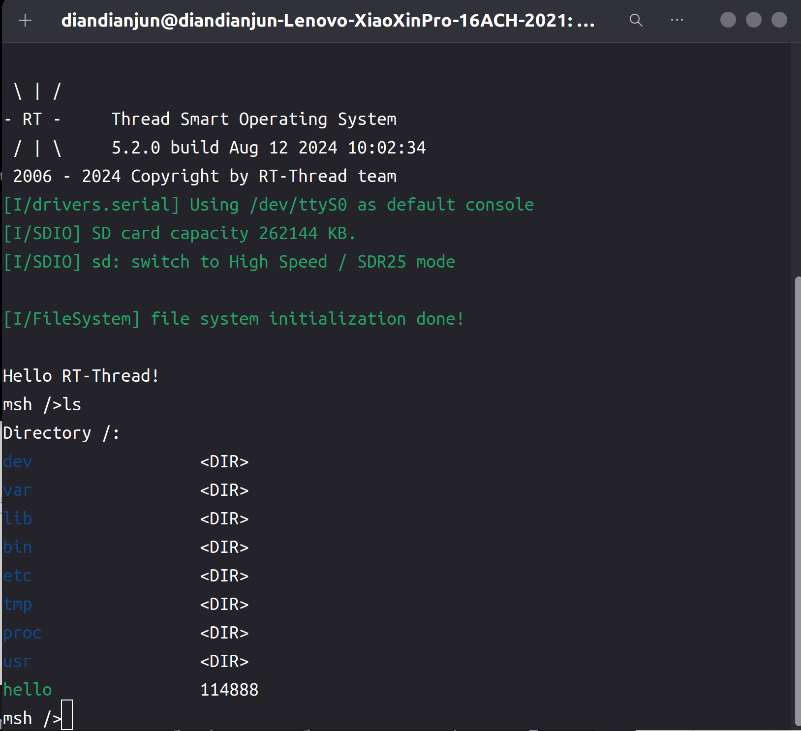
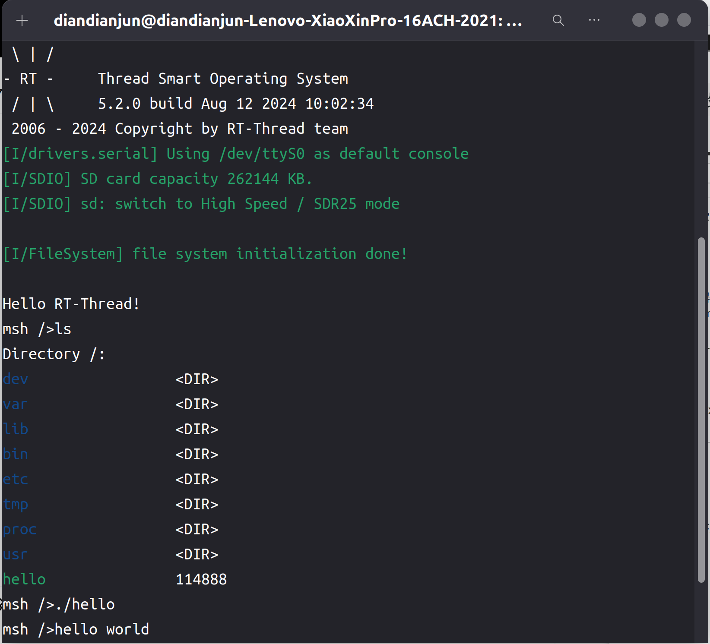

# 2024.08.01-2024.08.07-work-log

## 工作进展

本阶段主要完成的任务有：由于`aarch64`架构的开发板缺乏资料和社区支持，因此我们新增了一个`armv7-unknown-rtsmart`的编译目标，以便继续尝试将项目移植到真机上进行测试

## 资料收集

为Rust编译器添加一个编译目标：https://rustc-dev-guide.rust-lang.org/building/new-target.html#specifying-a-new-llvm

在#![no_std]环境下调用`libc`编写Rust程序：https://users.rust-lang.org/t/solved-hello-world-no-std-build-problem/23122/2

Rust链接c语言静态库：https://doc.rust-lang.org/cargo/reference/build-scripts.html#rustc-link-lib

从源码编译Rust编译器：https://www.jianshu.com/p/63ce92182dbf

## 为Rust编译器添加armv7-unknown-rtsmart的编译目标

找到`rust/compiler/rustc_target/src/spec`

在targets文件夹中添加文件`armv7_unknown_rtsmart.rs`，该target的配置内容如下：

```rust
pub fn target() -> Target {

    let mut base = rtsmart_base::opts();
    base.max_atomic_width = Some(64);
    base.env = "gnu".into();
    base.linker =  Some("arm-linux-musleabi-gcc".into());
    
    Target {
        llvm_target: "armv7-unknown-linux-gnueabi".into(),
        metadata: crate::spec::TargetMetadata {
            description: None,
            tier: None,
            host_tools: None,
            std: None,
        },
        pointer_width: 32,
        data_layout: "e-m:e-p:32:32-Fi8-i64:64-v128:64:128-a:0:32-n32-S64".into(),
        arch: "arm".into(),

        options: TargetOptions {
            // Info about features at https://wiki.debian.org/ArmHardFloatPort
            features: "+v7,+vfp3,-d32,+thumb2,-neon".into(),
            cpu: "generic".into(),
            max_atomic_width: Some(64),
            // unsupported_abis: arm_base::unsupported_abis(),
            mcount: "\u{1}__gnu_mcount_nc".into(),
            // linker_flavor: LinkerFlavor::Gnu(crate::spec::Cc::Yes, crate::spec::Lld::Yes),
            // link_script: Some(LINKER_SCRIPT.into()),
            ..base
        },
    }
}
```

首先还是复用了`aarch64-unknown-rtsmart`平台关于rtsmart系统的通用配置`rtsmart_base`。

- base.max_atomic_width = Some(64);
  这个设置表示目标平台支持的最大原子操作宽度是 64 位。在多线程编程中，原子操作是指在不被中断的情况下完成的操作，这对于实现线程安全至关重要。

- base.env = "gnu".into();
  这个设置指定目标环境为 gnu，这意味着编译器将假设使用 GNU 工具链，如 gcc、glibc 等。

- base.linker = Some("arm-linux-musleabi-gcc".into());
  这行代码指定了链接器，即编译过程中使用的工具。这里使用的是 arm-linux-musleabi-gcc，它是一个适用于 ARM 的 GCC 编译器版本。

- llvm_target: "armv7-unknown-linux-gnueabi".into(),
  llvm_target 指定了 LLVM 编译器后端的目标架构。这里的目标是 armv7-unknown-linux-gnueabi，表示编译器生成的代码将针对 ARMv7 架构，且使用 gnueabi 工具链。

- pointer_width: 32,
  这个字段指定目标平台的指针宽度为 32 位，这符合 ARMv7 架构的标准。

- data_layout: "e-m:e-p:32:32-Fi8-i64:64-v128:64:128-a:0:32-n32-S64".into(),
  data_layout 是一个字符串，描述了目标平台的数据布局，包括内存对齐、指针大小、以及其他重要的布局信息。这个布局是 LLVM 用来生成针对目标平台的有效代码的依据。

- features: "+v7,+vfp3,-d32,+thumb2,-neon".into(),
  features 字段列出了目标平台的特性。这些特性可以启用或禁用处理器的一些特性，比如 +v7 表示 ARMv7 架构，+vfp3 表示启用 VFPv3 浮点单元，-d32 表示禁用 32 寄存器，+thumb2 表示启用 Thumb-2 指令集，而 -neon 禁用了 NEON SIMD 扩展。

在`spec/mod.rs`中的第1706行增加模块定义

```rust
("armv7-unknown-rtsmart", armv7_unknown_rtsmart),
```

这样就创建了一个新的编译目标。

然后重新构建并安装Rust编译器：

```shell
./x.py build && ./x.py install
```

在安装目录下的bin目录输入如下命令：

```shell
./rustc --print target-list
```

可以在输出中找到`armv7_unknown_rtsmart`这个编译目标：



## 安装RT-Smart 官方 ARM 32 平台 musl gcc 工具链

下载地址 https://download.rt-thread.org/download/rt-smart/toolchains/arm-linux-musleabi_for_x86_64-pc-linux-gnu_latest.tar.bz2

下载完成后解压到特定目录，然后添加环境变量

```shell
# arm musl gcc
export RTT_CC=gcc
export RTT_EXEC_PATH=/path/to/arm-linux-musleabi_for_x86_64-pc-linux-gnu/bin
export RTT_CC_PREFIX=arm-linux-musleabi-

export PATH=$PATH:$RTT_EXEC_PATH
```

## 修改libc

在libc的`Cargo.toml`中的第46行的targets中添加`armv7-unknown-rtsmart`目标：

```toml
targets = [
    ...
    "armv5te-unknown-linux-gnueabi",
    "armv5te-unknown-linux-musleabi",
    "armv7-linux-androideabi",
    "armv7-unknown-linux-gnueabihf",
    "armv7-unknown-linux-musleabihf",
    "armv7-wrs-vxworks-eabihf",
    "armv7-unknown-rtsmart",
    "armv7r-none-eabi",
    "armv7r-none-eabihf",
    "hexagon-unknown-linux-musl",
    "i586-pc-windows-msvc",
    "i586-unknown-linux-gnu",
    "i586-unknown-linux-musl",
    ...
]
```

然后需要将build.rs中的

```rust
println!("cargo:rustc-link-search=/path/to/lib");
```

改为指向`arm-linux-musleabi`的lib库

同时将libc/src/rtsmart/mod.rs第2330行和2331行的两个静态库导入注释掉

```rust
// #[link(name = "gcc_eh", kind = "static", cfg(target_feature = "crt-static"))]
// #[link(name = "gcc", kind = "static", cfg(target_feature = "crt-static"))]
```

如果导入这两个库链接时会报错

然后将userapp中的`userapps/sdk/rt-thread/lib/arm/cortex-a/librtthread.a`移动到`/opt/arm-linux-musleabi_for_x86_64-pc-linux-gnu/arm-linux-musleabi/lib`中，即上述的`arm-linux-musleabi`的lib库，此次不需要libgcc_eh.a和libgcc.a，因此所需的静态库如下：

```
libutil.a
librt.a
libpthread.a
libm.a
libdl.a
libc.a
librtthread.a
```

## 构建qemu-vexpress-a9的内核镜像

进入到`qemu-vexpress-a9`目录下

```shell
cd ./rt-thread/bsp/qemu-vexpress-a9/  #打开 rt-thread 项目目录中的 bsp/qemu-vexpress-a9 目录
scons --menuconfig
```

1. 选择RT-Thread Kernel选项

   

2. 在内核配置部分勾选`Enable RT-Thread Smart (microkernel on kernel/userland)`以启用smart内核

   

然后在该目录下执行`scons`命令开始编译内核

## 生成arm架构下的文件系统

进入到userapps的目录下

### 编译

首先运行env.sh 添加一下环境变量

```shell
source env.sh
```

进入 apps 目录进行编译

```shell
cd apps
xmake f -a arm # 配置为 arm平台
xmake -j8
```

### 镜像制作

运行 xmake smart-rootfs 制作 rootfs ，运行 xmake smart-image 制作镜像

```shell
xmake smart-rootfs
xmake smart-image -f fat #制作 fat 镜像
```

然后可以在userapps/apps/build下找到fat.img

之后将`fat.img`，`rtthread.bin`，`qemu.sh`放在一个目录下，将`qemu.sh`中的-sd sd.bin改成-sd fat.img，然后注释掉最上面三行，内容如下：

```shell
#if [ ! -f "sd.bin" ]; then
#dd if=/dev/zero of=fat.img bs=1024 count=65536
#fi

qemu-system-arm --version
qemu-system-arm -M vexpress-a9 -smp cpus=2 -kernel rtthread.bin -serial stdio -sd fat.img
```

然后运行`qemu.sh`即可运行该系统

## 编写示例程序进行测试

使用原先的example2/hello程序，将.cargo/config.toml中的编译目标修改为对应平台

```toml
[build]
target = "armv7-unknown-rtsmart"

[target.armv7-unknown-rtsmart]
linker = "arm-linux-musleabi-gcc"
```

然后使用如下命令进行编译

```shell
cargo xbuild -Zbuild-std=core,alloc --release
```

在`target/armv7-unknown-rtsmart/release/hello`处即可找到对应的应用程序

使用如下命令将hello程序移入文件系统中：

```shell
mkdir fat
sudo mount fat.img fat/
sudo cp -fv ./hello ./fat/hello
sudo umount fat/
```

然后用./qemu.sh运行即可在系统内看见hello程序



使用./hello运行当前程序，结果如下：



## 总结

本周我们添加了一个`armv7-unknown-rtsmart`的编译目标，并对其进行了测试，不仅验证了我们的项目方法具有普适性，在其他编译平台上依然可以使用，也可以正常复用我们编写的rtsmart-std这一标准库，可以实现跨平台使用，也为我们下周在移植到arm平台的开发板上进行测试做好了准备。