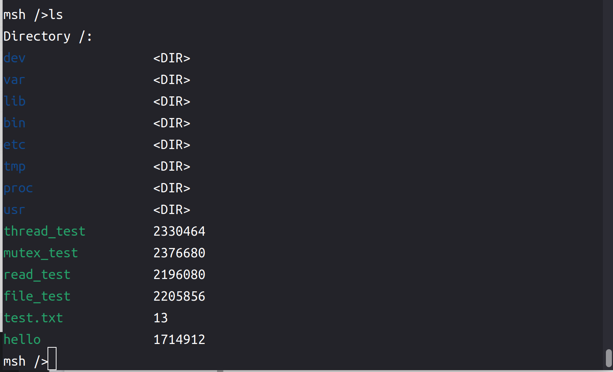

# 在RT-Thread Smart上支持rust语言编写的用户态程序

## 一、项目概述

### 1.1 项目背景

嵌入式平台广泛应用于各类电子设备中，其核心需求之一是能够高效地执行特定任务。这些平台通常具有资源受限的特点，包括有限的处理能力、存储空间和电源供应。因此，实时操作系统（RTOS）成为嵌入式系统的关键组件，它能够提供确定性、高可靠性和低延迟的任务调度和资源管理。

RT-Thread Smart（简称rt-smart）是RT-Thread开源实时操作系统的一个扩展版本，专为嵌入式平台设计。它继承了RT-Thread的核心特性，如高实时性、模块化和灵活性，同时增强了用户态应用程序的支持，使其能够运行复杂的用户态任务。

目前，RT-Thread Smart的用户态应用程序主要支持C/C++语言，并使用musl libc作为其标准库。C/C++语言在嵌入式系统中有着深厚的历史积淀，丰富的库和工具链使其在嵌入式开发中占据重要地位。然而，随着嵌入式系统的复杂性增加，以及对安全性和开发效率的更高要求，C/C++的某些局限性逐渐显现，如手动内存管理的复杂性和潜在的安全漏洞。

#### Rust语言的优势

Rust语言自诞生以来，迅速崭露头角，特别是在系统编程领域。其核心特点包括：

1. **内存安全**：Rust通过所有权系统和借用检查器，确保在编译时避免空指针、悬垂指针和数据竞争等常见的内存安全问题。
2. **高性能**：Rust编译后的程序能够接近甚至达到C/C++的性能，这对于资源受限的嵌入式系统尤为重要。
3. **并发性**：Rust提供了安全且高效的并发编程模型，使得开发者能够充分利用多核处理器的能力，而不必担心并发带来的复杂性和安全问题。
4. **现代化开发体验**：Rust拥有强大的包管理器（Cargo），现代化的语法和工具链，极大地提升了开发者的生产力和代码质量。

将Rust语言引入RT-Thread Smart，不仅能够丰富其用户态应用程序的开发语言选择，还能为嵌入式开发带来诸多优势，如Rust的内存安全特性可以减少因内存错误导致的系统崩溃和安全漏洞。Rust的现代化语法和工具链能够加速开发流程，减少调试和维护时间等。

### 1.2 预期目标

1. 通过封装 `aarch64-smart-museabi` 上的C库函数，基于Rust的FFI机制（Foreign Function Interface，外部函数接口），封装成Rust程序能够调用的接口，再通过静态库链接的方式将库函数链接到最终的应用程序中，保证函数能够被正确调用，从而使得Rust应用程序能够调用 `rtsmart` 操作系统提供的系统功能，为封装Rust功能库提供依赖
2. 通过修改Rust编译器中对于编译平台的支持，添加一个到 `aarch64-unknown-rtsmart` 的编译目标，提供如 `llvm_target`、`linker`、`max_atomic_width`、`pointer_width`、`data_layout`、`arch`等 `aarch64-unknown-rtsmart` 架构和系统有关的target option，使得Rust编译器能够i编译出适配当前架构与系统的机器指令，使得应用程序能够在目标平台上运行
3. 基于目标1封装的libc库，编写Rust生态中常用的标准库函数。即为Rust编写一个针对 `aarch64-unknown-rtsmart` 平台的标准库，使得用户能够调用标准库的函数编写更加复杂的应用程序。

### 1.3 项目目录结构

- `examples`目录：包含6个example，分别是
  1. 裸`FFI`调用`printf`输出Hello world
  2. 封装了`stdout`库后调用`println!`输出Hello world
  3. 封装了`thread`库后创建两个thread分别用于计算0-10的总和
  4. 封装了`mutex`库后，创建一个共享变量并加上锁，创建两个thread分别对其进行修改，不会引发并发错误
  5. 封装了`stdin`库后调用`read_line`读取标准输入，并通过`println!`输出
  6. 封装了`fs`库后创建文件，并调用其读写接口对其进行写入和读取
- `libc`目录：包含Rust在不同操作系统下的C库函数的`FFI`接口
- `marco_main`目录：`marco_main`属性宏的实现，用于将Rust的main函数转变为C风格的main函数，使得程序能够找到main函数
- `rtsmart-std`目录：为 `aarch64-unknown-rtsmart` 平台编写的Rust标准库
- `rust` 目录：对rust编译器中编译目标修改的部分文件
- `worklog`目录：包含每周的工作日志

