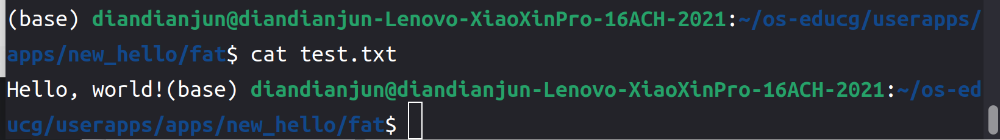

# 在RT-Thread Smart上支持rust语言编写的用户态程序

[TOC]

## 一、项目概述

### 1.1 项目背景

嵌入式平台广泛应用于各类电子设备中，其核心需求之一是能够高效地执行特定任务。这些平台通常具有资源受限的特点，包括有限的处理能力、存储空间和电源供应。因此，实时操作系统（RTOS）成为嵌入式系统的关键组件，它能够提供确定性、高可靠性和低延迟的任务调度和资源管理。

RT-Thread Smart（简称rt-smart）是RT-Thread开源实时操作系统的一个扩展版本，专为嵌入式平台设计。它继承了RT-Thread的核心特性，如高实时性、模块化和灵活性，同时增强了用户态应用程序的支持，使其能够运行复杂的用户态任务。

目前，RT-Thread Smart的用户态应用程序主要支持C/C++语言，并使用musl libc作为其标准库。C/C++语言在嵌入式系统中有着深厚的历史积淀，丰富的库和工具链使其在嵌入式开发中占据重要地位。然而，随着嵌入式系统的复杂性增加，以及对安全性和开发效率的更高要求，C/C++的某些局限性逐渐显现，如手动内存管理的复杂性和潜在的安全漏洞。

#### Rust语言的优势

Rust语言自诞生以来，迅速崭露头角，特别是在系统编程领域。其核心特点包括：

1. **内存安全**：Rust通过所有权系统和借用检查器，确保在编译时避免空指针、悬垂指针和数据竞争等常见的内存安全问题。
2. **高性能**：Rust编译后的程序能够接近甚至达到C/C++的性能，这对于资源受限的嵌入式系统尤为重要。
3. **并发性**：Rust提供了安全且高效的并发编程模型，使得开发者能够充分利用多核处理器的能力，而不必担心并发带来的复杂性和安全问题。
4. **现代化开发体验**：Rust拥有强大的包管理器（Cargo），现代化的语法和工具链，极大地提升了开发者的生产力和代码质量。

将Rust语言引入RT-Thread Smart，不仅能够丰富其用户态应用程序的开发语言选择，还能为嵌入式开发带来诸多优势，如Rust的内存安全特性可以减少因内存错误导致的系统崩溃和安全漏洞。Rust的现代化语法和工具链能够加速开发流程，减少调试和维护时间等。

### 1.2 项目预期目标

1. Rust语言支持库（已完成）

   编译并运行rt-smart操作系统。编译一个最小的Rust语言程序，使之能在rt-smart操作系统上运行；查阅rt-smart的文档和资料，了解其中可用的系统调用。查阅rt-smart与编译器有关的文档，了解rt-smart遵守的调用约定；选择一个系统调用的模块，制作一个封装和处理这部分系统调用的库。依赖于这个库，用户可以编写应用于rt-smart操作系统的应用程序，并使用里面的系统调用。请参考libtock-rs。

2. 制作一个到rt-smart的Rust编译目标（已完成）

   查阅Rust语言相关的资料，了解Rust语言目前支持哪些平台。Rust语言是否拥有面向嵌入式操作系统专门的编译目标？请举例；作为一个独立的平台，rt-smart提供平台相关的开发方法。请为Rust编译器添加一个名为“aarch64-rt-smart”的编译目标。使用该目标得到的二进制程序，能直接应用到rt-smart支持的平台上；请将第一题的成果视作标准库的一部分，选择一个系统调用的模块，为`aarch64-rt-smart`添加std标准库对应模块的代码。

3. Rust生态中的rt-smart平台（已完成）

   许多的库实现和平台有关系，这些库通常需要特定的操作系统功能支持。比如`num_cpus`，它在不同平台上调用不同的系统调用，达到列出CPU核数量的功能。查阅资料，列出几个这样的库。[您可能需要浏览crates.io或lib.rs](http://xn--crates-2b6jp45f6hzoe5bfutnya307j.xn--iolib-ym6j.rs/)。选择一个Rust生态中的库，为其添加代码，使之能支持rt-smart操作系统的相关功能。

### 1.3 项目达成目标

1. 通过封装 `aarch64-smart-museabi` 上的C库函数，基于Rust的FFI机制（Foreign Function Interface，外部函数接口），封装成Rust程序能够调用的接口，再通过静态库链接的方式将库函数链接到最终的应用程序中，保证函数能够被正确调用，从而使得Rust应用程序能够调用 `rtsmart` 操作系统提供的系统功能，为封装Rust功能库提供依赖
2. 通过修改Rust编译器中对于编译平台的支持，添加一个到 `aarch64-unknown-rtsmart` 的编译目标，提供如 `llvm_target`、`linker`、`max_atomic_width`、`pointer_width`、`data_layout`、`arch`等 `aarch64-unknown-rtsmart` 架构和系统有关的target option，使得Rust编译器能够i编译出适配当前架构与系统的机器指令，使得应用程序能够在目标平台上运行
3. 基于目标1封装的libc库，编写Rust生态中常用的标准库函数。即为Rust编写一个针对 `aarch64-unknown-rtsmart` 平台的标准库，使得用户能够调用标准库的函数编写更加复杂的应用程序。当前项目编写的主要标准库包括：用于标准输出的`stdout`库，用于标准输入的`stdin`库，用于创建、运行、操作、删除线程的`thread`库，用于保障线程安全的`mutex`库，用于创建文件、操作文件读写的`fs`库

#### 决赛第一阶段新达成的目标

1. 将原先标准输出库stdout中简单且不规范的日志输出功能抽取出来，编写了一个新的logging库，用于日志的输出，支持5个等级的日志级别用于表示消息的重要性和详细程度。
2. 修改原先的属性宏marco_main，使其支持从命令行读入用户输入的参数，便于用户与应用程序进行交互。
3. 编写完善线程通信相关的标准库，如支持通过信号量实现线程同步的标准库semaphore库，能够在线程间传递任意线程安全类型的对象数据的channel库，以支持更方便的线程通信。
4. 尝试将项目移植到真机上进行测试，使用树莓派开发板安装rt-smart环境，然后将当前项目编译出的Rust应用程序在开发板上跑进行测试。
5. 将当前项目编译出的Rust应用程序与aarch64-linux-musleabi-gcc编译器编译出的C程序进行性能对比分析。

### 1.4 项目目录结构

代码和文档都存储Gitlab仓库中。以下是仓库目录和文件描述：

```plaintext
.
├── 技术文档.md # 项目技术文档
├── 技术文档.pdf # 项目技术文档PDF版本
├── bench # C与Rust性能对比测试程序
│   ├── c_bench
│   │   └── main.c
│   └── rust_bench
│       ├── Cargo.lock
│       ├── Cargo.toml
│       └── src
│           └── main.rs
├── data.csv # C与Rust性能对比测试结果
├── examples # 标准库测试程序
│   ├── example1 # libc和rust编译目标的测试，最小的Rust语言程序
│   │   └── hello
│   │       ├── Cargo.lock
│   │       ├── Cargo.toml
│   │       └── src
│   │           └── main.rs
│   ├── example2 # 测试marco_main属性宏和stdout库的测试程序
│   │   └── hello
│   │       ├── Cargo.lock
│   │       ├── Cargo.toml
│   │       └── src
│   │           └── main.rs
│   ├── example3 # 测试thread库的测试程序
│   │   └── thread_test
│   │       ├── Cargo.lock
│   │       ├── Cargo.toml
│   │       └── src
│   │           └── main.rs
│   ├── example4 # 测试mutex库的测试程序
│   │   └── mutex_test
│   │       ├── Cargo.lock
│   │       ├── Cargo.toml
│   │       └── src
│   │           └── main.rs
│   ├── example5 # 测试stdin库的测试程序
│   │   └── read_test
│   │       ├── Cargo.lock
│   │       ├── Cargo.toml
│   │       └── src
│   │           └── main.rs
│   ├── example6 # 测试fs库的测试程序
│   │   └── file_test
│   │       ├── Cargo.lock
│   │       ├── Cargo.toml
│   │       └── src
│   │           └── main.rs
│   ├── example7 # 测试logging库的测试程序
│   │   └── log_test
│   │       ├── Cargo.lock
│   │       ├── Cargo.toml
│   │       └── src
│   │           └── main.rs
│   ├── example8 # 测试marco_main属性宏接受参数的测试程序
│   │   └── param_test
│   │       ├── Cargo.lock
│   │       ├── Cargo.toml
│   │       └── src
│   │           └── main.rs
│   ├── example9 # 测试semaphore库的测试程序
│   │   └── semaphore_test
│   │       ├── Cargo.lock
│   │       ├── Cargo.toml
│   │       └── src
│   │           └── main.rs
│   └── example10 # 测试channel库的测试程序
│       └── channel_test
│           ├── Cargo.lock
│           ├── Cargo.toml
│           └── src
│               └── main.rs
├── img # 技术文档图片
├── libc # Rust在不同系统平台的外部函数接口
│   ├── build.rs
│   ├── Cargo.toml
│   ├── CONTRIBUTING.md
│   ├── LICENSE-APACHE
│   ├── LICENSE-MIT
│   ├── README.md
│   ├── rustfmt.toml
│   ├── src
│   │   ├── fixed_width_ints.rs
│   │   ├── fuchsia
│   │   ├── hermit
│   │   ├── lib.rs
│   │   ├── macros.rs
│   │   ├── rtsmart # Rust在rt-smart系统平台的外部函数接口
│   │   │   ├── aarch64.rs
│   │   │   ├── arm.rs
│   │   │   └── mod.rs
│   │   ├── sgx.rs
│   │   ├── solid
│   │   ├── switch.rs
│   │   ├── teeos
│   │   ├── unix
│   │   ├── vxworks
│   │   ├── wasi.rs
│   │   ├── windows
│   │   └── xous.rs
│   └── triagebot.toml
├── LICENSE.txt # 开源协议文本
├── marco_main # 将Rust风格的main函数转换为C风格的main函数的属性宏
│   ├── Cargo.lock
│   ├── Cargo.toml
│   └── src
│       └── lib.rs
├── README.md # 项目说明文件
├── rtsmart-std # 基于libc开发的rtsmart平台上的标准库
│   ├── Cargo.lock
│   ├── Cargo.toml
│   └── src
│       ├── api # 封装调用libc的api
│       │   ├── mem.rs
│       │   ├── mod.rs
│       │   ├── mpsc.rs
│       │   ├── mutex.rs
│       │   ├── semaphore.rs
│       │   └── thread.rs
│       ├── fs.rs # fs库
│       ├── lib.rs # 模块声明
│       ├── logging.rs # logging库
│       ├── malloc.rs # 内存分配器
│       ├── mpsc.rs # channel库
│       ├── mutex.rs # mutex库
│       ├── param.rs # marco_main接受参数封装类型
│       ├── prelude # 预引入声明
│       │   ├── mod.rs
│       │   └── no_std.rs
│       ├── puts.rs # stdout库的辅助模块
│       ├── semaphore.rs # semaphore库
│       ├── stdin.rs # stdin库
│       ├── stdout.rs # stdout库
│       ├── thread.rs # thread库
│       └── time.rs # time库
├── rust # 为添加编译目标，在rust编译器源代码中修改或添加的文件
└── worklog # 每周的工作日志
    ├── img # 每周的工作日志所使用的图片
    ├── markdown # 每周的工作日志markdown格式
    └── pdf # 每周的工作日志pdf格式
```

## 二、赛题分析与调研

根据预期目标可知，本项目的主要任务分为三个部分，分别是封装Rust在rt-smart系统平台上的外部函数接口库`libc`、向Rust编译器添加一个到`aarch64-unknown-rtsmart`平台的编译目标、编写rt-smart平台上的Rust标准库

### 2.1 外部函数接口库`libc`

该库是基于Rust的`FFI`功能实现的，`FFI`全称是 `Foregn Function Interface` ，即实现不同编程语言间的函数级相互调用，对于复杂的项目，可以充分复用不同编程语言的已有功能，减小开发负担。`Rust` 语言作为一种新时代的系统级编程语言，它同 `C/C++` 一样都是直接将程序代码编译为机器指令码执行，相比 `Java,Python` 等底层使用虚拟机解释执行字节码及使用垃圾回收的语言，在实现 `FFI` 时容易得多。利用 `C/C++` 的已有的生态基础，`Rust` 很多底层代码不用重复造轮子，直接通过 `FFI` 封装复用已有的 `C/C++` 库，这对于一门新语言能快速广泛的运用到项目中是至关重要的。

Rust 调用 C 的情况，我们需要在 Rust 中声明需要调用的 C 函数，这样 Rust 在编译生成调用符号及调用规范时，便会采用 C 的规范去编译。Rust 中也是采用 `extern "C"` 的方式去声明 C 的调用接口，不过 Rust 并不知道实际 C 函数的实现是否安全，所以一般在申明前加上 `unsafe` 关键字（非必须，但是C函数调用必须处于 `unsafe` 块中）。 示例如下：

```rust
use libc::c_int;

#[link(name = "add")]
unsafe extern "C" {
    fn add(c_int, c_int) -> c_int;
}

fn main() {
    let a: i32 = 10;
    let b: i32 = 20;
    let c: i32 = unsafe { add(a, b) };
}
```

不像 C 和 C++ 都可以使用支持 C++ 的编译器进行编译，Rust 和 C 需要使用各自不同的编译器进行编译，最后在链接起来。Rust 调用 C 通常是先将 C 代码编译为静态库文件，然后在构建 Rust 程序时，在链接阶段链接到 C 静态库。

我们可以在声明代码块前加上特定的 rust 属性宏 `#[link(name = "add")]` 去指导编译器链接到某个具体的静态库。

如此，我们的`libc`库的作用就是将这些C库函数引入并链接到Rust应用程序中来，使得我们的Rust应用程序能够调用这些C库函数

### 2.2 Rust编译目标

Rust编译器对不同平台的支持由编译器下的compiler/rust_target来定义，用于告知编译器应生成何种输出，以下是编译器支持的部分编译目标：

```rust
supported_targets! {
    ("x86_64-unknown-linux-gnu", x86_64_unknown_linux_gnu),
    ("x86_64-unknown-linux-gnux32", x86_64_unknown_linux_gnux32),
    ("i686-unknown-linux-gnu", i686_unknown_linux_gnu),
    ("i586-unknown-linux-gnu", i586_unknown_linux_gnu),
    ("loongarch64-unknown-linux-gnu", loongarch64_unknown_linux_gnu),
    ("loongarch64-unknown-linux-musl", loongarch64_unknown_linux_musl),
    ("m68k-unknown-linux-gnu", m68k_unknown_linux_gnu),
    ("csky-unknown-linux-gnuabiv2", csky_unknown_linux_gnuabiv2),
    ("csky-unknown-linux-gnuabiv2hf", csky_unknown_linux_gnuabiv2hf),
    ("mips-unknown-linux-gnu", mips_unknown_linux_gnu),
    ("mips64-unknown-linux-gnuabi64", mips64_unknown_linux_gnuabi64),
    ("mips64el-unknown-linux-gnuabi64", mips64el_unknown_linux_gnuabi64),
    ("mipsisa32r6-unknown-linux-gnu", mipsisa32r6_unknown_linux_gnu),
    ("mipsisa32r6el-unknown-linux-gnu", mipsisa32r6el_unknown_linux_gnu),
    ("mipsisa64r6-unknown-linux-gnuabi64", mipsisa64r6_unknown_linux_gnuabi64),
    ("mipsisa64r6el-unknown-linux-gnuabi64", mipsisa64r6el_unknown_linux_gnuabi64),
    ("mipsel-unknown-linux-gnu", mipsel_unknown_linux_gnu),
    ("powerpc-unknown-linux-gnu", powerpc_unknown_linux_gnu),
    ("powerpc-unknown-linux-gnuspe", powerpc_unknown_linux_gnuspe),
    ("powerpc-unknown-linux-musl", powerpc_unknown_linux_musl),
    ("powerpc64-ibm-aix", powerpc64_ibm_aix),
    ("powerpc64-unknown-linux-gnu", powerpc64_unknown_linux_gnu),
    ("powerpc64-unknown-linux-musl", powerpc64_unknown_linux_musl),
    ("powerpc64le-unknown-linux-gnu", powerpc64le_unknown_linux_gnu),
    ("powerpc64le-unknown-linux-musl", powerpc64le_unknown_linux_musl),
    ("s390x-unknown-linux-gnu", s390x_unknown_linux_gnu),
    ("s390x-unknown-linux-musl", s390x_unknown_linux_musl),
    ("sparc-unknown-linux-gnu", sparc_unknown_linux_gnu),
    ("sparc64-unknown-linux-gnu", sparc64_unknown_linux_gnu),
    ("arm-unknown-linux-gnueabi", arm_unknown_linux_gnueabi),
    ("arm-unknown-linux-gnueabihf", arm_unknown_linux_gnueabihf),
    ("armeb-unknown-linux-gnueabi", armeb_unknown_linux_gnueabi),
    ("arm-unknown-linux-musleabi", arm_unknown_linux_musleabi),
    ("arm-unknown-linux-musleabihf", arm_unknown_linux_musleabihf),
    ("armv4t-unknown-linux-gnueabi", armv4t_unknown_linux_gnueabi),
    ("armv5te-unknown-linux-gnueabi", armv5te_unknown_linux_gnueabi),
    ("armv5te-unknown-linux-musleabi", armv5te_unknown_linux_musleabi),
    ("armv5te-unknown-linux-uclibceabi", armv5te_unknown_linux_uclibceabi),
    ("aarch64-unknown-linux-musl", aarch64_unknown_linux_musl),
    ("x86_64-unknown-linux-musl", x86_64_unknown_linux_musl),
    ("i686-unknown-linux-musl", i686_unknown_linux_musl),
    ("i586-unknown-linux-musl", i586_unknown_linux_musl),
    ("mips-unknown-linux-musl", mips_unknown_linux_musl),
    ("mipsel-unknown-linux-musl", mipsel_unknown_linux_musl),
    ("mips64-unknown-linux-muslabi64", mips64_unknown_linux_muslabi64),
    ("mips64el-unknown-linux-muslabi64", mips64el_unknown_linux_muslabi64),
    ("hexagon-unknown-linux-musl", hexagon_unknown_linux_musl),
    ("hexagon-unknown-none-elf", hexagon_unknown_none_elf),
    ("mips-unknown-linux-uclibc", mips_unknown_linux_uclibc),
    ("mipsel-unknown-linux-uclibc", mipsel_unknown_linux_uclibc),
    ("i686-linux-android", i686_linux_android),
    ("x86_64-linux-android", x86_64_linux_android),
    ......
}
```

每个编译目标，都有一份对应的target配置，用于告诉编译器特定平台的一些特定信息，例如：

- `llvm_target` :用于指定`LLVM`（底层编译框架）如何识别和生成目标代码的格式。
- `pointer_width`:定义指针的宽度（位数）。例如`aarch64`架构的指针宽度就是64。
- `data_layout`：指定了内存中的数据如何对齐和排列。这对编译器如何处理数据结构和内存访问至关重要。
- `arch`：目标架构，让编译器能够将程序编译成指定架构的指令
- `max_atomic_width`：指定目标平台上支持的最大原子操作宽度。
- `env`：指定目标平台的环境。它通常用于描述标准库和工具链的类型。
- `linker`：指定用于目标平台的链接器。
- ......

因此在本项目中，需要将`aarch64-unknown-rtsmart`该编译目标对应的编译配置信息加入到Rust编译器的源代码中，再将当前编译目标注册到其所支持的target中，重新编译rust编译器，即可观察到新编译的rust编译器可支持该编译目标。

再在应用程序编译时配置编译目标为`aarch64-unknown-rtsmart`，即可编译出在该平台上运行的二进制文件

```toml
[build]
target = "aarch64-unknown-rtsmart"

[target.aarch64-unknown-rtsmart]
linker = "aarch64-linux-musleabi-gcc"
```

### 2.3 Rust标准库

Rust的标准库源代码位于Rust编译器源代码的library/std下，封装了许多系统功能，以库函数的方式提供给用户进行调用。

Rust语言的设计目标是能编写操作系统内核的系统编程语言。使用静态编译，不采用GC机制，保证开发出的应用极高性能；具备现代编程语言的高效率语法, 并在编译阶段就保证内存安全，并发安全，分支安全等安全性。 现代高级语言的标准库是语言的一个紧密的组成部分，标准库负责语言众多关键特性实现。RUST的库也是如此，但与其他采用GC方案的语言不同，其他语言编程目标是在操作系统之上运行的用户态程序，只需要考虑一种模型。RUST则需要考虑操作系统内核与用户态两种模型。C语言在解决这个问题的方法是只提供用户态的标准库，操作系统内核的库由各操作系统自行实现。 RUST的现代语言特性决定了标准库无法象C语言那样把操作系统内核及用户态程序区分成完全独立的两个部分，所以只能更细致的设计，做模块化的处理。RUST标准库体系分为三个模块：语言核心库--`core`; `alloc`库；用户态 `std`库。

- `core`库是Rust语言核心库，适用于操作系统内核及用户态，包括Rust的基础类型，基本Trait, 类型行为函数，其他函数等内容。core库是硬件架构和操作系统无关的可移植库。主要内容有编译器内置intrinsics函数，包括内存操作函数，算数函数，位操作函数，原子变量操作函数等， 这些函数通常与CPU硬件架构紧密相关，且一般需要汇编来提供最佳性能。 intrinsic函数实际上也是对CPU指令的屏蔽层。基本数据类型，包括整数类型，浮点类型，布尔类型，字符类型，单元类型，内容主要是实现运算符Trait, 类型转换Trait, 派生宏Trait等，字符类型包括对`unicode`，`ascii`的不同编码的处理。整数类型有大小端变换的处理。还有字符串、时间库、类型转换、基础派生宏等内容。
- `alloc`库主要实现需要进行动态堆内存申请的智能指针类型，集合类型及他们的行为，函数，`Trait`等内容，仅建立在`core`库模块之上。`std`会对`alloc`模块库的内容做重新的封装。`alloc`库适用于操作系统内核及用户态程序。 包括： 基本内存申请；`Allocator Trait`;` Allocator`的实现结构`Global` ，基础智能指针：`Box`,` Rc`, 动态数组内存类型: `RawVec`, `Vec` ，字符串类型：`&str`, `String` ，并发编程指针类型:` Arc` ，指针内访问类型: `Cell`, `RefCell` 还有些其他类型，一般仅在标准库内部使用
- `std`库是在操作系统支撑下运行的只适用于用户态程序的库，core库实现的内容基本在std库也有对应的实现。其他内容主要是将操作系统系统调用封装为适合rust特征的结构和Trait,包括： 1.进程，线程库 2.网络库 3.文件操作库 4.环境变量及参数 5.互斥与同步库，读写锁 6.定时器 7.输入输出的数据结构， 8.系统事件，对`epoll`,`kevent`等的封装。可以将std库看做基本常用的容器类型及操作系统封装库。

因此在我们的项目中，就是基于`core`库、`alloc`库，`libc`编写标准库中的一些功能库，具体实现设计可以参考Rust编译器中的源代码，也可以自己自由发挥，只要能提供需要的功能即可。

### 2.4 分析与总结

基于上述的调研，可以得到我们当前项目的设计思路架构图


Rust-libc基于RT-Thread提供的POSIX API和RT-Thread API编写，Rust标准库基于Rust-libc编写，用户的Rust源程序再基于标准库编写。最终，可让用户的应用程序在RT-Thread系统上运行

用户编写的Rust源程序编译过程如下所示


其中编译与链接两步均由Rust编译器完成。而我们需要做的是给目标平台添加对应的配置，使得上方的Rust源代码能够被编译成合适的二进制文件

## 三、开发环境搭建

### 3.1 安装qemu-system-aarch64

我们选择的目标平台为`aarch64`，因此我们首先需要安装`qemu-system-aarch64`，用于支持rt-smart内核

```shell
sudo apt install qemu-system-aarch64
```

### 3.2 安装musl gcc工具链

然后需要安装`musl gcc`工具链，下载地址为：https://download.rt-thread.org/download/rt-smart/toolchains/aarch64-linux-musleabi_for_x86_64-pc-linux-gnu_latest.tar.bz2

然后配置环境变量：

```bash
# aarch64 musl gcc
export RTT_CC=gcc
export RTT_EXEC_PATH=/yourpath/aarch64-linux-musleabi_for_x86_64-pc-linux-gnu/bin
export RTT_CC_PREFIX=aarch64-linux-musleabi-
export PATH=$PATH:$RTT_EXEC_PATH
```

使用命令`source ~/.bashrc`刷新环境变量配置文件

之后可使用命令`aarch64-linux-musleabi-gcc -v`检查`musl gcc`工具环境变量是否正确设置

### 3.3 安装xmake和scons工具

```shell
sudo add-apt-repository ppa:xmake-io/xmake
sudo apt update
sudo apt install xmake
sudo apt-get install scons
```

### 3.4 安装ncurses库

ncurses（new curses）库是一个用于创建基于文本用户界面的编程库。它提供了一组函数，可以在终端上绘制窗口、小部件、菜单等，使得开发者能够编写复杂的文本用户界面应用程序，而不需要直接处理底层的终端控制代码。这里我们需要安装ncurses库，用于编译rt-smart内核时使用图形化界面进行配置

```shell
sudo apt-get install libncurses5-dev
```

### 3.5 构建内核镜像

首先将rt-smart的源码下载到本地：https://github.com/RT-Thread/rt-thread.git

进入到`qemu-virt64-aarch64`目录下

```shell
cd ./rt-thread/bsp/qemu-virt64-aarch64/  #打开 rt-thread 项目目录中的 bsp/qemu-virt64-aarch64 目录
scons --menuconfig
```

选择Smart内核

然后在该目录下执行`scons`命令开始编译内核

### 3.6 获取用户态的开发SDK

将Smart的userapps仓库克隆下来：

```shell
git clone https://github.com/RT-Thread/userapps.git
```

首先运行env.sh 添加一下环境变量

```shell
source env.sh
```

进入 apps 目录进行编译

```shell
cd apps
xmake f -a aarch64 # 配置为 aarch64平台
xmake -j8
```

运行 xmake smart-rootfs 制作 rootfs ，运行 xmake smart-image 制作镜像

```shell
xmake smart-rootfs
xmake smart-image -f fat -o ../prebuilt/qemu-virt64-aarch64-fat/fat.img #制作 fat 镜像
```

这个fat.img镜像即可作为虚拟机内的文件系统

修改qemu.sh中的路径即可完成挂载

进入到userapp/sdk/rt-thread/lib/aarch64/cortex-a目录下

获取到里面的两个库文件，分别是静态库`librtthread.a`和动态库`librtthread.so`，这两个库文件用于之后编译应用程序时进行链接，找到对应支持的库函数

## 四、外部函数接口库

下载`libc`的源代码

```shell
git clone https://github.com/rust-lang/libc.git
```

在`src`目录下添加`rtsmart`目录

将定义的外部函数接口写入到rtsmart/mod.rs下

在`Cargo.toml`中的第34行的targets中添加`aarch64-unknown-rtsmart`目标：

```toml
targets = [
    "aarch64-apple-darwin",
    "aarch64-apple-ios",
    "aarch64-linux-android",
    "aarch64-pc-windows-msvc",
    "aarch64-unknown-freebsd",
    "aarch64-unknown-fuchsia",
    "aarch64-unknown-hermit",
    "aarch64-unknown-linux-gnu",
    "aarch64-unknown-linux-musl",
    "aarch64-unknown-netbsd",
    "aarch64-unknown-openbsd",
    "aarch64-unknown-rtsmart",
    ...
]
```

前面提到，定义外部函数接口时需要指定链接的静态库

在本项目中，我们的rt-smart的`libc`就链接了如下静态库：

```rust
#[link(name = "util", kind = "static",
cfg(target_feature = "crt-static"))]
#[link(name = "rt", kind = "static",
cfg(target_feature = "crt-static"))]
#[link(name = "pthread", kind = "static",
cfg(target_feature = "crt-static"))]
#[link(name = "m", kind = "static",
cfg(target_feature = "crt-static"))]
#[link(name = "dl", kind = "static",
cfg(target_feature = "crt-static"))]
#[link(name = "c", kind = "static",
cfg(target_feature = "crt-static"))]
#[link(name = "rtthread", kind = "static",
cfg(target_feature = "crt-static"))]
#[link(name = "gcc_eh", kind = "static",
cfg(target_feature = "crt-static"))]
#[link(name = "gcc", kind = "static",
cfg(target_feature = "crt-static"))]
#[link(name = "util", cfg(not(target_feature = "crt-static")))]
#[link(name = "rt", cfg(not(target_feature = "crt-static")))]
#[link(name = "pthread", cfg(not(target_feature = "crt-static")))]
#[link(name = "m", cfg(not(target_feature = "crt-static")))]
#[link(name = "dl", cfg(not(target_feature = "crt-static")))]
#[link(name = "c", cfg(not(target_feature = "crt-static")))]
#[link(name = "rtthread", cfg(not(target_feature = "crt-static")))]
```

之后在build.rs中查找这些静态库并链接进项目即可：

```rust
println!("cargo:rustc-link-search=/opt/aarch64-smart-musleabi/aarch64-linux-musleabi/lib");
println!("cargo:rustc-link-lib=static=util");
println!("cargo:rustc-link-lib=static=rt");
println!("cargo:rustc-link-lib=static=pthread");
println!("cargo:rustc-link-lib=static=m");
println!("cargo:rustc-link-lib=static=dl");
println!("cargo:rustc-link-lib=static=c");
println!("cargo:rustc-link-lib=static=rtthread");
println!("cargo:rustc-link-lib=static=gcc_eh");
println!("cargo:rustc-link-lib=static=gcc");
// Avoid unnecessary re-building.
println!("cargo:rerun-if-changed=build.rs");
```

这里就需要用到前面获取的用户态开发SDK里的`librtthread.a`这一静态库了

## 五、编译器添加编译目标

找到`rust/compiler/rustc_target/src/spec`

在targets文件夹中添加文件`aarch64_unknown_rtsmart.rs`

在base文件夹中添加`rtsmart_base.rs`文件

这些文件用于定义编译目标平台的一些特性，用于告知编译器应生成何种输出

```rust
pub fn target() -> Target {
    let mut base = base::rtsmart_base::opts();
    base.max_atomic_width = Some(128);
    base.env = "gnu".into();
    base.linker =  Some("aarch64-linux-musleabi-gcc".into());
    
    Target {
        llvm_target: "aarch64-unknown-linux-gnu".into(),
        metadata: crate::spec::TargetMetadata {
            description: None,
            tier: None,
            host_tools: None,
            std: None,
        },
        pointer_width: 64,
        data_layout: "e-m:e-i8:8:32-i16:16:32-i64:64-i128:128-n32:64-S128".into(),
        arch: "aarch64".into(),

        options: TargetOptions {
            mcount: "\u{1}_mcount".into(),
            ..base
        },
    }
}
```

这段代码进行了如下定义：

- `max_atomic_width` 设置为 `Some(128)`，这表示最大支持的原子操作宽度为 128 位。

- `env` 设置为 `"gnu"`，表示目标环境是 GNU。

- `linker` 设置为 `Some("aarch64-linux-musleabi-gcc".into())`，指定链接器为 `aarch64-linux-musleabi-gcc`。

- `llvm_target`设置为`aarch64-unknown-linux-gnu`，指示编译器应针对ARM 64-bit 架构进行代码生成。这是

- `pointer_width`设置为64表明目标架构中指针宽度为 64 位

- `data_layout`设置为`"e-m:e-i8:8:32-i16:16:32-i64:64-i128:128-n32:64-S128"`含义如下
  - `e`：小端序（little-endian），表示低字节存储在低地址。
  - `m:e`：描述地址模式的默认对齐。
  - `i8:8:32`：8 位整数对齐为 8 位，存储大小为 32 位。
  - `i16:16:32`：16 位整数对齐为 16 位，存储大小为 32 位。
  - `i64:64`：64 位整数对齐为 64 位。
  - `i128:128`：128 位整数对齐为 128 位。
  - `n32:64`：自然对齐为 32 位或 64 位。
  - `S128`：堆栈对齐为 128 位。

- `arch`架构设置为`aarch64`，表示 ARM 64-bit 架构，这是现代 ARM 处理器常用的 64 位指令集架构。

除此之外，在option中还有如下配置：

```rust
os: "rtsmart".into(),
dynamic_linking: true,
executables: true,
families: cvs!["unix"],
has_rpath: true,
pre_link_args: args,

// linker_flavor: LinkerFlavor::Ld,
// link_script: Some(LINKER_SCRIPT.to_string()),

crt_static_default: true,

panic_strategy: PanicStrategy::Abort,
disable_redzone: true,
emit_debug_gdb_scripts: false,
//eh_frame_header: false,

position_independent_executables: true,
relro_level: RelroLevel::Full,
// has_elf_tls: false,
crt_static_respected: true,
..Default::default()
```

这部分option用于定义以下配置：

- `os: "rtsmart".into()`：目标操作系统名称为`“rtsmart”`
- `dynamic_linking: true`：表示目标平台支持动态链接库（如 `.so` 文件）。
- `executables: true`：表示目标平台支持生成可执行文件。
- `families: cvs!["unix"]`：指定目标平台所属的操作系统家族为UNIX 家族。这可以影响编译器对某些系统特性的假设。
- ......

等等一系列配置完成后，在`spec/mod.rs`中的第1705行增加模块定义

```rust
("aarch64-unknown-rtsmart", aarch64_unknown_rtsmart)
```

这样就创建了一个新的编译目标。

## 六、编写标准库

### 6.1 marco_main

由于在没有Rust标准库的支持下，也就是no_std模式下，是无法使用main函数的。于是就另辟蹊径，通过过程宏的方式对用户编写的代码进行重构，通过使用C ABI调用格式的main函数，就可以正常使用main函数作为程序的入口点。

为此，我们开发了一个叫做`marco_main`的属性宏

**Cargo.toml**

```toml
[package]
name = "marco_main"
version = "0.1.0"
edition = "2021"

[lib]
proc_macro = true

[dependencies]
quote = "1.0"
proc-macro2 = "1.0"
darling = "0.13.0"

[dependencies.syn]
version = "1.0"
features = ["extra-traits", "full"]
```

一个普通的过程宏项目的Cargo.toml文件中，在lib里标注proc_macro = true

同时需要用到quote、proc-macro2、syn等库。darling库用于自动将属性宏上的属性值转换到结构体对象上。

**`proc-macro2`**

`proc-macro2`是对 `proc_macro` 的包装，根据其文档，它用于两个特定目的：

- 将类似与过程宏的功能带到其他上下文中，如 build.rs 和 main.rs
- 让过程宏可进行单元测试

由于 `proc_macro` 只能在 `proc-macro` 类型的库中使用，所以无法直接使用 `proc_macro` 库。

始终记住，`proc-macro2` 模仿 `proc_macro` 的 api，对后者进行包装，让后者的功能在非 `proc-macro` 类型的库中也能使用。

因此，建议基于 `proc-macro2` 来开发过程宏代码的库，而不是基于 `proc_macro` 构建，因为这将使这些库可以进行单元测试，这也是以下列出的库传入和返回 `proc-macro2::TokenStream` 的原因。

当需要 `proc_macro::TokenStream` 时，只需对 `proc-macro2::TokenStream` 进行 `.into()` 操作即可获得 `proc_macro` 的版本，反之亦然。

使用 `proc-macro2` 的过程宏通常会以别名的形式导入，比如使用 `use proc-macro2::TokenStream as TokenStream2` 来导入 `proc-macro2::TokenStream`。

**`quote`**

`quote` 主要公开了一个声明宏：`quote!`。

这个小小的宏让你轻松创建标记流，使用方法是将实际的源代码写出为 Rust 语法。

同时该宏还允许你将标记直接插入到编写的语法中：

1. 使用 `#local` 语法进行插值，其中 `local` 指的是当前作用域中的一个 local。
2. 使用 `#(#local)*` 来对实现了 `ToTokens` 的类型的迭代器进行插值，其工作原理类似于声明宏的反复，因为它们允许在反复中使用分隔符和额外的标记。

```rust
let name = /* 某个标识符 */;
let exprs = /* 某个对表达式标记流的迭代器 */;
let expanded = quote! {
    impl SomeTrait for #name { // #name 将插入上述的局部名称
        fn some_function(&self) -> usize {
            #( #exprs )+* // 通过迭代生成表达式
        }
    }
};
```

在准备输出时，`quote!` 是一个非常有用的工具，它避免了通过逐个插入标记来创建标记流。

**`syn`**

`syn` 是一个解析库，用于将 Rust 标记流解析为 Rust 源代码的语法树。

它是一个功能非常强大的库，使得解析过程宏输入变得非常容易，而 `proc_macro` 本身不公开任何类型的解析功能，只公开标记。

由于这个库可能是一个严重的编译依赖项，它大量使用 feature 控制来允许用户根据需要将其功能剪裁得尽可能小。

那么，它能提供什么呢？很多东西。

首先，当启用 `full` feature 时，它具有对所有标准 Rust 语法节点的定义和从而能够完全解析 Rust 语法。

在启用 `derive` feature （默认开启）之后，它还提供一个 `DeriveInput` 类型，该类型封装了传递给 derive 宏输入所有信息。

在启用 `parsing` 和 `proc-macro` feature （默认开启）之后，`DeriveInput` 可以直接与 `parse_macro_input!` 配合使用，以将标记流解析为所需的类型。

如果 Rust 语法不能解决你的问题，或者说你希望解析自定义的非 Rust 语法，那么这个库还提供了一个通用的[解析 API][parse]，主要是以 `Parse` trait 的形式（这需要 `parsing` feature，默认启用）。

除此之外，该库公开的类型保留了位置信息和 `Span`，这让过程宏发出详细的错误消息，指向关注点的宏输入。

由于这又是一个过程宏的库，它利用了 `proc-macro2` 的类型，因此可能需要转换成 `proc_macro` 的对应类型。

**marco_main_use宏代码逻辑**

首先在函数头上使用#[proc_macro_attribute]进行标注

同时接受两个参数

```rust
pub fn marco_main_use(args: TokenStream, input: TokenStream) -> TokenStream
```

- 第一个参数是属性名称后面的带分隔符的标记树，不包括它周围的分隔符。如果只有属性名称（其后不带标记树，比如 `#[attr]`），则这个参数的值为空。
- 第二个参数是添加了该过程宏属性的条目，但不包括该过程宏所定义的属性。因为这是一个 [`active`](https://doc.rust-lang.org/reference/attributes.html#active-and-inert-attributes) 属性，在传递给过程宏之前，该属性将从条目中剥离出来。

接下来首先是使用parse_macro_input!宏通过Rust的代码标记流获取到源代码语法树，以及解析出过程宏上提供的appname和desc等属性

```rust
let f = parse_macro_input!(input as syn::ItemFn);
let raw_arg = parse_macro_input!(args as syn::AttributeArgs);
let parg = Args::from_list(&raw_arg).map_err(|e| e.write_errors());
let arg = match parg {
    Ok(x) => x,
    Err(e) => {
        return e.into();
    }
};
```

然后根据源代码语法树和args判断当前代码是否符合转换的条件

```rust
if arg.appname.is_none() {
    return parse::Error::new(
        Span::call_site(),
        "`#[marco_main_use]` macro must have attribute `appname`",
    )
        .to_compile_error()
        .into();
}

// check the function signature
let valid_signature = f.sig.constness.is_none()
    && f.sig.unsafety.is_none()
    && f.sig.asyncness.is_none()
    && f.vis == Visibility::Inherited
    && f.sig.abi.is_none()
    && f.sig.generics.params.is_empty()
    && f.sig.generics.where_clause.is_none()
    && f.sig.variadic.is_none()
    && match f.sig.output {
    ReturnType::Default => true,
    _ => false,
};
if !valid_signature {
    return parse::Error::new(
        f.span(),
        "`#[entry]` function must have signature `fn(arg: vec::IntoIter<&[u8]>)`",
    )
        .to_compile_error()
        .into();
};
```

符合条件之后，就可以通过quote!()宏构造新的标记流，按照之前的设计，将用户编写的main函数转换为以 C ABI 调用约定为基础的 `main` 函数，作为程序的入口点。通过以下方式直接转换然后返回

```rust
let content = f.block.into_token_stream();
let core = quote!(
    #[no_mangle]
    pub extern "C" fn main(_argc: isize, _argv: *const *const u8) -> usize {
        #content
        0
    }
);

quote!(
    #core
).into()
```

这种类型的main函数代码即可被成功`aarch64-rtsmart-muslabi-gcc`编译成可执行文件，既不违反rust在no_std模式下不能定义main函数的规定，又让编译器找到程序入口位置。

编写一个测试程序，观察其宏展开的状态

```rust
#![no_std]
#![no_main]

use marco_main::marco_main_use;
use rtsmart_std::println;

#[marco_main_use(appname = "rust_hello", desc = "Rust example2 app.")]
fn main() {
    println!("hello world");
}
```

首先我们可以观察一下宏展开后的代码是什么情况，因此我们下载cargo-expand工具

```shell
cargo install cargo-expand
```

然后通过如下命令观察宏展开后的Rust代码

```shell
cargo expand -Zbuild-std=core,alloc
```

运行后命令行窗口输出如下内容：

```rust
#![feature(prelude_import)]
#![no_std]
#![no_main]
#[prelude_import]
use core::prelude::rust_2021::*;
#[macro_use]
extern crate core;
extern crate compiler_builtins as _;
use marco_main::marco_main_use;
use rtsmart_std::println;
#[no_mangle]
pub extern "C" fn main(_argc: isize, _argv: *const *const u8) -> usize {
    {
        {
            ::rtsmart_std::out::_print(format_args!("hello world\n"));
        };
    }
    0
}
```

这是声明宏和过程宏同时展开后的结果，与我们之前编写的测试libc的应用程序代码相似，都是通过将用户编写的main函数转换为以 C ABI 调用约定为基础的 `main` 函数，作为程序的入口点，来进行编译运行的。

#### 决赛修改

决赛阶段对marco_main这一属性宏进行了修改，使其能够接受参数

首先需要main函数接受参数，先定义一个Param类作为接受的对象

```rust
use alloc::vec::Vec;
use core::iter::IntoIterator;
use core::ops::Deref;
use core::fmt::{self, Display};

#[derive(Debug)]
pub struct ParamItem(&'static [u8]);

impl Deref for ParamItem {
    type Target = [u8];
    fn deref(&self) -> &Self::Target {
        return self.0;
    }
}

impl Display for ParamItem {
    fn fmt(&self, f: &mut fmt::Formatter) -> fmt::Result {
        write!(f, "{}", core::str::from_utf8(self.0).unwrap())
    }
}

impl ParamItem {
    pub fn new(raw: &'static [u8]) -> Self {
        ParamItem(raw)
    }
}

pub type Param = <Vec<ParamItem> as IntoIterator>::IntoIter;
```

每个参数ParamItem是一个u8类型的数组切片，Param类是多个ParamItem构成的动态数组。这样参数即可以字符串形式输入，以u8数组切片的形式传递，用户可自行将其转换回字符串。

除此之外，需要让main函数接受一个输入参数

```rust
// check the function signature
let valid_signature = f.sig.constness.is_none()
    && f.sig.unsafety.is_none()
    && f.sig.asyncness.is_none()
    && f.vis == Visibility::Inherited
    && f.sig.abi.is_none()
    && f.sig.inputs.len() == 1
    && f.sig.generics.params.is_empty()
    && f.sig.generics.where_clause.is_none()
    && f.sig.variadic.is_none()
    && match f.sig.output {
    ReturnType::Default => true,
    _ => false,
};
```

然后在外围包裹一个函数用于处理C语言中接受的参数，将其转换封装成Param对象，传入到main函数中

```rust
let core = quote!(
    #[no_mangle]
    pub unsafe extern "C" fn #main_func_name(argc: u32, argv: *const *const u8) {
        use core::iter::Iterator;
        use rtsmart_std::param::ParamItem;
        let vec = {
            (0..argc as isize)
                .map(|i| {
                    let mut len = 0usize;
                    loop {
                        if *(*argv.offset(i)).offset(len as isize) != b'\0' {
                            len += 1;
                        } else {
                            break
                        }
                    }
                    ParamItem::new(core::slice::from_raw_parts::<'static, _>(*argv.offset(i), len))
                })
                .collect::<Vec<_>>()
        };
        #call_func_name (vec.into_iter())
    }
);
```

自此之后，由于外围这个函数充当C语言中的main函数，因此我们定义的函数不能再叫main函数，必须改叫其他函数，我们约定叫做rust_main

### 6.2 stdout库

标准输出库主要需要使用的`api`是`libc`中的`printf`函数

借助`core`库自带的`fmt::Write`这一trait，可以轻松做到rust中的模式匹配输出、debug模式输出等等功能，`printf`即可只用来输出单一字符。

```rust
struct StdOut;

impl fmt::Write for StdOut {
    fn write_str(&mut self, s: &str) -> fmt::Result {
        fn rtt_kputs(s: *const u8) {
            unsafe { printf(s as _); }
        }
        puts(s, rtt_kputs);
        Ok(())
    }
}

fn up_cast(a: usize, b: usize) -> usize {
    let r = a / b;
    return if a % b == 0 { r } else { r + 1 };
}

pub(crate) fn puts(str: &str, kp: fn(s: *const u8)) {
    let str = str.as_bytes();
    let mut buf = [0 as u8; 129];
    for i in 0..up_cast(str.len(), 128) {
        let end = min(128, str.len() - i * 128);
        for j in 0..end {
            buf[j] = str[(j + i * 128) as usize];
        }
        buf[end] = 0;
        kp(buf.as_ptr())
    }
}
```

通过设计一个缓冲数组buf，每次写入最多128个字节，然后循环写入，直到写入完毕即可。

```rust
pub fn _print(args: fmt::Arguments) {
    unsafe {
        StdOut.write_fmt(args).unwrap_unchecked();
    }
}
```

这里就借助了`core`库中的模式匹配功能进行输出

之后编写对应的声明宏，方便开发者调用输出函数即可

```rust
#[macro_export]
macro_rules! print {
    ($($arg:tt)*) => ({
        $crate::out::_print(format_args!($($arg)*));
    });
}

#[macro_export]
#[allow_internal_unstable(print_internals, format_args_nl)]
macro_rules! println {
    ($($arg:tt)*) => ({
        $crate::out::_print(format_args_nl!($($arg)*));
    });
}
```

这里的声明宏写法借鉴了Rust标准库源代码和宏小册中的例子

除此之外还编写了debug宏和log宏，可以自动将输出格式转换为debug模式和log模式

```rust
#[macro_export]
macro_rules! log {
    ($($arg:tt)*) => ({
        $crate::println!("[$LOG][{}:{}] {}",
        $crate::out::file!(), $crate::out::line!(), format_args!($($arg)*));
    });
}

#[cfg(debug_assertions)]
#[macro_export]
macro_rules! dbg {
    () => {
        $crate::println!("[{}:{}]", $crate::out::file!(), $crate::out::line!());
    };
    ($val:expr $(,)?) => {
        match $val {
            tmp => {
                $crate::println!("[{}:{}] {} = {:#?}",
                $crate::out::file!(), $crate::out::line!(), $crate::out::stringify!($val), &tmp);
            }
        }
    };
    ($($val:expr),+ $(,)?) => {
        ($($crate::dbg!($val)),+,)
    };
}
```

### 6.3 stdin库

标准输入库主要需要使用的`api`是`libc`中的`getchar`函数，不断读取字符，直到`EOF`或者遇到换行符为止（目前只是以简单功能考虑，未来如果全方位考虑的话可扩展到所有空白字符。同时`getchar`函数一个字符一个字符的读性能上也不高。未来如果有机会完善项目的话，我们会做这方面的考虑）。

```rust
struct Stdin;

impl Read for Stdin {
    fn read(&mut self, buf: &mut [u8]) -> Result<usize, RTTError> {
        let mut i = 0;
        unsafe {
            while i < buf.len() {
                let c = libc::getchar();
                if c == 0 || c == '\n' as i32 {
                    break;
                }
                buf[i] = c as u8;
                i += 1;
            }
        }
        Ok(i)
    }
}
```

再封装一个InputStream结构，用于读取一整行字符串，并将C风格的字符串转换成Rust中的String并返回

```rust
impl InputStream {
    pub fn new() -> InputStream {
        InputStream {
            stdin: Stdin
        }
    }
    
    pub fn read_line(&mut self) -> Result<String, RTTError> {
        let mut buf = [0u8; 1024];
        let mut s = String::new();
        loop {
            let n = self.stdin.read(&mut buf)?;
            if n == 0 {
                break;
            }
            s.push_str(&String::from_utf8_lossy(&buf[..n]));
            if n < buf.len() {
                break;
            } else {
                buf = [0u8; 1024];
            }
        }
        Ok(s)
    }
}
```

这里使用到了`core`库中的String的处理函数String::from_utf8_lossy，用于将字节切片（byte slice）转换为 `String`

这里也是每次用一个长度为1024的数组作为缓冲区去读取输入的字符。如果读取的字符少于1024，则说明遇到了换行符，则本次读取直接结束。否则就继续清空buf，再去读取，将新读取的输入拼接在原先的结果后面。然后返回结果。

### 6.4 thread库

thread库主要需要使用的`api`是`libc`中RT-Thread的SDK中关于线程相关操作的函数，主要参考了RT-Thread编程手册和RT-Thread API参考手册，以及RT-Thread源代码中的头文件`rtthread.h`

```c
/*
 * thread interface
 */
rt_err_t rt_thread_init(struct rt_thread *thread,
                        const char       *name,
                        void (*entry)(void *parameter),
                        void             *parameter,
                        void             *stack_start,
                        rt_uint32_t       stack_size,
                        rt_uint8_t        priority,
                        rt_uint32_t       tick);
rt_err_t rt_thread_detach(rt_thread_t thread);
rt_thread_t rt_thread_create(const char *name,
                             void (*entry)(void *parameter),
                             void       *parameter,
                             rt_uint32_t stack_size,
                             rt_uint8_t  priority,
                             rt_uint32_t tick);
rt_thread_t rt_thread_self(void);
rt_thread_t rt_thread_find(char *name);
rt_err_t rt_thread_startup(rt_thread_t thread);
rt_err_t rt_thread_delete(rt_thread_t thread);

rt_err_t rt_thread_yield(void);
rt_err_t rt_thread_delay(rt_tick_t tick);
rt_err_t rt_thread_delay_until(rt_tick_t *tick, rt_tick_t inc_tick);
rt_err_t rt_thread_mdelay(rt_int32_t ms);
rt_err_t rt_thread_control(rt_thread_t thread, int cmd, void *arg);
rt_err_t rt_thread_suspend(rt_thread_t thread);
rt_err_t rt_thread_suspend_with_flag(rt_thread_t thread, int suspend_flag);
rt_err_t rt_thread_resume(rt_thread_t thread);
```

我们将其引入到libc中，改写为Rust风格的接口函数

```rust
// rtthread sdk
pub type rt_base_t   = c_long;
pub type rt_err_t    = rt_base_t;

pub type rt_uint32_t = ::c_uint;
pub type rt_int32_t = ::c_int;
pub type rt_uint8_t  = ::c_uchar;

pub type rt_thread_t = *mut c_void;
pub type rt_tick_t = rt_uint32_t;
pub type rt_ubase_t = c_ulong;
pub type rt_size_t = rt_ubase_t;
pub fn rt_thread_create(
    name: *const ::c_char,
    entry: extern "C" fn(*mut ::c_void),
    paramter: *mut ::c_void,
    stack_size: rt_uint32_t,
    priority: rt_uint8_t,
    tick: rt_uint32_t
) -> rt_thread_t;

pub fn rt_thread_self() -> rt_thread_t;

pub fn rt_thread_startup(thread: rt_thread_t) -> rt_err_t;

pub fn rt_thread_delete(thread: rt_thread_t) -> rt_err_t;

pub fn rt_thread_yield() -> rt_err_t;

pub fn rt_thread_delay(tick: rt_tick_t) -> rt_err_t;

pub fn rt_thread_mdelay(ms :rt_uint32_t) -> rt_err_t;
```

在编译的时候，只要链接`librtthread.a`这一静态库，即可访问到这些函数

```rust
#[link(name = "rtthread", kind = "static",
cfg(target_feature = "crt-static"))]
```

**ThreadBuilder**

在使用`thread::Thread::new()`的时候，返回一个`ThreadBuilder`，让编程者设置一些thread的参数，效果如下所示：

```rust
let run = || loop {
        time::sleep(Duration::new(1, 0));
        let mut sum = 0;
        for i in 0..10 {
            sum += i;
        }
        println!("sum: {}", sum);
    };

let t = Thread::new()
        .name("thread 1")
        .stack_size(4096)
		.priority(0)
        .start(run.clone())
		.unwrap();
```

为此，定义如下ThreadBuilder：

```rust
pub struct ThreadBuilder {
    th_name: String,
    th_stack_size: u32,
    th_priority: u8,
    th_ticks: u32,
}

impl ThreadBuilder {
    pub fn name(&mut self, name: &str) -> &mut Self {
        self.th_name = name.into();
        self
    }

    pub fn stack_size(&mut self, stack_size: u32) -> &mut Self {
        self.th_stack_size = stack_size;
        self
    }

    pub fn priority(&mut self, priority: u8) -> &mut Self {
        self.th_priority = priority;
        self
    }

    pub fn ticks(&mut self, ticks: u32) -> &mut Self {
        self.th_ticks = ticks;
        self
    }

    pub fn start<F>(&self, func: F) -> RTResult<Thread>
        where
            F: FnOnce() -> (),
            F: Send + 'static,
    {
        Thread::spawn(
            self.th_name.clone(),
            self.th_stack_size,
            self.th_priority,
            self.th_ticks,
            func,
        )
    }
}
```

**Thread**

一个Thread对象对应一个`rt_thread_t`，即一个线程控制块TCB，用于管理和标识一个线程。由于时间问题，`rt_thread_t`内部过于复杂，我们暂时没有将它完整定义到rust的libc中，只是用`*mut c_void`代替

Thread最重要的创建功能如下：

```rust
unsafe fn spawn_inner(
    name: String,
    stack_size: u32,
    priority: u8,
    ticks: u32,
    func: Box<dyn FnOnce() -> () + Send + 'static>,
) -> RTResult<Thread> {
    let func = Box::new(func);
    let param = &*func as *const _ as *mut _;

    extern "C" fn thread_func(param: *mut c_void) {
        unsafe {
            let run = Box::from_raw(param as *mut Box<dyn FnOnce()>);
            run();
        }
    }

    let th_handle = thread_create(
        name.as_ref(),
        thread_func,
        param,
        stack_size,
        priority,
        ticks,
    )
        .ok_or(RTTError::OutOfMemory)?;

    let ret = match Self::_startup(th_handle) {
        Ok(_) => {
            mem::forget(func);
            Ok(Thread(th_handle))
        }
        Err(e) => Err(e),
    };

    return ret;
}
```

较为关键的一步是将闭包转变为函数，使得参数类型能够成功对应，`rt_thread_create`接受的参数类型是

```rust
extern "C" fn(parameter: *mut c_void);
```

为此我们定义了一个这样的函数，并将闭包以参数的方式通过指针传入，并在内部运行，完成相关的逻辑。

创建完成后需要启动，也就是startup方法

这与Unix环境下的线程使用有一定的差别，即Unix接口下的线程创建后可直接运行，而rt-thread的接口中需要调用`rt_thread_startup`使得线程运行

除此之外，还提供如下方法：

```rust
pub fn delete(&self) -> RTResult<()> {
    let ret = thread_delete(self.0);
    if ret == 0 {
        Ok(())
    } else {
        Err(ThreadStartupErr)
    }
}

pub fn delay(ms: i32) -> RTResult<()> {
    let ret = thread_m_delay(ms);
    if ret == 0 {
        Ok(())
    } else {
        Err(ThreadStartupErr)
    }
}
```

用于暂停和删除线程

### 6.5 mutex库

标准输入库主要需要使用的`api`是`libc`中RT-Thread的SDK中关于互斥量相关操作的函数，主要参考了RT-Thread编程手册和RT-Thread API参考手册，以及RT-Thread源代码中的头文件`rtthread.h`

```c
/*
 * mutex interface
 */
rt_err_t rt_mutex_init(rt_mutex_t mutex, const char *name, rt_uint8_t flag);
rt_err_t rt_mutex_detach(rt_mutex_t mutex);
rt_mutex_t rt_mutex_create(const char *name, rt_uint8_t flag);
rt_err_t rt_mutex_delete(rt_mutex_t mutex);

void rt_mutex_drop_thread(rt_mutex_t mutex, rt_thread_t thread);
rt_uint8_t rt_mutex_setprioceiling(rt_mutex_t mutex, rt_uint8_t priority);
rt_uint8_t rt_mutex_getprioceiling(rt_mutex_t mutex);

rt_err_t rt_mutex_take(rt_mutex_t mutex, rt_int32_t time);
rt_err_t rt_mutex_take_interruptible(rt_mutex_t mutex, rt_int32_t time);
rt_err_t rt_mutex_take_killable(rt_mutex_t mutex, rt_int32_t time);
rt_err_t rt_mutex_release(rt_mutex_t mutex);
rt_err_t rt_mutex_control(rt_mutex_t mutex, int cmd, void *arg);
```

我们将其引入到libc中，改写为Rust风格的接口函数

```rust
s!{
    pub struct rt_mutex {
        pub mtype: c_int,
        pub data: *mut c_void,
    }
}
pub type rt_mutex_t  = *mut rt_mutex;
pub fn rt_mutex_create(
    name: *const ::c_char,
    flag: ::rt_uint8_t
) -> ::rt_mutex_t;

pub fn rt_mutex_init(
    mutex: *mut rt_mutex,
    name: *mut ::c_char,
    flag: ::rt_uint8_t,
) -> rt_err_t;
pub fn rt_mutex_delete(mutex: ::rt_mutex_t) -> rt_err_t;
pub fn rt_mutex_take(mutex: ::rt_mutex_t, time: ::rt_int32_t) -> rt_err_t;
pub fn rt_mutex_release(mutex: ::rt_mutex_t) -> rt_err_t;
```

**Mutex**

Mutex对象持有一个`rt_mutex_t`作为互斥量，同时还保存该互斥量所保存的共享资源data

```rust
pub struct Mutex<T: Sized> {
    mutex: rt_mutex_t,
    data: UnsafeCell<T>,
}
impl<T> Mutex<T> {
    pub fn new(t: T) -> Result<Self, RTTError> {
        Ok(Mutex {
            mutex: mutex_create("Unnamed").unwrap(),
            data: UnsafeCell::new(t),
        })
    }
    
    pub fn new_with_name(t: T, name: &str) -> Result<Self, RTTError> {
        Ok(Mutex {
            mutex: mutex_create(name).unwrap(),
            data: UnsafeCell::new(t),
        })
    }

    pub fn try_lock(&self) -> Result<MutexGuard<T>, RTTError> {
        let ret = unsafe { mutex_take(self.mutex, 0) };
        if ret != 0 {
            return Err(RTTError::MutexTakeTimeout);
        }
        Ok(MutexGuard {
            mutex: &self.mutex,
            data: &self.data,
        })
    }
    
    pub fn lock(&self) -> Result<MutexGuard<T>, RTTError> {
        let ret = unsafe { mutex_take(self.mutex, -1) };
        if ret != 0 {
            return Err(RTTError::MutexTakeTimeout);
        }
        Ok(MutexGuard {
            mutex: &self.mutex,
            data: &self.data,
        })
    }
}
```

比较关键的是Mutex必须实现`Send`和`Sync`这两个trait，才能保证数据在多线程间访问是2不出错：

```rust
unsafe impl<T: Send> Send for Mutex<T> {}
unsafe impl<T: Send> Sync for Mutex<T> {}
```

**MutexGuard**

这是一个控制互斥量的智能指针，在Mutex对象上锁之后，返回一个MutexGuard智能指针，用于访问数据和管理锁的释放

```rust
pub struct MutexGuard<'a, T: Sized> {
    mutex: &'a rt_mutex_t,
    data: &'a UnsafeCell<T>,
}
```

由于所有权机制的限制，只能将引用传给MutexGuard，因此需要加上生命周期。

需要实现`Deref`和`DerefMut`这两个trait让指针能够通过解引用的方式访问和改变数据，同时需要实现`Drop`这一trait自动释放互斥量。如果忘记这个的话极易造成死锁。

```rust
impl <'a, T> Deref for MutexGuard<'a, T> {
    type Target = T;

    fn deref(&self) -> &Self::Target {
        unsafe { &*self.data.get() }
    }
}

impl <'a, T> Drop for MutexGuard<'a, T> {
    fn drop(&mut self) {
        let mutex = self.mutex as *const _ as *mut _;
        mutex_release(mutex);
    }
}

impl <'a, T> DerefMut for MutexGuard<'a, T> {
    fn deref_mut(&mut self) -> &mut Self::Target {
        unsafe { &mut *self.data.get() }
    }
}
```

### 6.6 fs库

标准输出库主要需要使用的`api`是`libc`中的C库里的文件相关操作函数

```c
int open(const char *, int, ...);
int close(int);
ssize_t read(int, void *, size_t);
ssize_t write(int, const void *, size_t);
off_t lseek(int, off_t, int);
int fsync(int);
int ftruncate(int, off_t);
```

这些是rt-smart上支持的一些C语言库函数，可用于文件操作，将其转换为Rust风格的函数接口如下：

```rust
pub fn open(path: *const c_char, oflag: ::c_int, ...) -> ::c_int;
pub fn close(fd: ::c_int) -> ::c_int;
pub fn read(fd: ::c_int, buf: *mut ::c_void, count: ::size_t) -> ::ssize_t;
pub fn write(fd: ::c_int, buf: *const ::c_void, count: ::size_t) -> ::ssize_t;
pub fn lseek(fd: ::c_int, offset: off_t, whence: ::c_int) -> off_t;
pub fn fsync(fd: ::c_int) -> ::c_int;
pub fn ftruncate(fd: ::c_int, length: off_t) -> ::c_int;
```

基于这些库函数编写fs标准库

首先我们计划提供与`ThreadBuilder`类似的函数式调用配置方法来创建或打开文件，示例如下所示

```rust
let mut res_file = fs::OpenOptions::new()
    .read(true)
    .write(true)
    .create(true)
    .append(false)
    .open("test.txt");
```

可用来配置文件的读写、创建与否、是否追加等属性，通过这种方式提供接口，使得接口的使用变得更加简单。

因此，我们会先创建一个`OpenOptions`来打开文件

**OpenOptions**

```rust
pub struct OpenOptions {
    pub path: String,
    pub read: bool,
    pub write: bool,
    pub create: bool,
    pub append: bool,
}
impl OpenOptions {
    pub fn new() -> OpenOptions {
        OpenOptions {
            path: String::new(),
            read: false,
            write: false,
            create: false,
            append: false,
        }
    }

    pub fn read(&mut self, read: bool) -> &mut Self {
        self.read = read;
        self
    }

    pub fn write(&mut self, write: bool) -> &mut Self {
        self.write = write;
        self
    }

    pub fn create(&mut self, create: bool) -> &mut Self {
        self.create = create;
        self
    }

    pub fn append(&mut self, append: bool) -> &mut Self {
        self.append = append;
        self
    }

    pub fn open(&mut self, path: &str) -> RTResult<File> {
        self.path = path.to_string();
        let fd = unsafe {
            crate::fs::open(
                self.path.as_ptr(),
                self.read,
                self.write,
                self.create,
                self.append,
            )
        };
        if fd < 0 {
            Err(FileOpenErr)
        } else {
            Ok(File { fd })
        }
    }
}
```

在最终open的时候再将配置信息一并传入用于打开文件

```rust
pub fn open(path: *const u8, read: bool, write: bool, create: bool, append: bool) -> i32 {
    let flags = if read && write {
        libc::O_RDWR
    } else if write {
        libc::O_WRONLY
    } else {
        libc::O_RDONLY
    };

    let flags = if create {
        flags | libc::O_CREAT
    } else {
        flags
    };

    let flags = if append {
        flags | libc::O_APPEND
    } else {
        flags
    };
    unsafe { libc::open(path as *const c_char, flags) }
}
```

**File**

与Linux操作系统相同，rt-smart每个打开的文件都由一个文件描述符（file descriptor, FD）来标识。文件描述符是一个非负整数，用于指代一个已经打开的文件或其他类型的 I/O 资源（如管道、网络套接字等）。文件描述符与打开的文件之间的映射由内核管理。

因此，我们对File结构的定义如下：

```rust
pub struct File {
    pub fd: i32,
}
```

需对其实现Drop这一trait，使其在离开作用域后自动释放时，关闭文件

```rust
impl Drop for File {
    fn drop(&mut self) {
        unsafe {
            libc::close(self.fd);
        }
    }
}
```

**读写功能**

```rust
pub fn read(&self, buf: &mut [u8]) -> RTResult<usize> {
    let n = unsafe { libc::read(self.fd, buf.as_mut_ptr() as *mut c_void, buf.len()) };
    if n < 0 {
        Err(FileReadErr)
    } else {
        Ok(n as usize)
    }
}

pub fn read_to_string(&self) -> RTResult<String> {
        let mut buf = [0; 128];
        let mut string = String::new();
        self.seek(0)?;
        loop {
            let n = self.read(&mut buf)?;
            if n == 0 {
                break;
            }
            let substr = unsafe { String::from_utf8_unchecked(buf.to_vec()) };
            string.push_str(&substr);
        }
        Ok(string)
}
pub fn write(&self, buf: &[u8]) -> RTResult<usize> {
    let n = unsafe { libc::write(self.fd, buf.as_ptr() as *const c_void, buf.len()) };
    if n < 0 {
        Err(FileWriteErr)
    } else {
        Ok(n as usize)
    }
}

pub fn write_all(&self, buf: &str) -> RTResult<()> {
        self.write(buf.as_bytes())?;
        Ok(())
}
```

读取的步骤与stdin的逻辑相似，用一个固定长度的buf进去读取内容，再不断的拼到String后面，最后再将结果String返回

**其他功能**

```rust
pub fn seek(&self, offset: i64) -> RTResult<i64> {
    let n = unsafe { libc::lseek(self.fd, offset, SEEK_SET) };
    if n < 0 {
        Err(FileSeekErr)
    } else {
        Ok(n)
    }
}

pub fn flush(&self) -> RTResult<()> {
    let n = unsafe { libc::fsync(self.fd) };
    if n < 0 {
        Err(FileFlushErr)
    } else {
        Ok(())
    }
}

pub fn set_len(&self, len: i64) -> RTResult<()> {
    let n = unsafe { libc::ftruncate(self.fd, len) };
    if n < 0 {
        Err(FileSetLengthErr)
    } else {
        Ok(())
    }
}

pub fn close(&self) -> RTResult<()> {
    let n = unsafe { libc::close(self.fd) };
    if n < 0 {
        Err(FileCloseErr)
    } else {
        Ok(())
    }
}
```

- `seek`函数：将文件指针移动到文件中的指定位置。
- `flush`函数：将文件的所有缓冲区数据刷新到磁盘上，确保数据持久化。
- `set_len`函数：调整文件的长度。
- `close`函数：关闭文件描述符，释放相关资源。

这些函数都是通过调用底层的 `libc` 库函数来操作文件描述符，提供了文件指针移动、缓冲区刷新、文件长度设置和文件关闭等基本功能。每个函数都使用 `RTResult` 类型来返回结果，处理可能的错误，并提供适当的错误处理机制。

### 6.7 logging库

在软件开发和系统监控中，日志记录是一个至关重要的工具。不同的日志级别用于表示消息的重要性和详细程度。日志共分为如下5个等级，且分别以不同的颜色呈现：

```Rust
#[repr(usize)]
#[derive(Debug, Copy, Clone, PartialEq, Eq)]
pub enum Level {
    Error = 1,
    Warn = 2,
    Info = 3,
    Debug = 4,
    Trace = 5,
}
```

- Error表示系统中的严重问题，可能导致程序无法继续运行。记录会导致系统崩溃或重大故障的事件。这些日志通常需要立即关注和处理。用红色字体表示。
- Warn表示潜在问题或非正常操作，但不会立即导致系统失败。记录可能会导致问题但当前不影响系统运行的事件。这些日志提示需要注意的问题，可能需要将来进行检查或修复。用黄色字体表示。
- Info表示常规操作或重要事件的日志。记录系统运行中的常规信息，用于跟踪程序流程和状态。这些日志有助于了解系统的正常运行情况。用绿色字体表示。
- Debug表示开发和调试过程中使用的详细信息。记录详细的调试信息，以帮助开发人员查找和解决问题。这些日志通常包括变量值、函数调用等细节信息。用蓝色字体表示。
- Trace表示最详细的日志级别，用于记录系统的每一步操作。记录极其详细的跟踪信息，通常用于诊断复杂问题或分析系统性能。这些日志可以提供完整的执行路径和状态。用灰色字体表示。

首先定义一个基本日志函数，用于根据日志等级输出对应的信息

```Rust
pub fn _log(level: Level, args: core::fmt::Arguments) {
    use core::fmt::Write;
    use crate::stdout;
    use crate::time;
    let mut s = String::new();
    write!(&mut s, "[{:?}][{:?}]", level, time::get_time()).unwrap();
    write!(&mut s, "{}", args).unwrap();
    match level {
        Level::Error => {
            println!("\x1b[1;31m{}\x1b[0m", s);
        }
        Level::Warn => {
            println!("\x1b[1;33m{}\x1b[0m", s);
        }
        Level::Info => {
            println!("\x1b[1;32m{}\x1b[0m", s);
        }
        Level::Debug => {
            println!("\x1b[1;34m{}\x1b[0m", s);
        }
        Level::Trace => {
            println!("\x1b[1;30m{}\x1b[0m", s);
        }
    }
}
```

这段代码用于根据日志级别记录日志信息。该函数会根据传入的日志级别（`level`）和格式化的日志内容（`args`），生成带有时间戳和日志级别标识的日志消息，并以不同的颜色输出到控制台。

在定义了这个函数后，可基于该函数定义对应的不同的日志宏，其内容如下：

```rust
#[macro_export]
macro_rules! log {
    ($level:expr, $($arg:tt)*) => ({
        $crate::logging::_log($level, format_args!($($arg)*));
    });
}

#[macro_export]
macro_rules! error {
    ($($arg:tt)*) => ({
        $crate::logging::_log($crate::logging::Level::Error, format_args!($($arg)*));
    });
}

#[macro_export]
macro_rules! warn {
    ($($arg:tt)*) => ({
        $crate::logging::_log($crate::logging::Level::Warn, format_args!($($arg)*));
    });
}

#[macro_export]
macro_rules! info {
    ($($arg:tt)*) => ({
        $crate::logging::_log($crate::logging::Level::Info, format_args!($($arg)*));
    });
}

#[macro_export]
macro_rules! debug {
    ($($arg:tt)*) => ({
        $crate::logging::_log($crate::logging::Level::Debug, format_args!($($arg)*));
    });
}

#[macro_export]
macro_rules! trace {
    ($($arg:tt)*) => ({
        $crate::logging::_log($crate::logging::Level::Trace, format_args!($($arg)*));
    });
}
```

这段代码定义了一组用于日志记录的宏，这些宏封装了对 `_log` 函数的调用，以便于使用不同的日志级别记录消息。每个宏使用 `macro_rules!` 进行定义，并通过 `#[macro_export]` 导出，以便在其他模块或包中使用。

### 6.8 semaphore库

semaphore库主要需要使用的`api`是`libc`中RT-Thread的SDK中关于线程通信中信号量操作的相关函数，主要参考了RT-Thread编程手册和RT-Thread API参考手册，以及RT-Thread源代码中的头文件`rtthread.h`

`semaphore` 库是一个 Rust 库，用于实现信号量（Semaphore）机制。信号量是一种常见的同步原语，广泛用于多线程编程中，用于控制对共享资源的访问。信号量可以用于限制资源的并发访问次数，防止资源竞争或数据不一致问题。

```c
/*
 * semaphore interface
 */
rt_err_t rt_sem_init(rt_sem_t    sem,
                     const char *name,
                     rt_uint32_t value,
                     rt_uint8_t  flag);
rt_err_t rt_sem_detach(rt_sem_t sem);
rt_sem_t rt_sem_create(const char *name, rt_uint32_t value, rt_uint8_t flag);
rt_err_t rt_sem_delete(rt_sem_t sem);

rt_err_t rt_sem_take(rt_sem_t sem, rt_int32_t time);
rt_err_t rt_sem_take_interruptible(rt_sem_t sem, rt_int32_t time);
rt_err_t rt_sem_take_killable(rt_sem_t sem, rt_int32_t time);
rt_err_t rt_sem_trytake(rt_sem_t sem);
rt_err_t rt_sem_release(rt_sem_t sem);
rt_err_t rt_sem_control(rt_sem_t sem, int cmd, void *arg);
```

```C
/**
 * Semaphore structure
 */
struct rt_semaphore
{
    struct rt_ipc_object parent; /**< inherit from ipc_object */
    rt_uint16_t value; /**< value of semaphore. */
    rt_uint16_t reserved; /**< reserved field */
};
```

将其加入到libc中，转换为Rust风格的调用接口：

```rust
pub type rt_sem_t = *mut c_void;

pub fn rt_sem_create(name: *const ::c_char, value: ::rt_int32_t, flag: ::rt_uint8_t) -> rt_sem_t;
pub fn rt_sem_delete(sem: rt_sem_t) -> rt_err_t;
pub fn rt_sem_take(sem: rt_sem_t, time: ::rt_int32_t) -> rt_err_t;
pub fn rt_sem_release(sem: rt_sem_t) -> rt_err_t;
```

由于我们不需要用到rt_semaphore结构体内部的变量，因此我们只将rt_sem_t定义为void*，不具体实现内部的结构

Semaphore对象持有对应的信号量变量

```rust
pub struct Semaphore {
    pub sem: rt_sem_t,
}
```

并支持以下接口

```rust
impl Semaphore {
    pub fn new(name: &str) -> Option<Self> {
        sem_create(name)
    }

    pub fn take(&self, tick: isize) -> bool {
        sem_take(&self, tick)
    }

    pub fn take_wait_forever(&self) {
        sem_take_forever(&self)
    }

    pub fn release(&self) {
        sem_release(&self)
    }
    
    pub fn drop(&self) {
        sem_delete(&self)
    }
}
```

这些接口基于libc中对应的库函数实现

```rust
use alloc::ffi::CString;
use libc::{c_char, RT_IPC_FLAG_FIFO};
use crate::semaphore::Semaphore;

pub fn sem_create(name: &str) -> Option<Semaphore> {
    let name = CString::new(name).unwrap();
    let name_c = name.as_ptr() as *const c_char;
    let sem = unsafe { libc::rt_sem_create(name_c, 0, RT_IPC_FLAG_FIFO) };
    if sem.is_null() {
        None
    } else {
        Some(Semaphore { sem })
    }
}

pub fn sem_take(sem: &Semaphore, tick: isize) -> bool {
    let ret = unsafe { libc::rt_sem_take(sem.sem, tick as _) };
    ret == 0
}

pub fn sem_take_forever(sem: &Semaphore) {
    unsafe {
        libc::rt_sem_take(sem.sem, libc::RT_WAITING_FOREVER);
    }
}

pub fn sem_release(sem: &Semaphore) {
    unsafe {
        libc::rt_sem_release(sem.sem);
    }
}

pub fn sem_delete(sem: &Semaphore) {
    unsafe {
        libc::rt_sem_delete(sem.sem);
    }
}
```

由于信号量也属于线程间的共享资源，因此必须实现`Send`和`Sync`这两个trait，才能保证数据在多线程间访问时不报错

```rust
unsafe impl Send for Semaphore {}
unsafe impl Sync for Semaphore {}
```

### 6.9 channel库

channel库主要需要使用的`api`是`libc`中RT-Thread的SDK中关于线程通信中消息队列操作的相关函数，主要参考了RT-Thread编程手册和RT-Thread API参考手册，以及RT-Thread源代码中的头文件`rtthread.h`

`rt_messagequeue` 是 RT-Thread 实时操作系统中的消息队列机制。消息队列用于线程之间的异步通信，允许一个线程向消息队列发送消息，而另一个线程从消息队列接收消息。这种机制可以用于线程之间的数据交换和同步。它是 RT-Thread 中用于实现线程间异步通信的重要机制。通过消息队列，线程可以安全地交换数据，避免了直接共享内存带来的复杂性和潜在风险。消息队列机制在实时操作系统中广泛应用，特别适用于需要高可靠性和实时性的嵌入式系统。

在 Rust 中，`std::sync::mpsc` 模块提供了消息传递通道（channel）机制，用于线程间的通信。`mpsc` 是 "multiple producer, single consumer"（多生产者，单消费者）的缩写。通过 `channel`，一个或多个生产者线程可以向同一个消费者线程发送消息。

基于以上信息我们可知，可以基于RT-Thread的messagequeue机制实现rust中的channel，方便地实现线程间通信。

```c
/*
 * message queue interface
 */
rt_err_t rt_mq_init(rt_mq_t     mq,
                    const char *name,
                    void       *msgpool,
                    rt_size_t   msg_size,
                    rt_size_t   pool_size,
                    rt_uint8_t  flag);
rt_err_t rt_mq_detach(rt_mq_t mq);
rt_mq_t rt_mq_create(const char *name,
                     rt_size_t   msg_size,
                     rt_size_t   max_msgs,
                     rt_uint8_t  flag);
rt_err_t rt_mq_delete(rt_mq_t mq);

rt_err_t rt_mq_send(rt_mq_t mq, const void *buffer, rt_size_t size);
rt_err_t rt_mq_send_interrupt(rt_mq_t mq, const void *buffer, rt_size_t size);
rt_err_t rt_mq_send_killable(rt_mq_t mq, const void *buffer, rt_size_t size);
rt_err_t rt_mq_send_wait(rt_mq_t     mq,
                         const void *buffer,
                         rt_size_t   size,
                         rt_int32_t  timeout);
rt_err_t rt_mq_send_wait_interruptible(rt_mq_t     mq,
                         const void *buffer,
                         rt_size_t   size,
                         rt_int32_t  timeout);
rt_err_t rt_mq_send_wait_killable(rt_mq_t     mq,
                         const void *buffer,
                         rt_size_t   size,
                         rt_int32_t  timeout);
rt_err_t rt_mq_urgent(rt_mq_t mq, const void *buffer, rt_size_t size);
rt_err_t rt_mq_recv(rt_mq_t    mq,
                    void      *buffer,
                    rt_size_t  size,
                    rt_int32_t timeout);
rt_err_t rt_mq_recv_interruptible(rt_mq_t    mq,
                    void      *buffer,
                    rt_size_t  size,
                    rt_int32_t timeout);
rt_err_t rt_mq_recv_killable(rt_mq_t    mq,
                    void      *buffer,
                    rt_size_t  size,
                    rt_int32_t timeout);
rt_err_t rt_mq_control(rt_mq_t mq, int cmd, void *arg);
```

```c
/**
 * message queue structure
 */
struct rt_messagequeue
{
    struct rt_ipc_object parent; /**< inherit from ipc_object */

    void *msg_pool; /**< start address of message queue */

    rt_uint16_t msg_size; /**< message size of each message */
    rt_uint16_t max_msgs; /**< max number of messages */

    rt_uint16_t entry; /**< index of messages in the queue */

    void *msg_queue_head; /**< list head */
    void *msg_queue_tail; /**< list tail */
    void *msg_queue_free; /**< pointer indicated the free node of queue */

    rt_list_t suspend_sender_thread; /**< sender thread suspended on this message queue */
};
typedef struct rt_messagequeue *rt_mq_t;
```

将其加入到libc中，转换为Rust风格的调用接口：

```rust
pub type rt_mq_t = *mut c_void;

pub fn rt_mq_create(name: *const ::c_char, msg_size: rt_size_t, max_msgs: rt_size_t, flag: rt_uint8_t) -> rt_mq_t;
pub fn rt_mq_send(mq: rt_mq_t, buffer: *const ::c_void, size: rt_size_t) -> rt_err_t;
pub fn rt_mq_send_wait(mq: rt_mq_t, buffer: *const ::c_void, size: rt_size_t, timeout: rt_int32_t) -> rt_err_t;
pub fn rt_mq_recv(mq: rt_mq_t, buffer: *mut ::c_void, size: rt_size_t, timeout: rt_int32_t) -> rt_base_t;
pub fn rt_mq_delete(mq: rt_mq_t) -> rt_err_t;
pub fn rt_mq_detach(mq: rt_mq_t) -> rt_err_t;
```

由于我们不需要用到rt_messagequeue结构体内部的变量，因此我们只将rt_mq_t定义为void*，不具体实现内部的结构

首先定义通信的节点Node

```rust
#[derive(Clone)]
pub struct Node<T> {
    pub mq: MessageQueue,
    item_type: PhantomData<UnsafeCell<T>>,
}
```

因为支持任意类型的数据传递，所以设定为泛型

其提供如下接口：

```rust
impl <T>Node<T> {
    pub fn new(mq: MessageQueue) -> Option<Self> {
        Some(Node { 
            mq,
            item_type: PhantomData,
        })
    }
    
    pub fn send(&self, item: T) {
        let inner = MaybeUninit::new(item);
        mq_send(self.mq, inner.as_ptr() as *const c_void, size_of::<T>() as _, libc::RT_WAITING_FOREVER)
    }
    
    pub fn send_timeout(&self, item: T, timeout: i32) {
        let inner = MaybeUninit::new(item);
        mq_send(self.mq, inner.as_ptr() as *const c_void, size_of::<T>() as _, timeout)
    }

    pub fn recv(&self) -> Option<T> {
        let mut item = MaybeUninit::<T>::uninit();
        mq_recv(self.mq, item.as_mut_ptr() as *mut c_void, size_of::<T>() as _, libc::RT_WAITING_FOREVER);
        Some(unsafe { item.assume_init() })
    }

    pub fn recv_timeout(&self, timeout: i32) -> Option<T> {
        let mut item = MaybeUninit::<T>::uninit();
        mq_recv(self.mq, item.as_mut_ptr() as *mut c_void, size_of::<T>() as _, timeout);
        Some(unsafe { item.assume_init() })
    }
}
```

其中send和receive主要基于rt_mq_send和rt_mq_recv实现

`MaybeUninit` 是 Rust 标准库中的一个工具类型，用于表示可能未初始化的内存。它可以帮助开发者安全地处理未初始化的变量，避免未定义行为，同时提高性能。

这里用MaybeUninit来封装数据内存是为了提供了对未初始化内存比裸指针更好的的安全控制避免未定义行为并提升性能。

最后，再定义获取通信节点的方法

```rust
pub fn channel<T>(name: &str, num: u32) -> (Arc<Node<T>>, Arc<Node<T>>) {
    let mb = mq_create(name, num, size_of::<T>() as _);
    let node = Arc::new(Node::new(mb).unwrap());
    (node.clone(), node)
}
```

节点均由Arc包裹，可以被复制和移动到线程闭包中使用

## 七、标准库测试程序及测试结果

### 7.1 测试统一说明

```toml
# See more keys and their definitions at https://doc.rust-lang.org/cargo/reference/manifest.html
[dependencies]
marco_main = {path = "../marco_main"}
rtsmart-std = { path = "../rtsmart-std" }
```

需要引用原先编写的rtsmart-std和marco_main库作为依赖。

同时在.cargo文件夹中添加一个config.toml文件，在里面添加如下内容：

```toml
[build]
target = "aarch64-unknown-rtsmart"

[target.aarch64-unknown-rtsmart]
linker = "aarch64-linux-musleabi-gcc"
```

使用如下命令编译应用程序

```shell
cargo xbuild -Zbuild-std=core,alloc
```

编译成功后在target/aarch64-unknown-rtsmart/debug里能找到编译好的应用程序

测试代码仍需加上#![no_std]和#![no_main]标注，否则编译器会自动去寻找标准库，而我们并未对Rust编译器内的标准库添加`aarch64-unknown-rtsmart`平台的支持，因此必然会报错。

然后需要使用marco_main_use这一过程宏，将用户编写的main函数转换为以 C ABI 调用约定为基础的 `main` 函数，作为程序的入口点。

找到编译好的应用程序后通过挂载虚拟机的文件系统，将应用程序放入虚拟机存储中，以待运行

### 7.2 stdout库测试

测试代码如下：

```rust
#![no_std]
#![no_main]

use marco_main::marco_main_use;
use rtsmart_std::println;

#[marco_main_use(appname = "rust_hello", desc = "Rust example2 app.")]
fn rust_main(_param: Param) {
    println!("hello world");
}
```

编译结果：


运行结果：


### 7.3 stdin库测试

测试代码如下：

这个测试程序比较简单，就是创建一个InputStream，然后读取一行字符串，再将其输出即可

```rust
#![no_std]
#![no_main]

extern crate alloc;

use marco_main::marco_main_use;
use rtsmart_std::println;
use rtsmart_std::stdin::InputStream;

#[marco_main_use(appname = "rust_read_test", desc = "Rust example5 app.")]
fn rust_main(_param: Param) {
    let mut input = InputStream::new();
    let line = input.read_line().unwrap();
    println!("{}", line);
}
```

编译结果：


运行结果：


### 7.4 thread库测试

测试代码如下：

测试代码选择使用两个线程，每隔特定的时间输出一些信息，用于标识它们正在运行

在线程运行完成后输出一句调试，用于表示线程正常结束

```rust
#![no_std]
#![no_main]

extern crate alloc;

use alloc::boxed::Box;
use core::time::Duration;
use marco_main::marco_main_use;
use rtsmart_std::{println, time};
use rtsmart_std::thread::Thread;

#[marco_main_use(appname = "rust_thread_test", desc = "Rust example3 app.")]
fn rust_main(_param: Param) {
    println!("Hello world");
    let run1 = || loop {
        time::sleep(Duration::new(1, 0));
        let mut sum = 0;
        for i in 0..10 {
            sum += i;
        }
        println!("thread1: {}", sum);
    };
    let run2 = || loop {
        time::sleep(Duration::new(1, 0));
        let mut sum = 0;
        for i in 0..10 {
            sum += i;
        }
        println!("thread2: {}", sum);
    };

    let t1 = Thread::new()
        .name("thread 1")
        .stack_size(4096)
        .start(run1.clone());
    let t2 = Thread::new()
        .name("thread 2")
        .stack_size(4096)
        .start(run2.clone());
    let thread1 = t1.unwrap();
    let thread2 = t2.unwrap();
    time::sleep(Duration::new(5, 0));
    thread1.delete().unwrap();
    thread2.delete().unwrap();
    println!("Thread1 and Thread2 are deleted");
}
```

编译结果：


运行结果：


### 7.5 mutex库测试

测试代码如下：

测试代码选择创建两个线程，一个共享资源，两个线程每隔一段时间对其进行修改，并输出修改的值

```rust
#![no_std]
#![no_main]

extern crate alloc;

use alloc::sync::Arc;
use core::time::Duration;

use marco_main::marco_main_use;
use rtsmart_std::{println, thread, time};
use rtsmart_std::mutex::Mutex;

#[marco_main_use(appname = "rust_mutex_test", desc = "Rust example4 app.")]
fn rust_main(_param: Param) {
    let counter = Arc::new(Mutex::new(0).unwrap());
    let run = move || loop {
        time::sleep(Duration::new(1, 0));
        let mut c = counter.lock().unwrap();
        *c += 1;
        println!("c :{}", *c);
    };

    let t1 = thread::Thread::new()
        .name("thread 1")
        .stack_size(4096)
        .start(run.clone()).unwrap();
    let t2 = thread::Thread::new()
        .name("thread 2")
        .stack_size(4096)
        .start(run.clone()).unwrap();
    time::sleep(Duration::new(5, 0));
    t1.delete().unwrap();
    t2.delete().unwrap();
    println!("Thread1 and Thread2 are deleted");
}
```

编译结果：


运行结果：


### 7.6 fs库测试

测试代码如下：

测试程序写的相对简单，使用`OpenOptions`打开一个文件，然后向里面写入一段字符串，再将其读出，输出到标准输出上，如果能正常创建文件、写入字符串、读出字符串，则说明fs库的功能正常。

```rust
#![no_std]
#![no_main]

extern crate alloc;

use alloc::string::String;
use marco_main::marco_main_use;
use rtsmart_std::{fs, println};

#[marco_main_use(appname = "rust_file_test", desc = "Rust example6 app.")]
fn rust_main(_param: Param) {
    let mut res_file = fs::OpenOptions::new()
        .read(true)
        .write(true)
        .create(true)
        .append(false)
        .open("test.txt");
    if res_file.is_err() {
        println!("{:?}", res_file.err().unwrap());
    } else {
        let mut file = res_file.unwrap();
        let buf = "Hello, world!".as_bytes();
        file.write(buf).expect("write error");
        let string = file.read_to_string().unwrap();
        println!("{}", string);
        file.close().expect("close error");
    }
}
```

编译结果：


运行结果：




### 7.7 logging库测试

编写如下测试程序：

首先基于println!宏输出一条正常的信息

然后通过log!宏+日志等级的方法调用log库进行输出

最后直接通过info!、warn!、error!、trace!、debug!等已封装的日志宏进行对应日志的输出。

```Rust
#![no_std]
#![no_main]

extern crate alloc;

use marco_main::marco_main_use;
use rtsmart_std::{debug, error, info, log, println, trace, warn};
use rtsmart_std::logging::Level;
use rtsmart_std::param::Param;

#[marco_main_use(appname = "rust_log", desc = "Rust example7 app.")]
fn rust_main(_param: Param) {
    println!("hello world");
    log!(Level::Info, "hello world");
    info!("hello world");
    warn!("hello world");
    error!("hello world");
    trace!("hello world");
    debug!("hello world");
}
```

编译结果：


运行结果：


### 7.8 semaphore库测试

测试代码选择创建两个线程，一个信号量，一个线程获取信号量，然后释放，另一个线程等待信号量，如此反复循环执行，用于测试semaphore库的功能的正确性

```rust
#![no_std]
#![no_main]

extern crate alloc;

use alloc::sync::Arc;
use core::time::Duration;
use marco_main::marco_main_use;
use rtsmart_std::param::Param;
use rtsmart_std::semaphore::Semaphore;
use rtsmart_std::{println, thread, time};

#[marco_main_use(appname = "rust_sem_test", desc = "Rust example9 app.")]
fn rust_main(_param: Param) {
    let send = Arc::new(Semaphore::new("Semaphore").unwrap());
    let recv = send.clone();

    let _ = thread::Thread::new()
        .name("thread 1")
        .stack_size(1024)
        .start(move || {
            loop {
                time::sleep(Duration::new(1, 0));
                send.release()
            }
        });
    time::sleep(Duration::new(1, 0));
    let _ = thread::Thread::new()
        .name("thread 2")
        .stack_size(1024)
        .start(move || {
            loop {
                println!("waiting!");
                recv.take_wait_forever();
                println!("recv a sem!")
            }
        });
}
```

编译结果：


运行结果：


### 7.9 channel库测试

测试代码创建了两个线程和一个channel，一个线程用于发送数据，另一个线程用于接收并输出数据的值，这里数据以字符串为例。如此反复循环执行，用于测试channel库的功能的正确性

```rust
#![no_std]
#![no_main]

extern crate alloc;

use marco_main::marco_main_use;
use rtsmart_std::{mpsc, println, time};
use rtsmart_std::api::thread::thread_m_delay;
use rtsmart_std::param::Param;
use rtsmart_std::thread::Thread;

#[marco_main_use(appname = "rust_channel_test", desc = "Rust example10 app.")]
fn rust_main(_param: Param) {
    let (tx, rx) = mpsc::channel("rust_channel_test", 2);
    let run1 = move || {
        loop {
            tx.send(String::from("msg"));
            time::sleep(Duration::new(1, 0));
        }
    };
    let run2 = move || {
        loop {
            time::sleep(Duration::new(1, 0));
            println!("waiting!");
            let a = rx.recv().unwrap();
            println!("recv {}", a);
        }
    };
    let t1 = Thread::new()
        .name("thread 1")
        .stack_size(4096)
        .start(run1.clone());
    let t2 = Thread::new()
        .name("thread 2")
        .stack_size(4096)
        .start(run2.clone());
}
```

编译结果：


运行结果：


### 7.10 marco_main属性宏接受参数测试

编写如下测试程序

```Rust
#![no_std]
#![no_main]

extern crate alloc;

use marco_main::marco_main_use;
use rtsmart_std::param::Param;
use rtsmart_std::println;

#[marco_main_use(appname = "rust_param", desc = "Rust example8 app.")]
fn rust_main(_param: Param) {
    for p in _param {
        println!("{}", p);
    }
}
```

该程序十分简单，把从命令行中读取的参数全部输出即可

运行结果如下图所示：


## 八、Rust与C程序的性能对比

### 测量代码运行时间

在C语言中可以使用函数gettimeofday()函数来得到精确时间。它的精度可以达到微妙，是C标准库的函数。

```c
#include<sys/time.h>

int gettimeofday(struct  timeval*tv,struct  timezone *tz )
```

gettimeofday()会把目前的时间用tv 结构体返回，当地时区的信息则放到tz所指的结构中

**timeval 结构体定义：**

```c
struct  timeval{
   long  tv_sec;  /*秒*/
   long  tv_usec; /*微妙*/
}；
```

将该接口函数添加到rust的libc中

```rust
pub fn gettimeofday(tp: *mut ::timeval, tz: *mut ::c_void) -> ::c_int;
```

```rust
pub struct timeval {
    pub tv_sec: time_t,
    pub tv_usec: suseconds_t,
}
```

在rust中添加time库，并添加一个用于获取当前时间的函数

```rust
pub fn get_time() -> Duration {
    let mut tv = libc::timeval {
        tv_sec: 0,
        tv_usec: 0,
    };
    unsafe {
        libc::gettimeofday(&mut tv, core::ptr::null_mut());
    }
    Duration::new(tv.tv_sec as u64, tv.tv_usec as u32 * 1000)
}
```

至此，我们为C语言程序和Rust程序的代码时间测量找到了解决方案

### 测试程序

C程序代码：

```c
#include <stdio.h>
#include <stdlib.h>
#include <unistd.h>
#include <sys/time.h>

int main(int argc, char **argv) {
    struct timeval tv_begin, tv_end;
    gettimeofday(&tv_begin,NULL);
    for (int i = 0; i < 1000; i++) {
        printf("C program: Hello world! %d\n", i);
    }
    gettimeofday(&tv_end,NULL);
    double milisecs = (tv_end.tv_sec - tv_begin.tv_sec) * 1000.0 + (tv_end.tv_usec - tv_begin.tv_usec) / 1000.0;
    printf("Time: %fms\n", milisecs);
    return 0;
}
```

Rust程序代码：

```rust
#![no_std]
#![no_main]

extern crate alloc;

use marco_main::marco_main_use;
use rtsmart_std::{println, time};
use rtsmart_std::param::Param;

#[marco_main_use(appname = "rust_bench", desc = "Rust bench app.")]
fn rust_main(_param: Param) {
    let start = time::get_time();
    for i in 0..1000 {
        println!("Rust program: Hello, world! {}", i);
    }
    let end = time::get_time();
    println!("Time: {:?}", end   - start);
}
```

循环进行输出，循环次数可调整，代码开始和结束时分别打时间戳进行时间测量，最终将结果输出

c程序编译命令：

```shell
aarch64-linux-musleabi-gcc ./main.c -o c_bench -static
```

Rust程序编译命令：

```shell
cargo xbuild -Zbuild-std=core,alloc --release
```

将二者编译出来的程序通过挂载文件系统放入qemu虚拟机磁盘后运行

更换循环次数，进行多组测试，画出如下测试结果折线图

| 循环次数 | C程序时间  | Rust程序时间 |
| -------- | ---------- | ------------ |
| 10次     | 2.232ms    | 2.632ms      |
| 100次    | 22.973ms   | 22.789ms     |
| 1000次   | 235.439ms  | 212.707      |
| 5000次   | 1080.896ms | 1079.136ms   |
| 10000次  | 2157.197ms | 2143.320ms   |


## 九、尝试移植到树莓派开发板上进行测试

### 编译固件

环境： linux amd64

下载rt-thread原码

在bsp\raspberry-pi\raspi4-64目录中运行配置

```shell
scons --menuconfig  
```

启用smart内核


保存设置后，编译固件

```shell
scons
```

报错

查询资料，根据[issue](https://github.com/RT-Thread/rt-thread/issues/8420)可以对bsp进行修改

修改`rt-thread/components/dfs/dfs_v2/filesystems/devfs/devfs.c`285行，315行，347行，378行，420行的ops为fops后成功编译


### 构建SD卡

使用raspi-imager先刷入raspberry os 。然后，将/bsp/toosl/uboot.bin和config.txt放入sd卡的boot


### 上机

如下所示连接 USB 转 TTL 串口线：

Radxa SBC	连接	串口线
GND (pin 6)	<--->	黑色线
TX (pin 8)	<--->	白色线
RX (pin 10)	<--->	绿色线
使用tty转usb连线


### 问题

发现运行程序出现问题，判断为bsp配置问题，询问社区发现树莓派缺少社区支持


移植过程中遇到了一些问题，通过查阅资料和询问社区解决了一部分问题，但是最终还是没有成功运行。原因是树莓派4B的支持不够完善，后续我们选择更换其他开发板进行测试。

## 十、项目总结与未来展望

在初赛阶段，我们的项目主要还是对在RT-Thread Smart上运行Rust语言编写的用户态应用程序做了一个探索和尝试，具体的标准库功能方面还不太完善，对于题目提出的三个目标，我们都已经一一达成

1. Rust语言支持库

   我们基于rt-smart上的musl-libc库函数与rt-thread的SDK等静态链接库，编写了Rust语言的外部函数接口库，向使用Rust语言的开发者提供系统级支持。

2. 制作一个到rt-smart的Rust编译目标

   我们在Rust编译器源代码中添加了`aarch64-unknown-rtsmart`平台的编译支持，使得我们新编译的Rust编译器能够支持编译出在该平台上运行的应用程序

3. Rust生态中的rt-smart平台：

   我们基于libc中提供的系统功能API，编写了一些Rust生态中常用的标准库，提供给开发者使用，这些库底层得到了rtsmart系统上的musl-libc和rt-thread SDK的支持，完成了其所对应的功能

因此，我们的项目未来继续完善时，应当会考虑进一步完善标准库的编写，例如为fs库支持对目录的操作，为thread库提供诸如信号量、计时器之类的高级功能。我们也希望为Rust语言在嵌入式平台上的生态做一些贡献。

在决赛第一阶段，我们又完成了以下工作：

1. 将原先标准输出库stdout中简单且不规范的日志输出功能抽取出来，编写了一个新的logging库，用于日志的输出，支持5个等级的日志级别用于表示消息的重要性和详细程度。
2. 修改原先的属性宏marco_main，使其支持从命令行读入用户输入的参数，便于用户与应用程序进行交互。
3. 编写完善线程通信相关的标准库，如支持通过信号量实现线程同步的标准库semaphore库，能够在线程间传递任意线程安全类型的对象数据的channel库，以支持更方便的线程通信。
4. 尝试将项目移植到真机上进行测试，使用树莓派开发板安装rt-smart环境，然后将当前项目编译出的Rust应用程序在开发板上跑进行测试。
5. 将当前项目编译出的Rust应用程序与aarch64-linux-musleabi-gcc编译器编译出的C程序进行性能对比分析。

虽然在真机上的测试遇到了一些问题，但我们后续会更换开发板进行测试，争取能够得到正确的结果

## 十一、参赛体会

在参赛的过程中，我们一方面加深了对Rust语言的理解，比如`rust_target`、`core`库这些底层的建筑，或是声明宏、属性宏、生命周期、闭包等高级用法。另一方面，我们对Unix环境编程也有了更多的实践经验，例如我们在编写libc和标准库的过程中多次使用到了musl-libc中的库函数，让我们对Unix环境下这些系统库函数的使用更加熟练。除此之外，我们对rt-thread环境下的编程也了解了许多，比如线程和互斥量的使用，系统的一些底层功能等等。

在完成项目的过程中，我们查阅了许多资料，也遇到了很多难以解决的问题，比如地址访问错误，线程死锁，线程冲突等难以查明的错误，网上与本题相关的信息极少，只能通过自己的探索一步一步达成我们的目标，找出错误的原因。在这个过程中，也锻炼了我们定位bug，修复bug的能力。

更加重要的是，我们学习到了一个新的系统平台与一门新的编程语言是如何进行沟通的，通过我们的项目，成功使得Rust语言在`aarch64-unknown-rtsmart` 平台上使用成为可能，我们非常荣幸能够成为Rust语言在嵌入式平台上的生态的贡献者。

最后，我们要感谢老师在这个学期对我们的指导和帮助，让我们能够顺利完成这个项目，也感谢我们的队友在这个项目中的辛勤付出，我们在完成项目的过程中培养了团队合作和沟通的能力，也学到了很多新的知识，这对我们的学习和成长都是非常有益的。

## 十二、参考资料

`Rust FFI`编程: https://cloud.tencent.com/developer/article/1620862

rt-thread系统`API`：https://www.rt-thread.org/document/api/index.html

Rust编译器支持的目标平台及其实现：https://doc.rust-lang.org/nightly/rustc/platform-support.html

Rust标准库源代码：https://github.com/rust-lang/rust/tree/master/library/std

Rust参考手册：https://rustwiki.org/zh-CN/reference/procedural-macros.html

Rust宏小册：https://zjp-cn.github.io/tlborm/

RT-Thread编程手册：https://gitee.com/rtthread/rtthread-manual-doc

Rust标准库：https://rustwiki.org/zh-CN/std/thread/index.html

UNIX环境高级编程 作者: [W.Richard Stevens](https://book.douban.com/author/368367) / [Stephen A.Rago](https://book.douban.com/search/Stephen A.Rago) 出版社: [人民邮电出版社](https://book.douban.com/press/2609) ISBN: 9787115147318

### 其他参考项目

1. https://gitlab.eduxiji.net/33461599/libc-for-rust-rt-samrt

   本项目引用并参考了该项目rt-smart操作系统的外部函数接口库。

   区别与创新点：本项目引入了更多的RT-Thread SDK提供的API函数，以支持更多的系统功能，如线程、信号量、消息队列等相关接口。

2. https://github.com/rust-for-rtthread/rtt_rust

   本项目借鉴了该项目标准库的设计模式，与上一项目结合，通过调用外部函数接口库，编写rt-smart操作系统使用的Rust标准库。同时也借鉴了该项目通过过程宏的方式对用户编写的代码进行重构，将用户的main函数转变为C ABI调用格式的main函数作为程序的入口点的思路，设计并实现了marco_main这一过程宏。

   区别和创新点：本项目实现了更多的标准库，如文件操作相关的fs库，并且将消息队列设计成了更符合Rust语言标准库规范的channel，使得使用更加方便，且与官方的设计统一。
